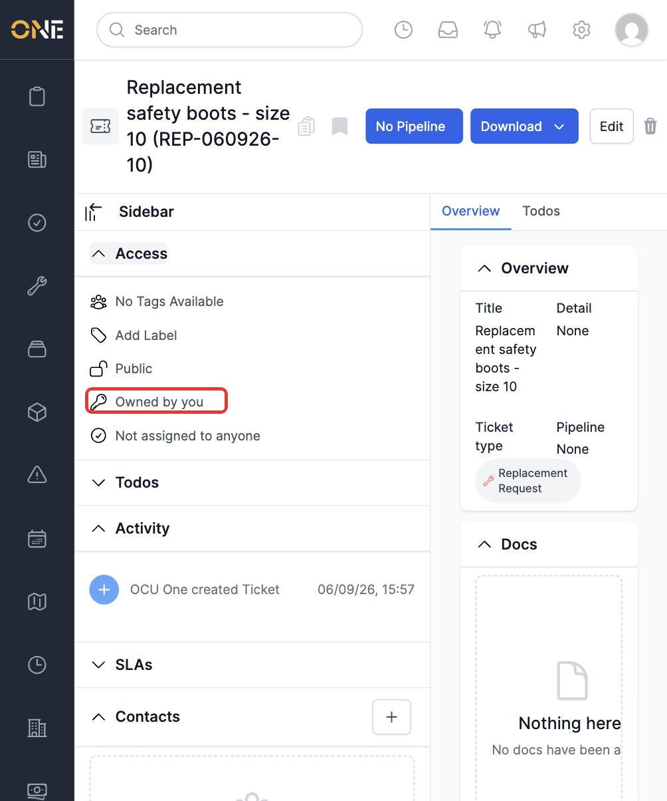
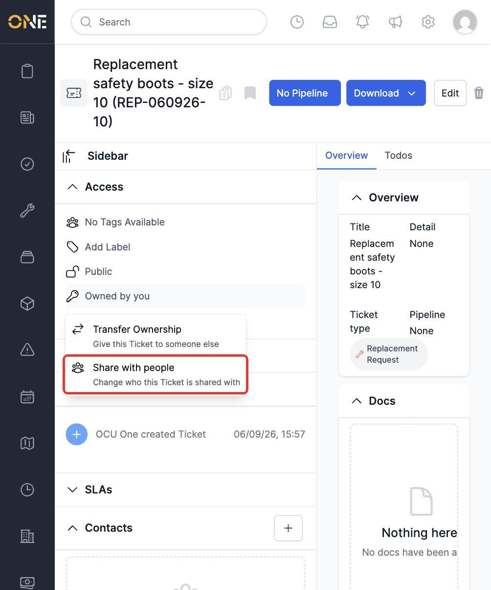
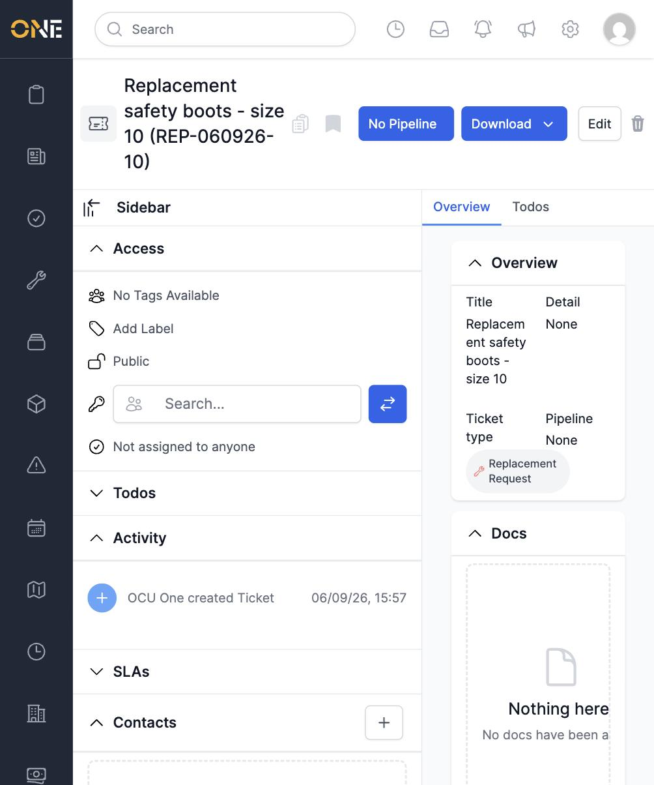
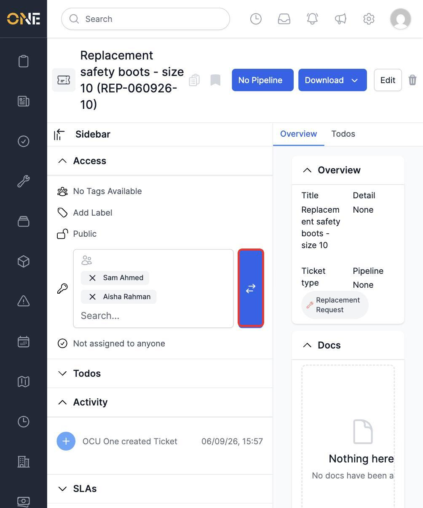
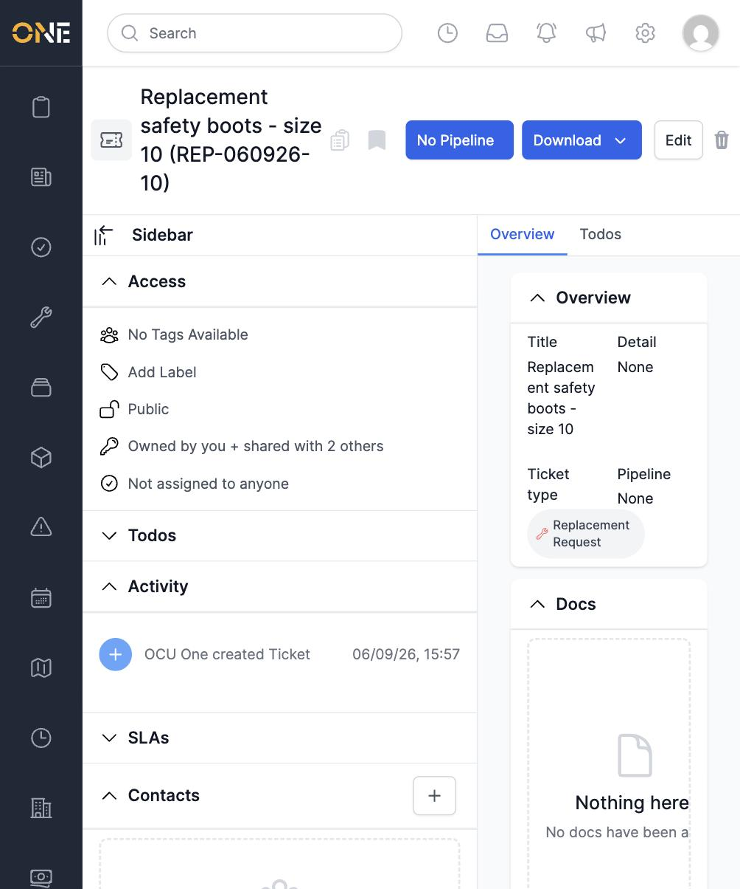
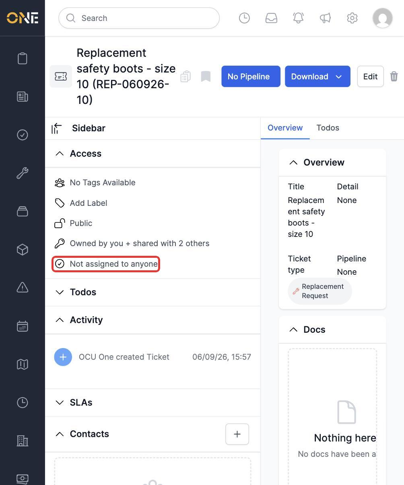
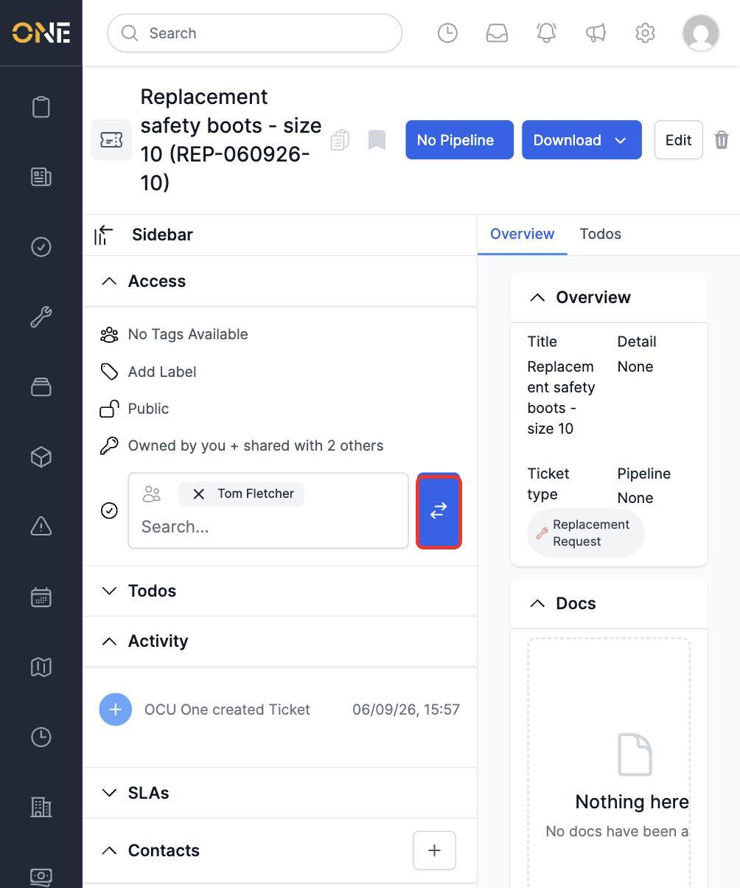

# Sharing or assigning a record to specific users

Beyond broad Visibility settings, the Access panel lets you share a record with specific people, and separately, assign it to specific people. These are two different things:

- **Sharing** gives named people access to see the record, in addition to whatever its Visibility setting already allows.
- **Assigning** marks specific people as responsible for the record — useful for routing work to the right person, independent of who can see it.

This guide covers both, using a Ticket as the example (the same steps work on any record type with an Access panel).

## Sharing a record with people

Open the Access panel in the sidebar and click the **Ownership** row (shown as "Owned by you" or the owner's name):

From the menu that opens, choose **Share with people**:

A search field appears in place of the menu. Type a name to search, and pick people from the results — you can add more than one:

Click the arrows button to confirm. The Ownership row updates to show the shared count:

To remove someone you've shared with, reopen **Share with people** and click the **x** on their chip before submitting again.

## Assigning a record to people

The **assigned users** row sits below Ownership (shown as "Not assigned to anyone", or listing whoever it's currently assigned to). Click it to open its search field directly — no extra menu, unlike Ownership:

Search for a name and select them the same way as sharing:

Click the arrows button to confirm. The row updates to show who it's assigned to:

You can assign more than one person the same way — just add more names to the field before submitting. To unassign everyone, reopen the row, remove every chip, and submit an empty field.

## Who can do this

Sharing and assigning both require the same access-management permission as changing Visibility or Ownership — typically the record's owner, or an Admin/Manager for that record type.
