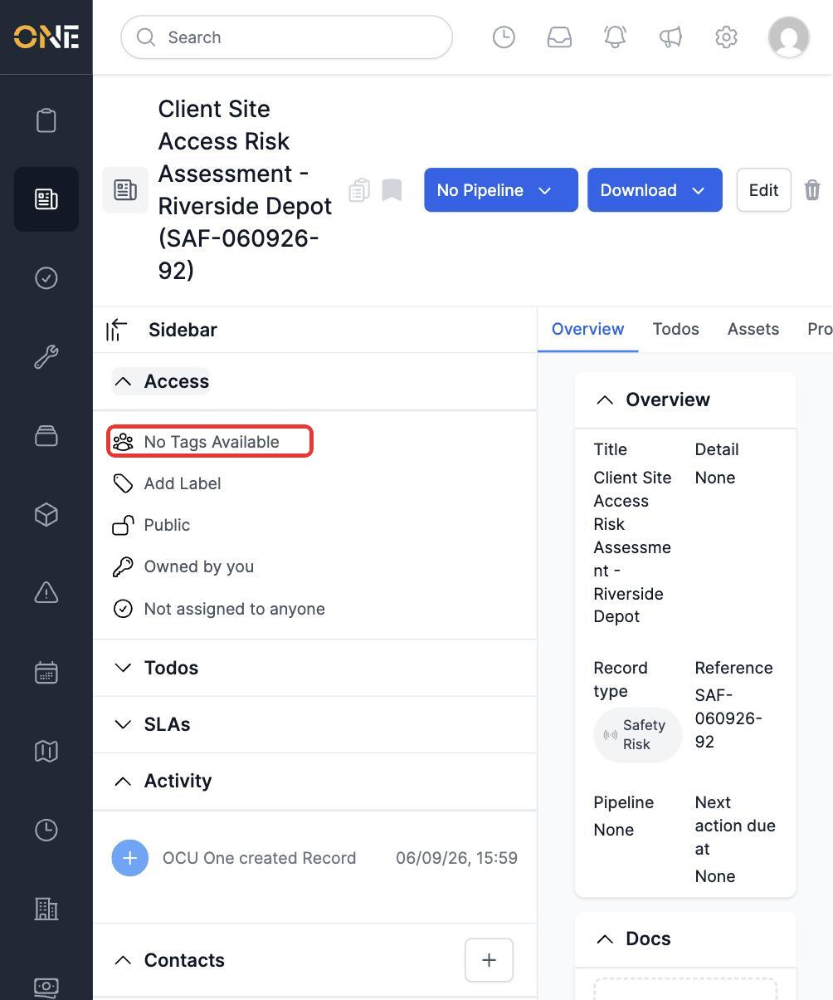
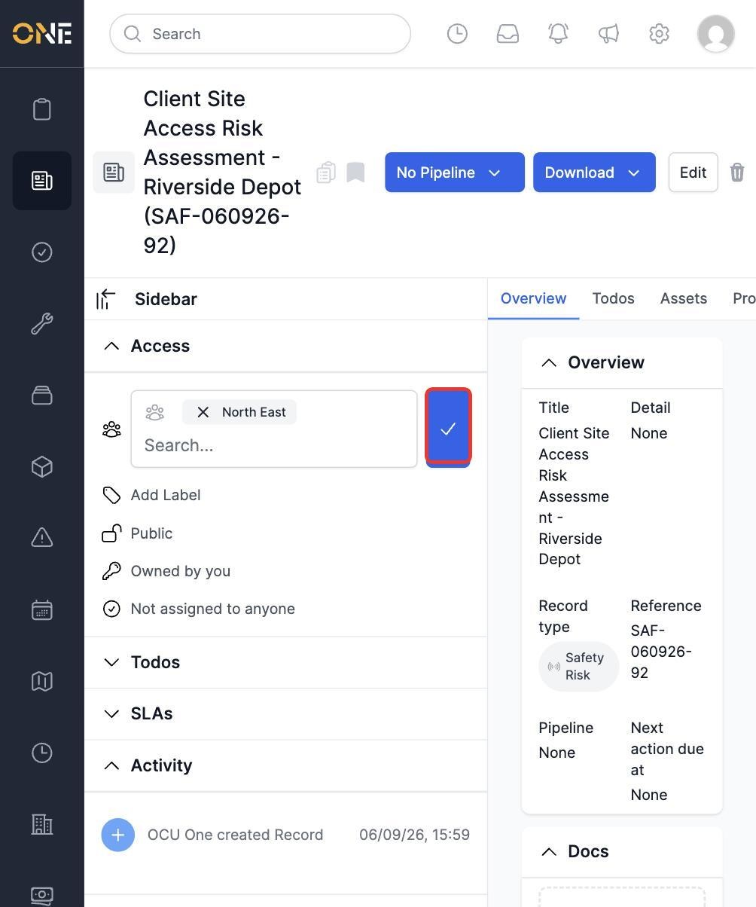
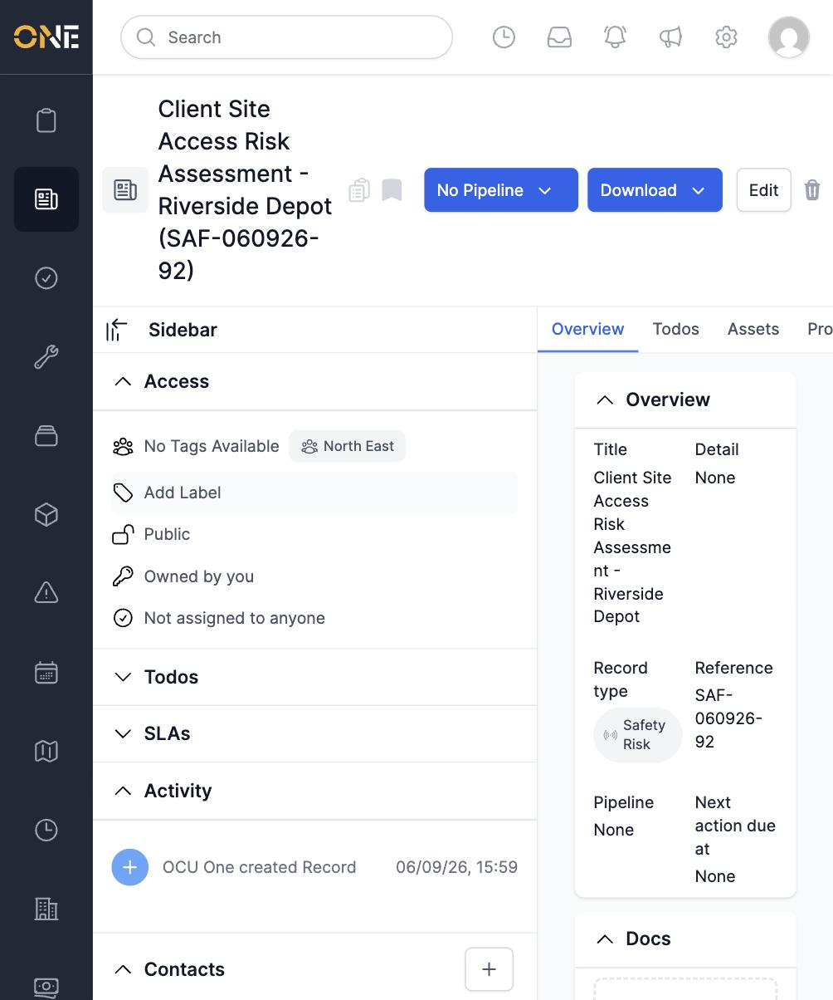
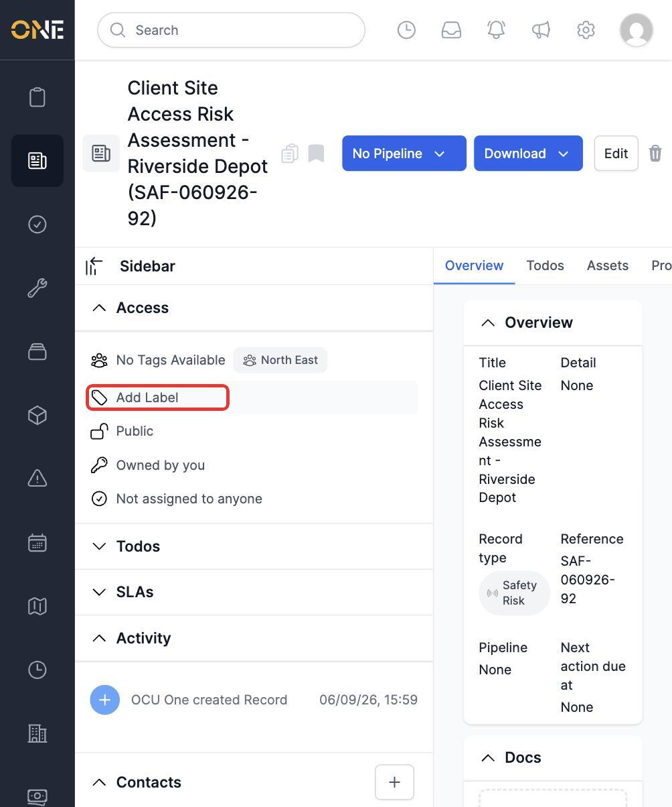
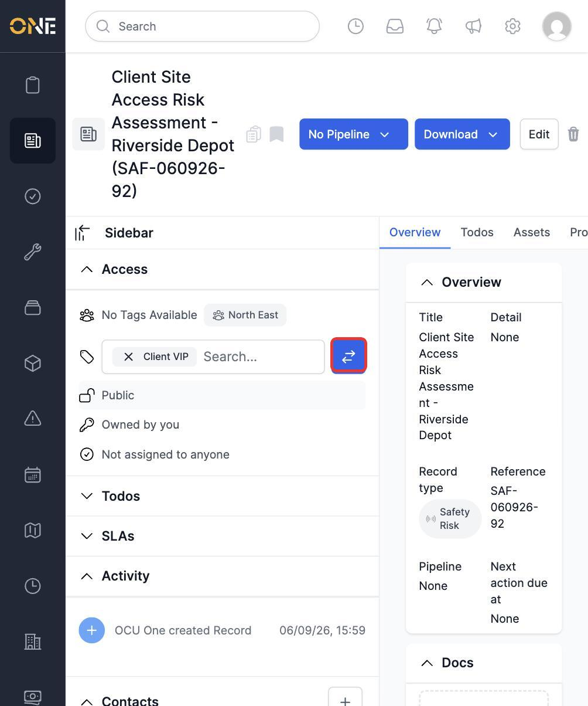
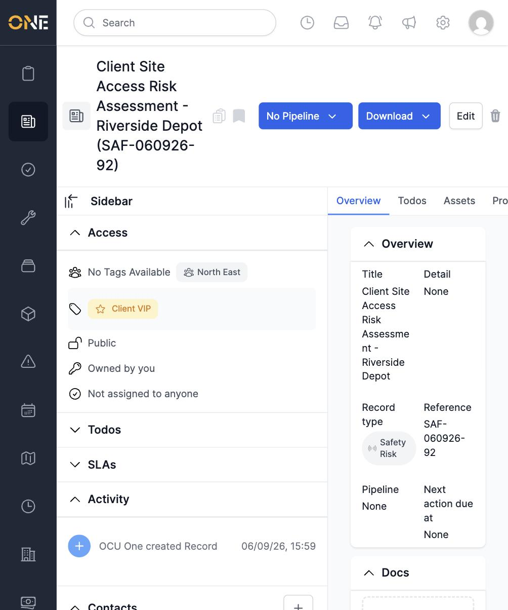

# Tagging or labelling a record from the Access panel

The Access panel also lets you tag and label a record — two lightweight ways of categorising it, alongside its Visibility and Ownership settings. This guide covers both, using a Record (a Safety Risk assessment) as the example, though the same steps work on any record type with an Access panel.

- **Tags** usually reflect something structural, like a region or team (e.g. "Area · North East"), and can also be used to restrict who sees a record if its Visibility is set to "Tags".
- **Labels** are more general-purpose markers (e.g. "Client VIP") — coloured, grouped, and mostly used for quick visual categorisation in lists.

## Tagging a record

Open the Access panel and click the **tags row** at the top (it may read "No Tags Available" even when tags exist in the system — see the note below):

A search field appears. Type to search and pick a tag from the results — tags are shown with their tag type prefixed (e.g. "Area · North East"):

Click the arrows button to confirm. The tag now appears as a small coloured chip next to the row:

> **Note:** the row's summary text can still read "No Tags Available" even after a tag has been added and tags exist for your organisation — this text reflects tags on your own personal account, not whether any tags exist to choose from or whether this record already has one. Don't take it to mean the tag picker is empty; the search field will still show real options.

## Labelling a record

Click **Add Label**, just below the tags row:

Search for a label and select it from the results:

Click the arrows button to confirm. The label appears as a coloured pill with its own icon:

You can apply more than one tag at a time, but only **one label per label group** — if you try to add a second label from a group that already has one applied, the change will be rejected.

To remove a tag or label, reopen its row, click the **x** on the chip you want to remove, and confirm again.

## Who can do this

Tagging follows the same access-management permission as Visibility and Ownership (the record's owner, or an Admin/Manager for that record type). Labelling only requires that you can view the record at all — no special access-management permission is needed.
