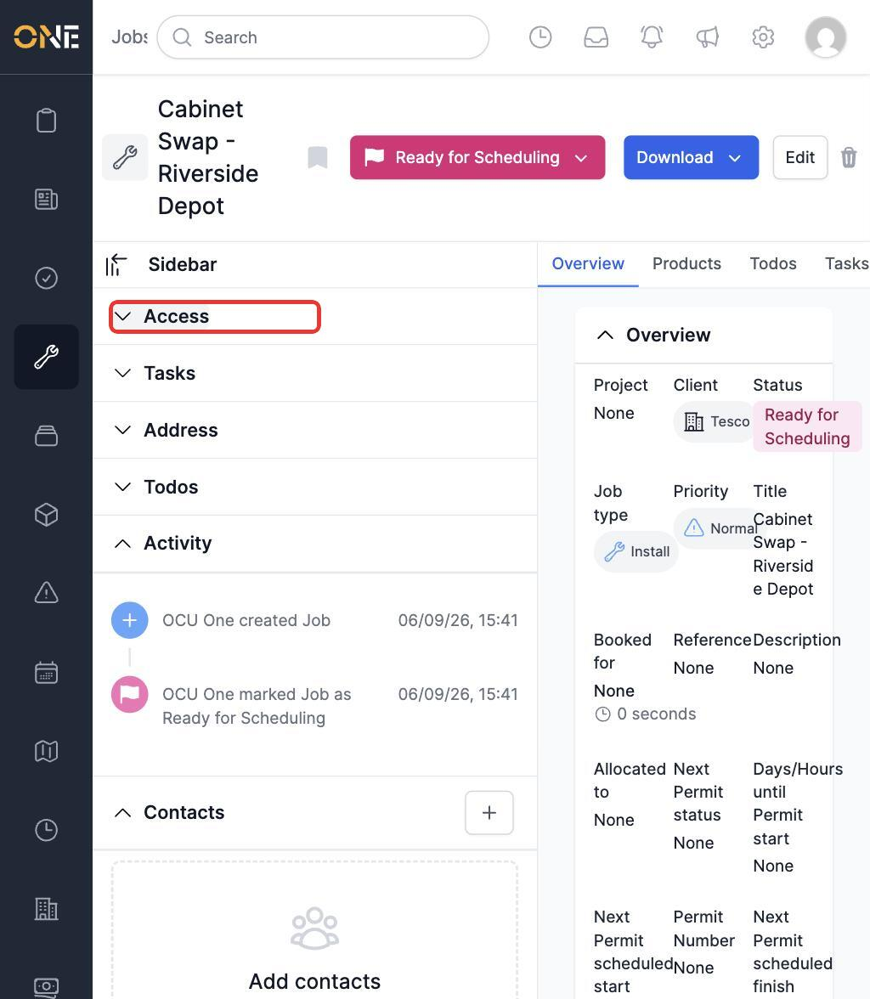
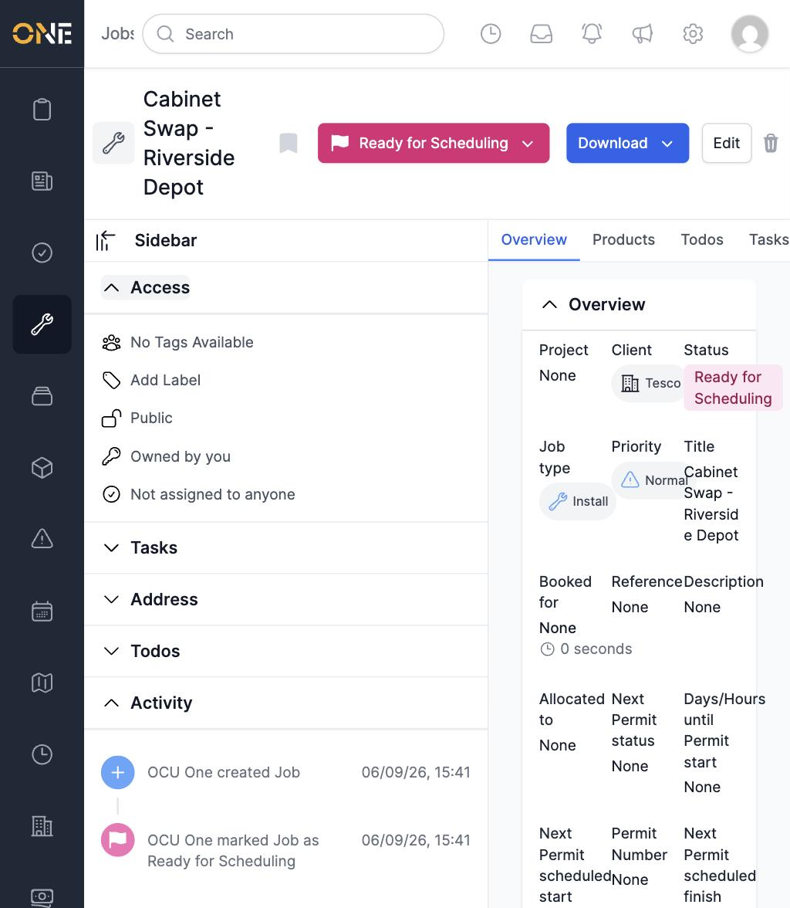
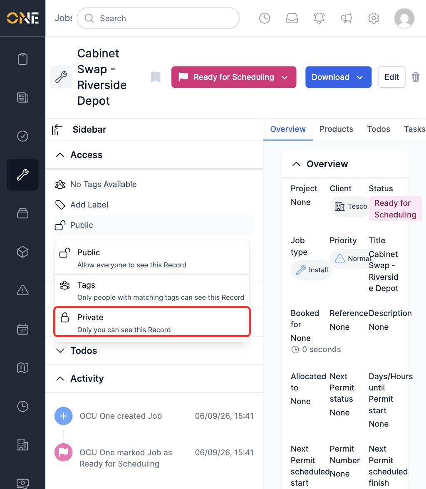
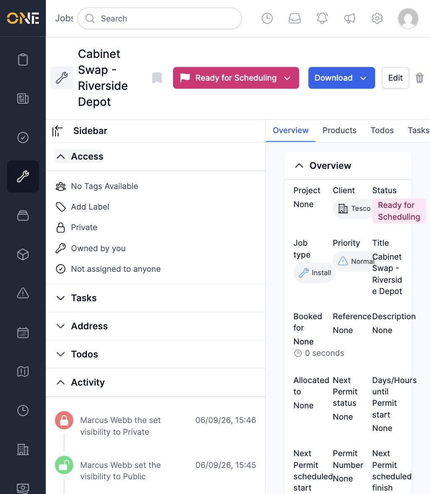
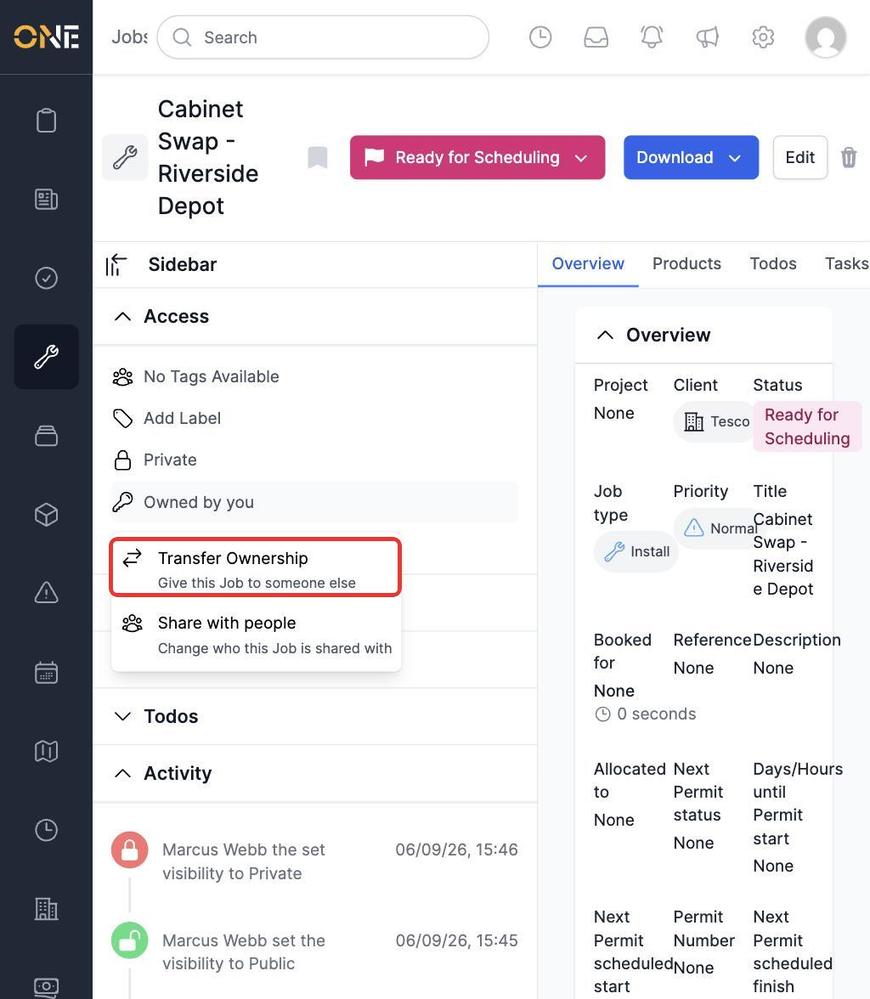
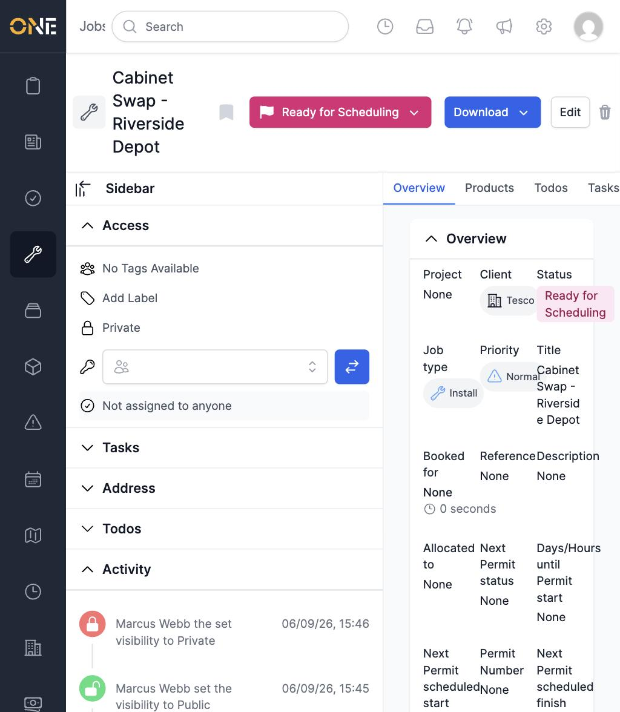
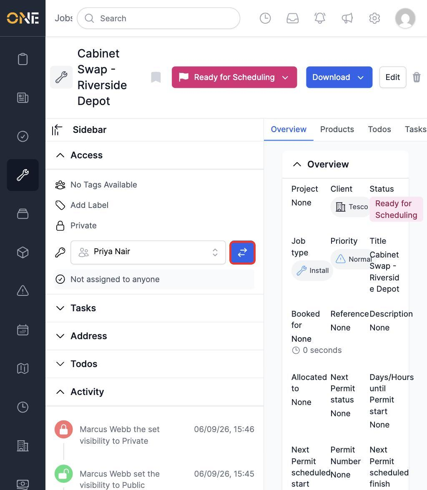
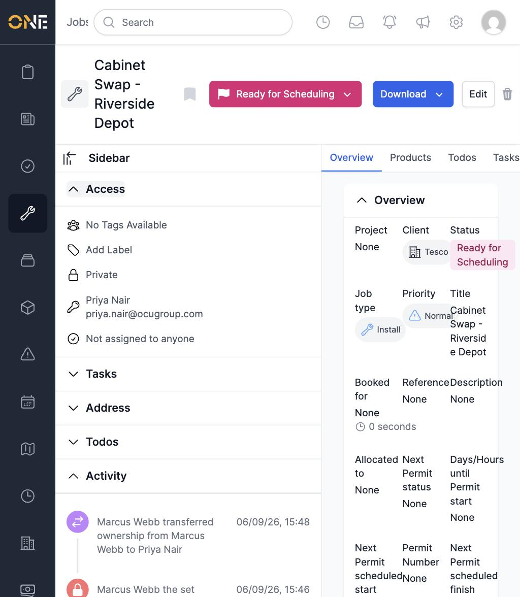

# Viewing a record's Access panel (visibility & ownership)

Every record in the app — a Job, Ticket, Project, Record, and so on — has an **Access** panel. It controls who can see the record, who owns it, and who it's shared with or assigned to. You'll find it in the sidebar of a record's Main (Overview) tab.

This guide covers opening the Access panel and using its two core controls: **Visibility** and **Ownership**. (Sharing or assigning a record to specific people, and tagging or labelling it, are covered in their own guides — they live in the same panel but work a little differently.)

## Opening the Access panel

On a record's page, look for **Access** in the sidebar list on the left. Click it to expand.

Once expanded, the panel shows several rows stacked on top of each other:

From top to bottom, these rows are:

- **Tags** and **Labels** — for categorising the record (see the Labels and Tagging guides).
- **Visibility** — who can see the record at all (a lock icon, described below).
- **Ownership** — who owns the record, shown with a key icon (described below).
- **Assigned users** — who the record has been assigned to (see the Sharing/Assigning guide).

Each row works the same way: click it to open its controls, and click elsewhere (or submit the form) to close it again.

## Setting who can see the record (Visibility)

The visibility row shows a lock icon and the current setting. Click it to open a dropdown with three options:

- **Public** — allow everyone to see this record.
- **Tags** — only people with matching tags can see this record.
- **Private** — only you can see this record.

Click an option to apply it immediately — there's no separate save step. The icon and label update right away, and the change is also recorded in the record's Activity feed further down the page.

> **Note:** the Activity feed entry for switching visibility to Private currently reads a little oddly (something like "*[name] the set visibility to Private*"). It's just an existing wording glitch in that one activity message — the visibility change itself works correctly.

## Setting who owns the record (Ownership)

The ownership row shows a key icon. If you own the record yourself, it says "Owned by you"; otherwise it shows the owner's name and email. Click the row to open a small menu:

- **Transfer Ownership** — give the record to someone else.
- **Share with people** — change who else the record is shared with, in addition to the owner (this doesn't change ownership itself).

Choosing **Transfer Ownership** reveals a search field in place of the menu:

Start typing a name to search, then pick the person from the results:

Click the arrows button next to the field to confirm the transfer. The panel updates immediately to show the new owner's name and email, and the change is logged in the Activity feed (e.g. "*[your name] transferred ownership from [old owner] to [new owner]*").

## Who can do this

Only the record's current owner, or someone with permission to manage access on that type of record (typically an Admin or Manager), can change its visibility or ownership. If you don't have access, these rows won't open a menu when clicked.
