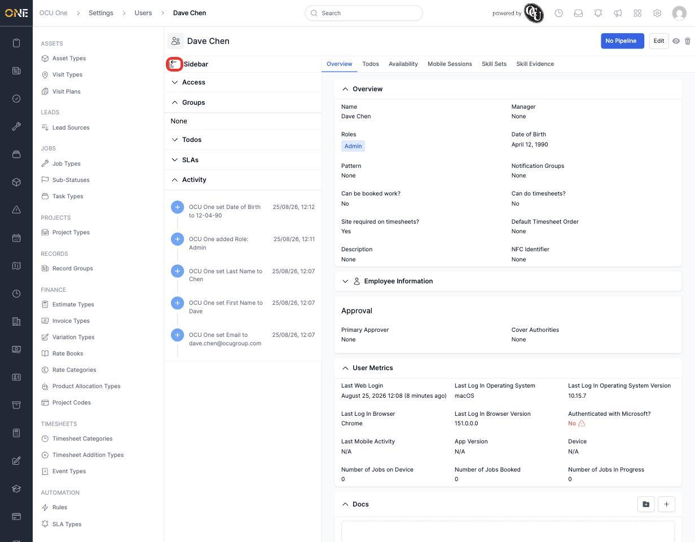
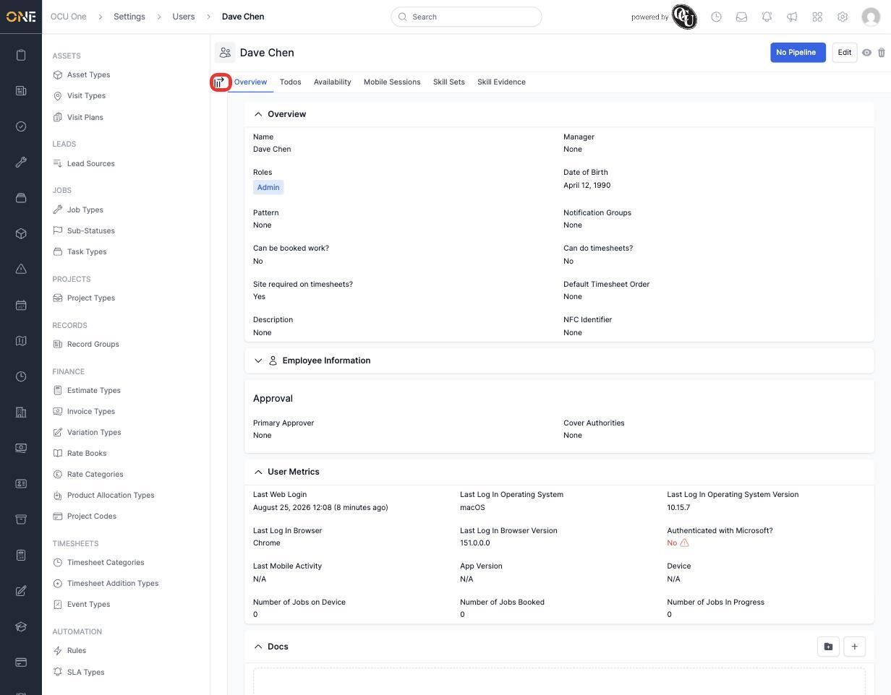

# Collapsing or expanding the sidebar

When you're viewing a record — a job, a client, a user, and so on — a **Sidebar** panel runs down the left of the record's tabs, next to the main content. You can collapse it out of the way if you want more room for the main content, and bring it back whenever you need it.

1. Click the icon next to **Sidebar**.

   

2. The sidebar tucks away, and the main content expands to fill the space. The same icon is still there if you want to bring it back.

   

Click the icon again at any time to bring the sidebar back. This preference is remembered for you, so once you've collapsed it, it stays collapsed the next time you open a record too.
