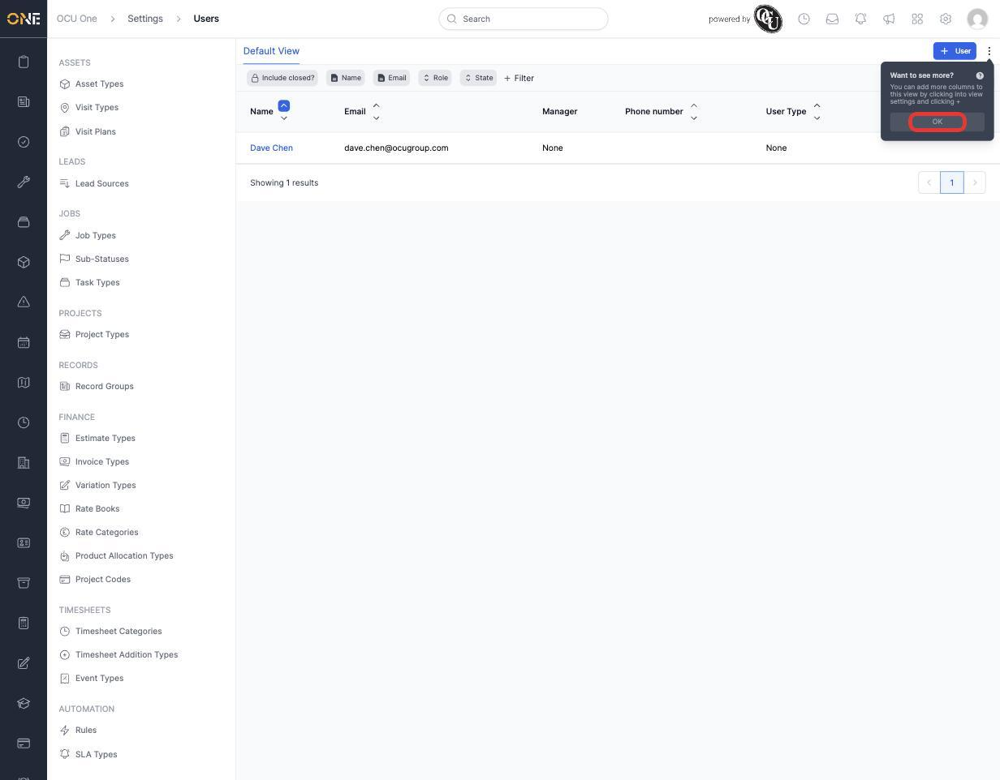
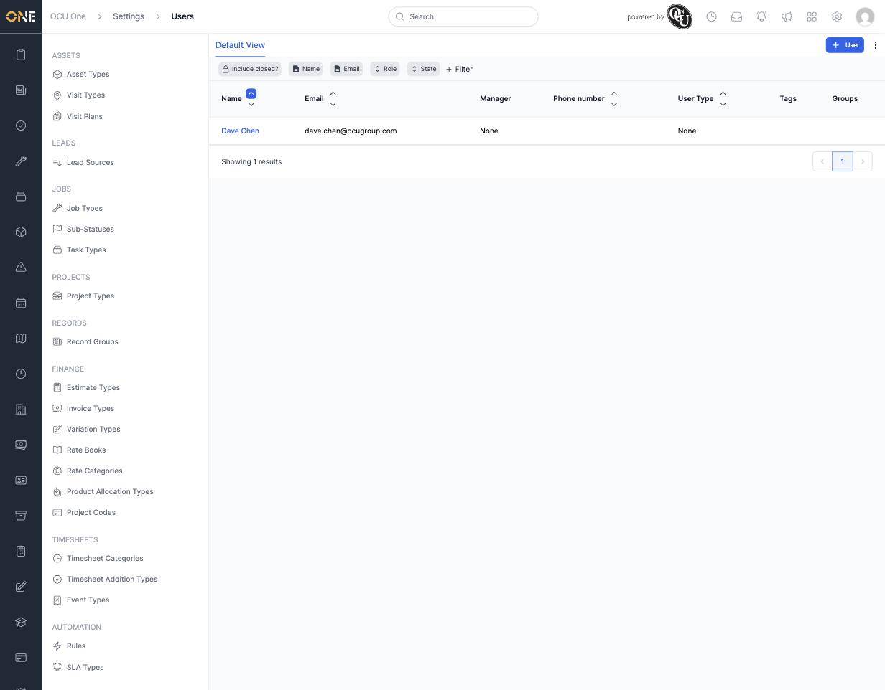

# Dismissing an onboarding tip

From time to time, OCU One shows a small tip pointing out a feature you might not have found yet. For example, the first time you open a table view, you may see a tip about adding more columns.

Click **OK** on the tip to dismiss it.

Once you've dismissed a tip, it won't show again — this is remembered against your account, not just your current session or device.
