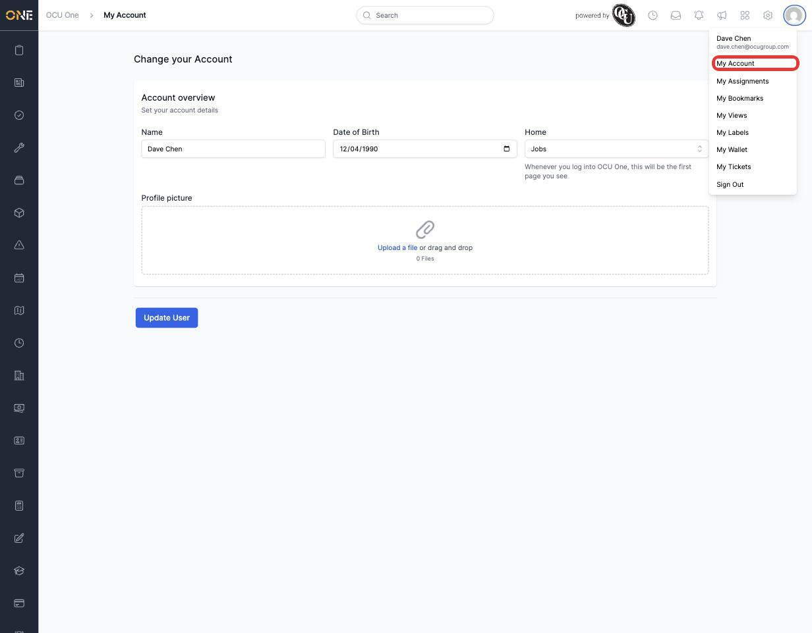
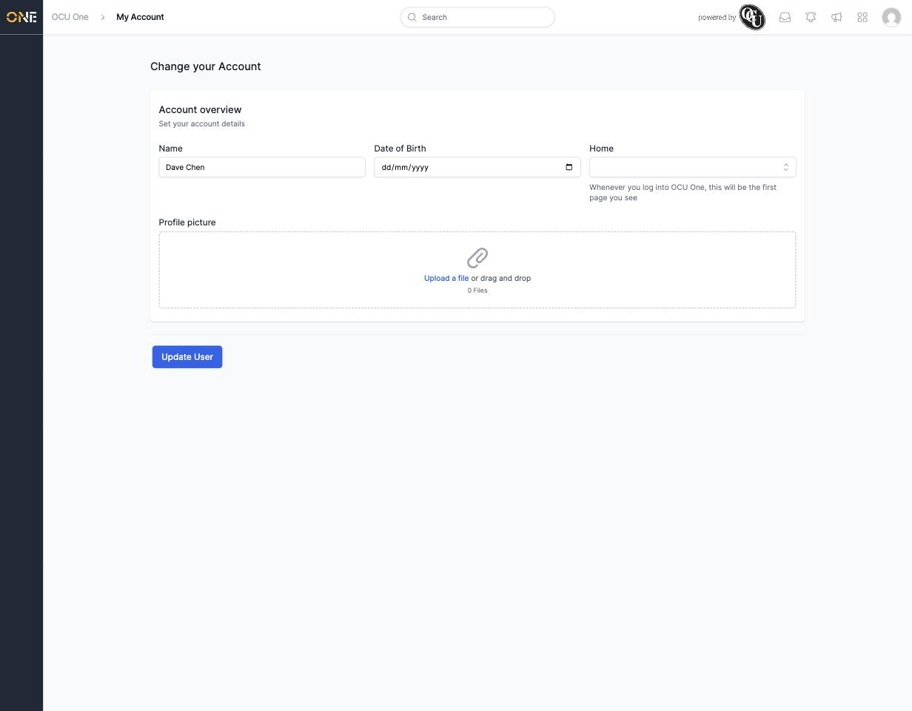
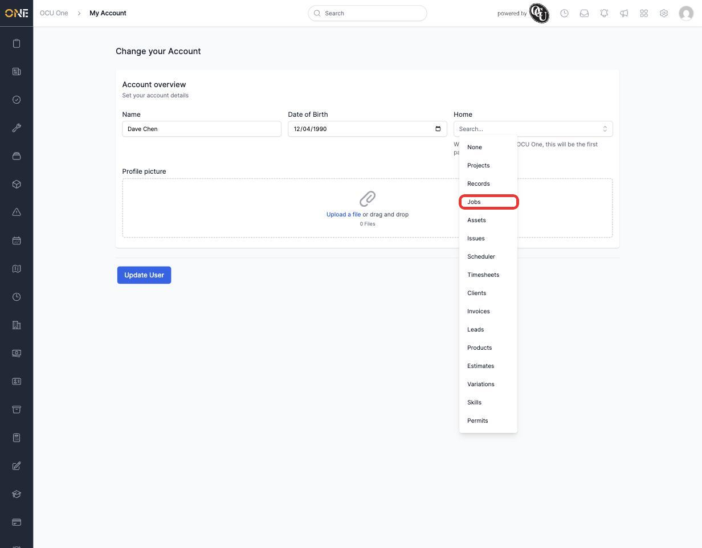
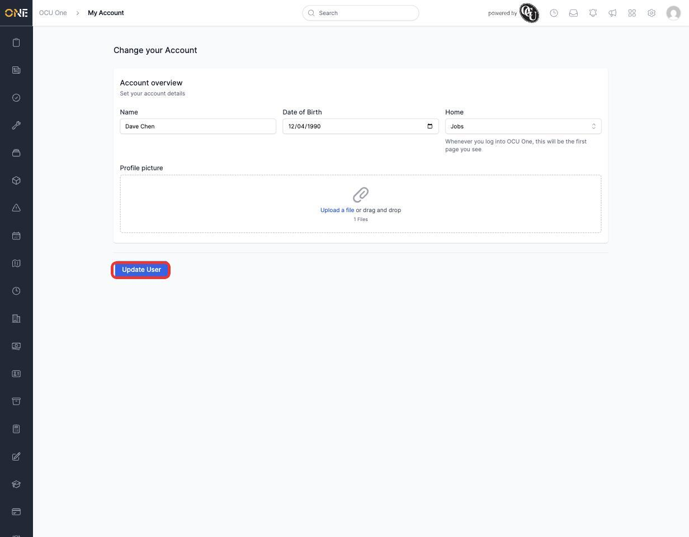
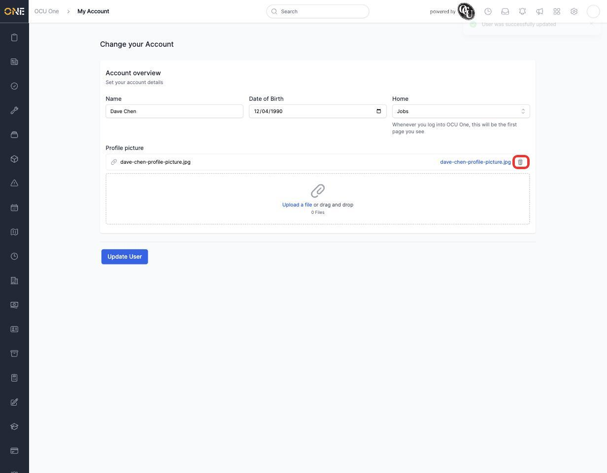
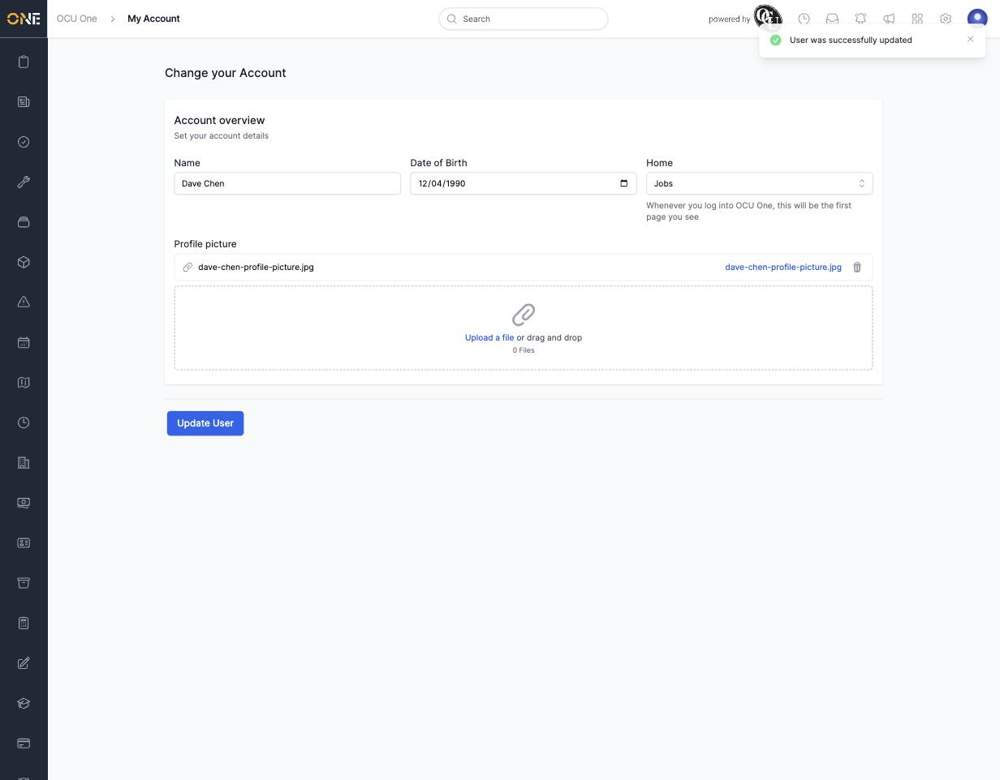

# Updating your account profile

My Account is where you manage a few personal details on your own OCU One profile — your date of birth, which page you land on when you log in, and your profile picture. Your name is shown here too, but it's read-only; if it needs changing, ask your administrator.

## Opening My Account

1. Click your avatar in the top right corner, then click **My Account**.

   

This opens the **Account overview** page.

## Setting your date of birth

Click into the **Date of Birth** field and enter your date of birth.

## Choosing your default home page

The **Home** field controls which page you land on whenever you log into OCU One. Click it to see the list of pages you can choose from, and pick one — the options shown depend on what you have access to.

If you don't set one, you'll land on the default Home page instead.

## Adding a profile picture

Click **Upload a file**, or drag and drop an image, into the **Profile picture** box. The file you've chosen is listed once selected.

## Saving your changes

Once you've made your changes, click **Update User**.

You'll see a confirmation message, and your profile picture now appears as your avatar in the top right corner.

## Removing your profile picture

To remove a profile picture you've already uploaded, click the trash icon next to its file name (shown above). It's removed straight away, and your avatar reverts to the default icon.

