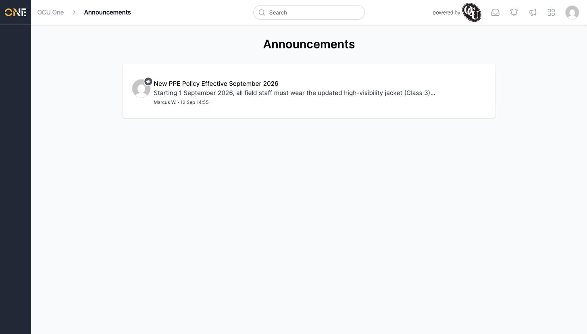
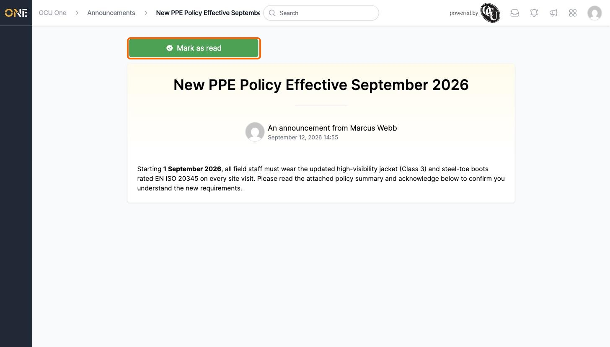
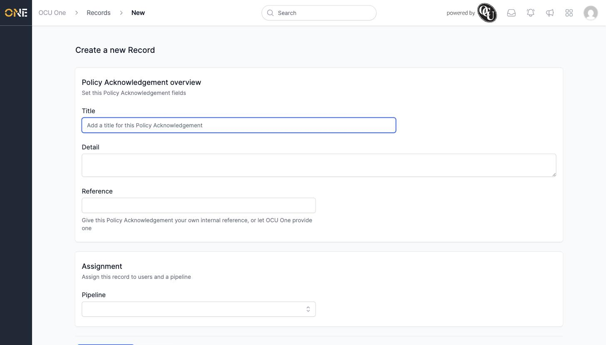
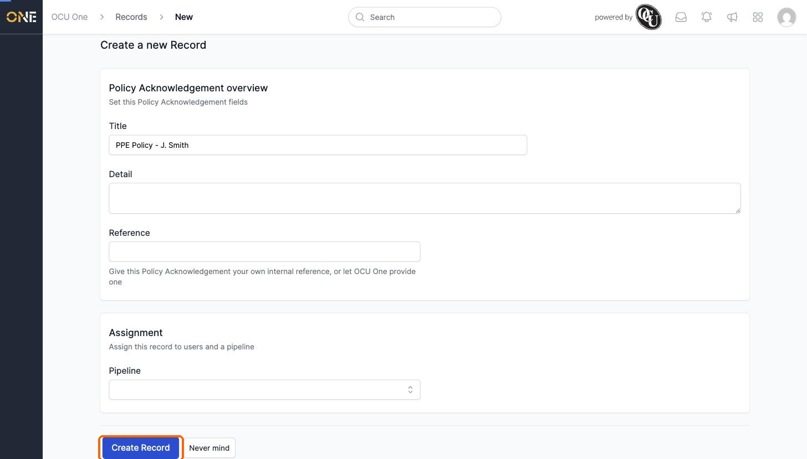
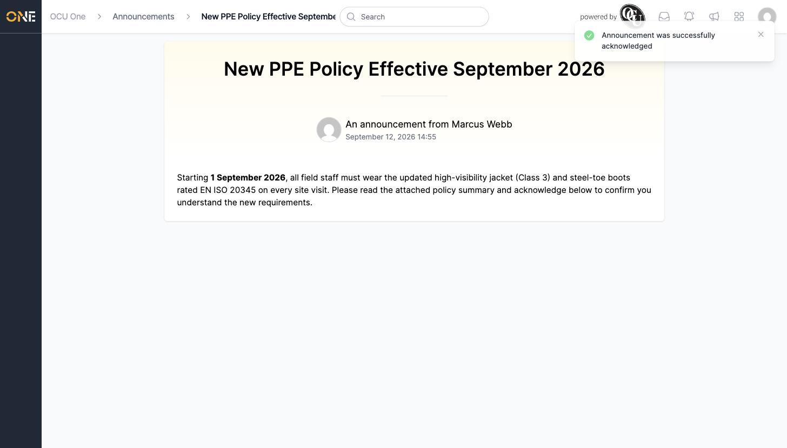

# Browsing company announcements

Announcements are company-wide messages — policy changes, safety notices, reminders — posted by an administrator for everyone to see. You can open the Announcements page from the megaphone icon in the top navigation bar at any time.

## Viewing the announcements list

The Announcements page shows every announcement you have access to, newest first. Each entry shows who posted it, a short preview of the content, and when it was posted.

Click an announcement's title to open it and read the full message.

## Reading an announcement

The announcement's page shows the full message, along with who posted it and when.

## Acknowledging an announcement

Some announcements require you to formally acknowledge that you've read them — for example, a policy change everyone needs to confirm they understand. If this applies, you'll see a green **Mark as read** button at the top of the announcement. Announcements that don't require acknowledgement won't show this button at all.

Clicking **Mark as read** doesn't mark it as read instantly — it opens a short form for you to fill in and submit. The exact fields depend on what the administrator set up, but a title is usually required.

Fill in a title and click **Create Record** to submit it.

You'll see a confirmation message, and the **Mark as read** button disappears from the announcement — you won't be prompted to acknowledge it again.

## Things to know

- Only announcements you've been given access to appear in your list — an administrator controls this the same way as any other record's visibility.
- Whether an announcement needs acknowledging is decided by whoever created it. If there's no **Mark as read** button, there's nothing further for you to do beyond reading it.
- Administrators see extra controls on this page (editing, deleting, and sending the announcement as a notification) that aren't shown here — see [Creating and editing an announcement](Creating%20and%20editing%20an%20announcement.md) and [Sending an announcement as a notification](Sending%20an%20announcement%20as%20a%20notification.md).
