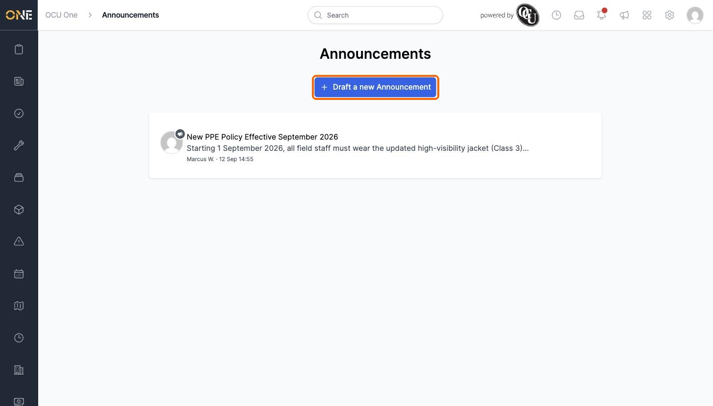
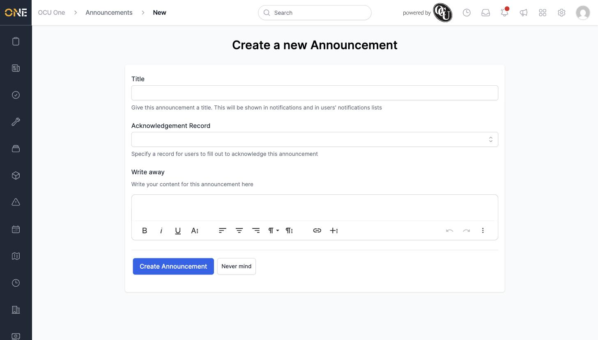
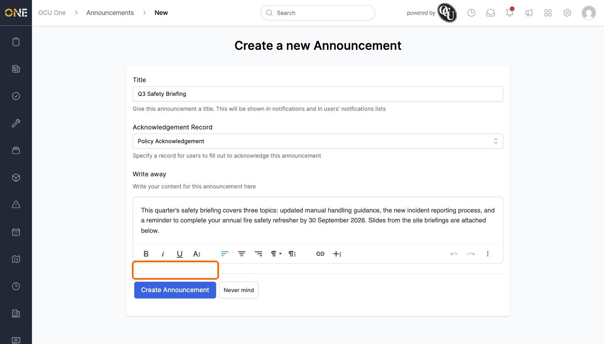
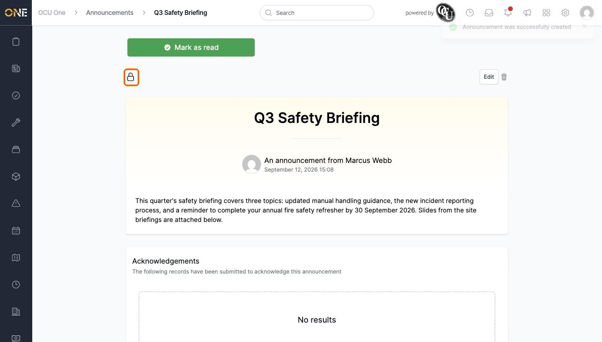
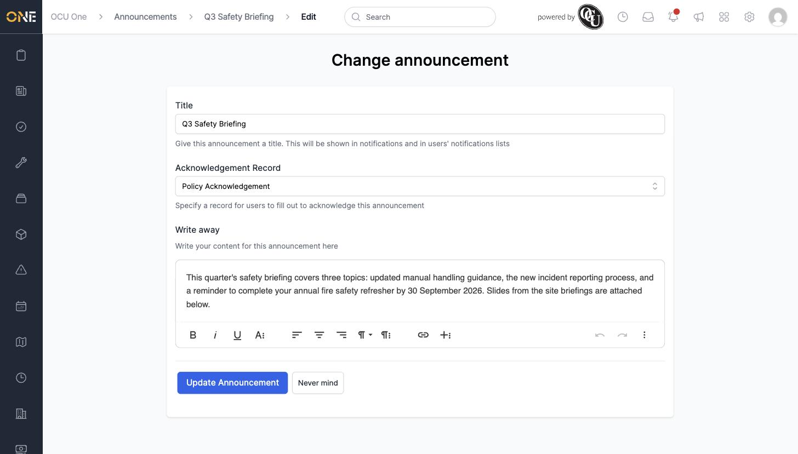
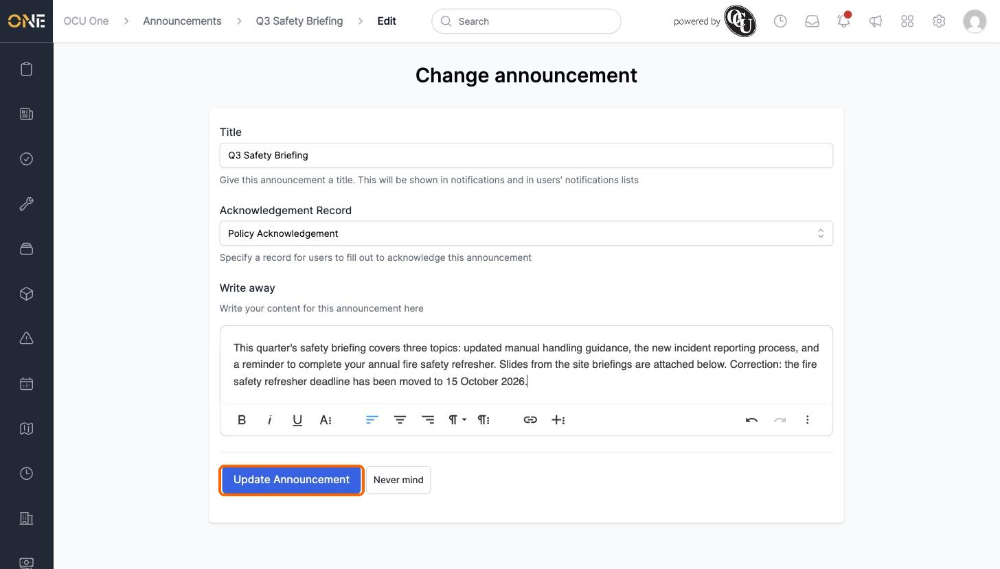
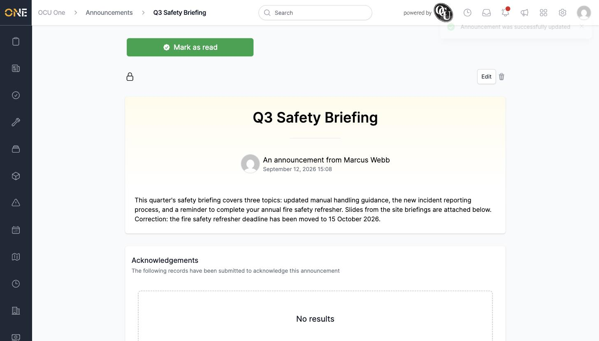
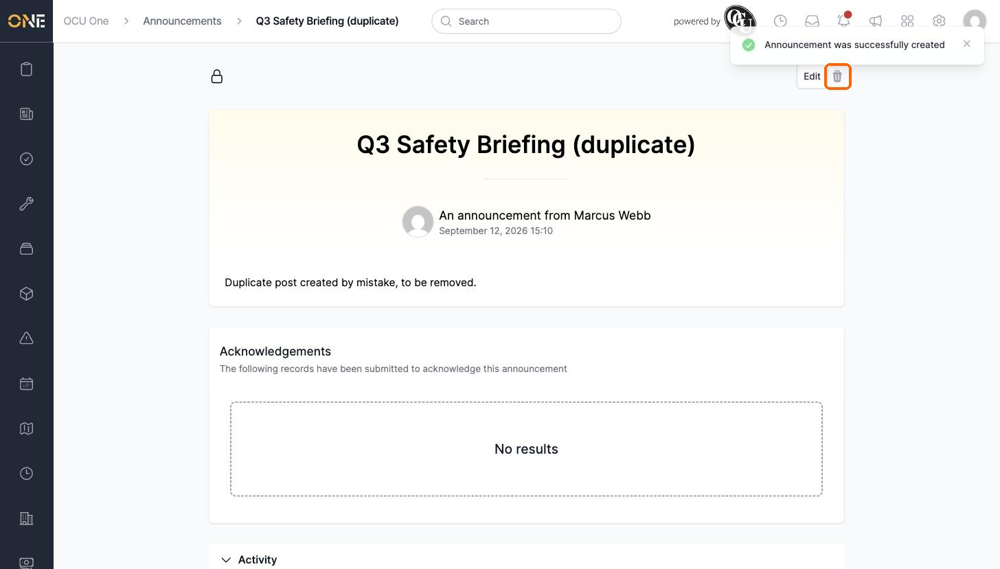
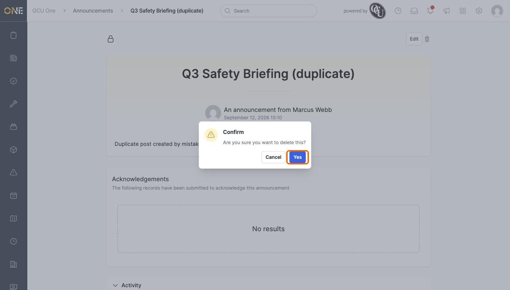
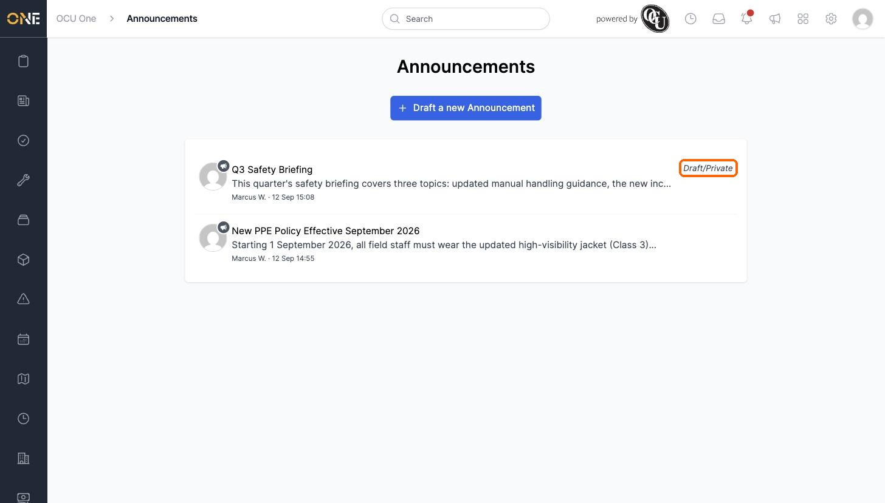

# Creating and editing an announcement (Admin)

If you have permission to manage announcements, you'll see a **Draft a new Announcement** button on the Announcements page. This is how you post a company-wide message.

## Creating an announcement

Clicking the button opens the announcement form.

Fill in:

- **Title** — shown in notifications and in people's notification lists.
- **Acknowledgement Record** — optional. Choose a record type here if you want people to formally confirm they've read the announcement (see [Browsing company announcements](Browsing%20company%20announcements.md) for what that looks like for the reader). Leave this blank for a plain, read-only announcement.
- **Write away** — the announcement's content, using the rich text editor.

Click **Create Announcement** to post it.

### New announcements start private

A newly created announcement starts out **Private** (shown as a locked padlock icon), which means only you can see it — it isn't visible to anyone else yet, and the option to send it as a notification is hidden until you change this.

Click the padlock icon to open the Access panel and change the visibility to **Public** (or restrict it to specific tags) before people can see it. This works the same way as visibility on any other record — see the Access & Visibility guides for the full picture.

## Editing an announcement

From the announcement's page, click **Edit** to change its title, acknowledgement record type, or content.

Make your changes and click **Update Announcement**.

The updated content appears immediately on the announcement's page.

## Deleting an announcement

If you post an announcement by mistake — for example a duplicate — open it and click the trash icon next to **Edit**.

Confirm the deletion when prompted.

The announcement is removed from the list. Announcements still set to Private show a **Draft/Private** label next to their entry, so you can tell at a glance which ones haven't been made visible yet.

## Things to know

- The acknowledgement record type is entirely optional — most announcements don't need one.
- Creating or editing an announcement doesn't notify anyone by itself. To actually alert people, see [Sending an announcement as a notification](Sending%20an%20announcement%20as%20a%20notification.md).
- Remember to change a new announcement's visibility from Private to Public (or to specific tags) once it's ready — otherwise no one else will be able to see it.
