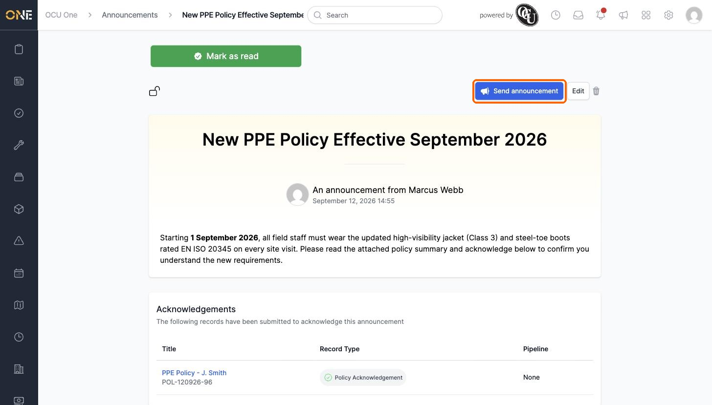
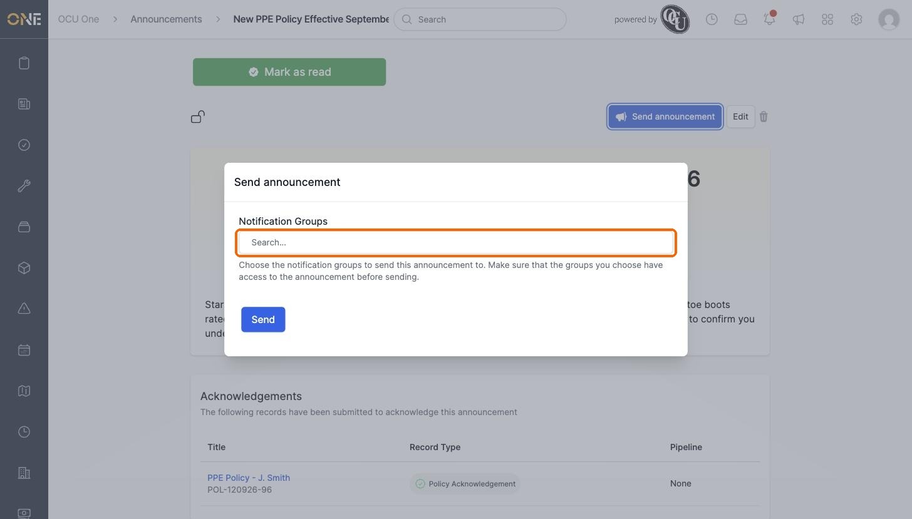
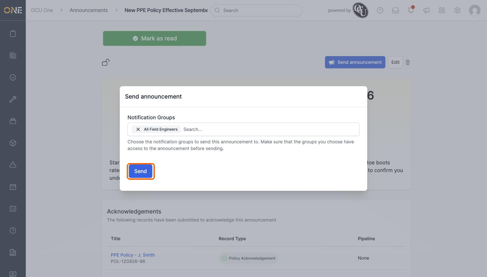
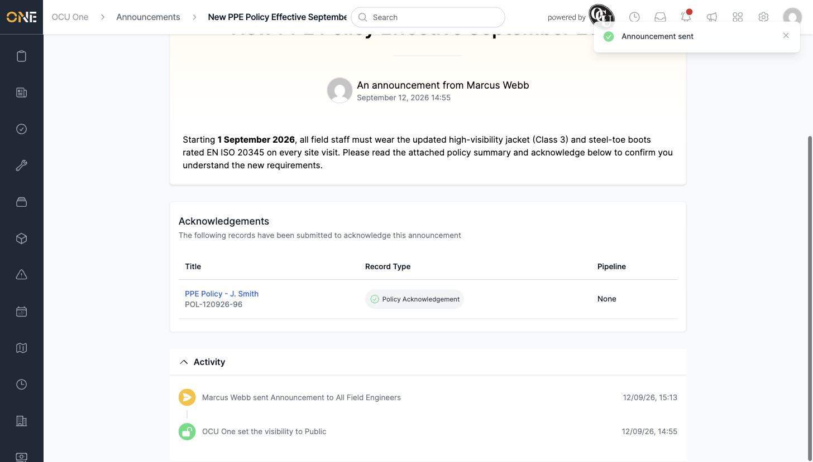
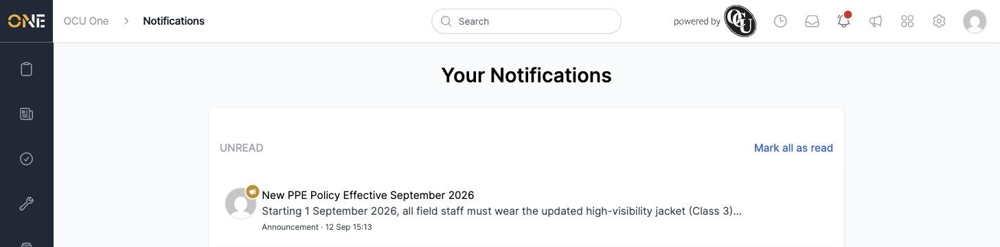

# Sending an announcement as a notification (Admin)

Creating an announcement doesn't alert anyone on its own — people only find out about it if they happen to check the Announcements page, or if you actively send it out as a notification. Sending is a separate step, and you can do it as many times as you like, to different groups, after the announcement is created.

## Sending an announcement

Open the announcement (it must already be set to **Public**, or shared with the right tags — a Private announcement hides the send option entirely) and click **Send announcement**.

A window opens asking which **Notification Groups** should receive it. Notification groups are set up in advance under Settings — see the Settings guides for how to create one. Search for the group you want in the box provided.

Select the group from the results. It appears as a removable chip above the search box — you can add more than one group before sending.

Click **Send**. You'll see a confirmation, and the announcement's activity feed logs who sent it and to which group.

## What the recipients see

Everyone in the notification group receives a notification, labelled **Announcement**, in their own notifications list.

## Things to know

- Make sure the notification group you're sending to actually has access to the announcement — the window itself warns you of this. If the announcement is set to specific tags, a group whose members don't share those tags won't be able to open it.
- Sending doesn't lock the announcement — you can send it again later, to the same group or a different one, for example to reach people who join a team afterwards.
- Only administrators with permission to manage announcements can send them; this is the same permission needed to create and edit announcements (see [Creating and editing an announcement](Creating%20and%20editing%20an%20announcement.md)).
