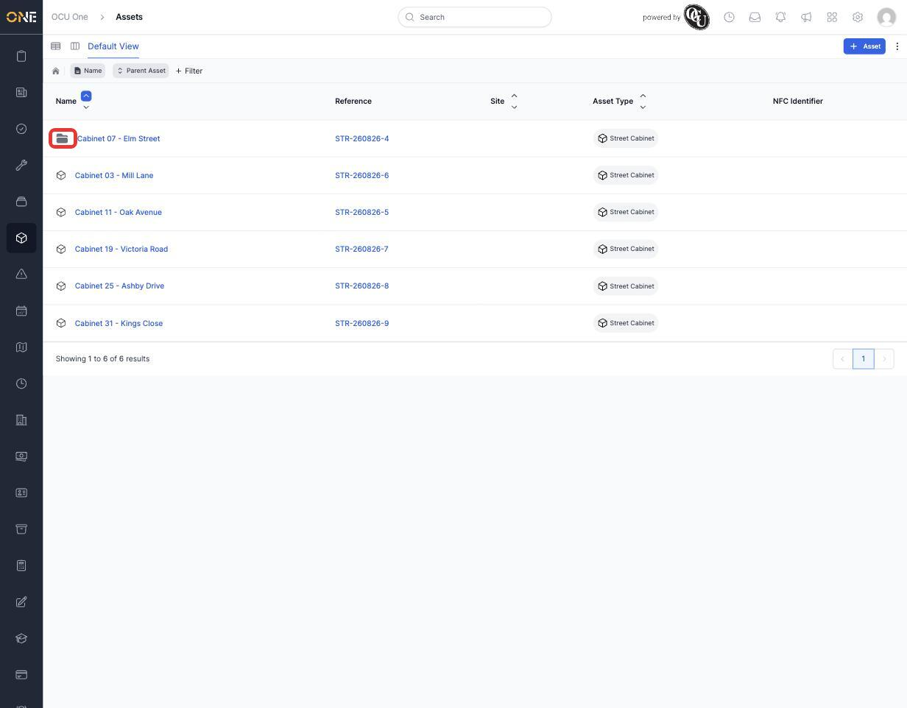
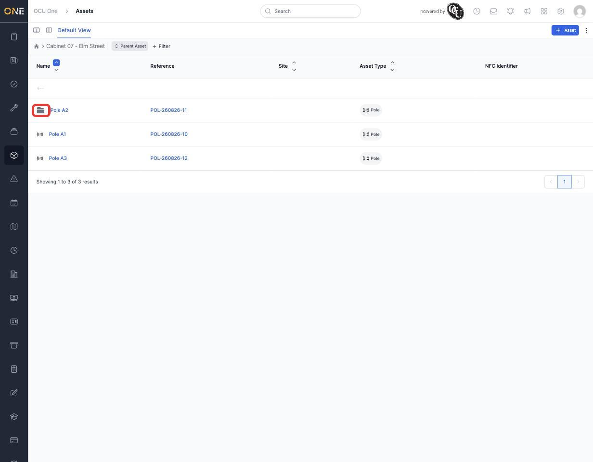
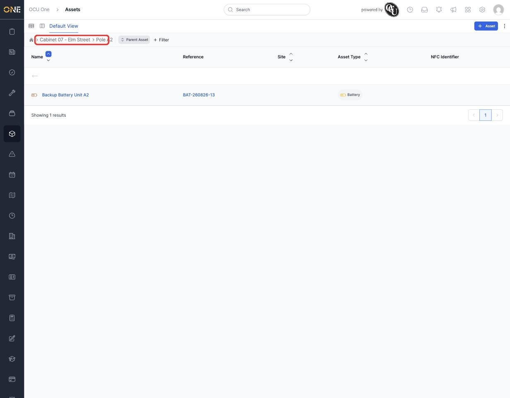

# Browsing assets in the drilldown tree view

Assets are the physical things your organisation tracks and maintains — equipment, infrastructure, anything with a service history. Many assets aren't standalone: a cabinet might contain several poles, and a pole might have its own battery unit fitted to it. The **drilldown** view is built for exploring assets this way — one level of the hierarchy at a time — rather than as one long flat list.

## Opening the drilldown view

From the sidebar, open **Assets**. By default you land on the drilldown view, showing every top-level asset — the ones that aren't sitting inside another asset. Each row shows the asset's **Name**, **Reference** (an ID the system generates automatically), **Site**, **Asset Type**, and **NFC Identifier** (if the physical item has an NFC tag attached for scanning).

An asset with its own contents — sub-assets — is marked with a folder icon instead of the plain asset-type icon. That folder is your cue that there's more to see inside.

*The top level of the tree. "Cabinet 07 - Elm Street" has a folder icon because it contains sub-assets — the plain cabinets don't.*

## Drilling into an asset's contents

Click the folder icon (not the asset's name — that opens the asset's own detail page instead) to step inside it. The list updates to show just what's inside that asset, and a breadcrumb trail appears above the list so you always know where you are and can jump back to any earlier level.

*Inside "Cabinet 07 - Elm Street": three poles. "Pole A2" also has a folder icon, meaning it has something fitted to it.*

Keep drilling in as far as the hierarchy goes. Here, Pole A2 turns out to have its own battery unit attached:

*Inside "Pole A2": a single battery unit. The breadcrumb at the top ("Cabinet 07 - Elm Street > Pole A2") shows exactly how deep you've drilled — click any part of it to jump back up.*

To go back up one level at a time instead of jumping straight to a breadcrumb, use the back arrow that appears above the list once you're inside an asset. To leave the tree entirely and return to the full top-level list, click the home icon at the start of the breadcrumb.

## Finding a specific asset without drilling level by level

If you already know (roughly) what you're looking for, you don't have to click your way down. Click **+ Filter** above the list to filter by Name, Reference, Asset Type, Site, and more — or use the quick filter chips (**Name**, **Parent Asset**) already sitting next to it. A filter applies at whatever level of the tree you're currently viewing, so if you're several levels deep and want to search everything again, jump back to the top level first via the breadcrumb's home icon.

## Switching to the table view

The drilldown is one of two ways to browse assets — see [[Browsing assets in the table (list) view]] for the flat, sortable alternative, which is better when you want to see many assets side by side regardless of what contains what. You can switch between the two using the icons in the top-left corner of the view, next to "Default View".
