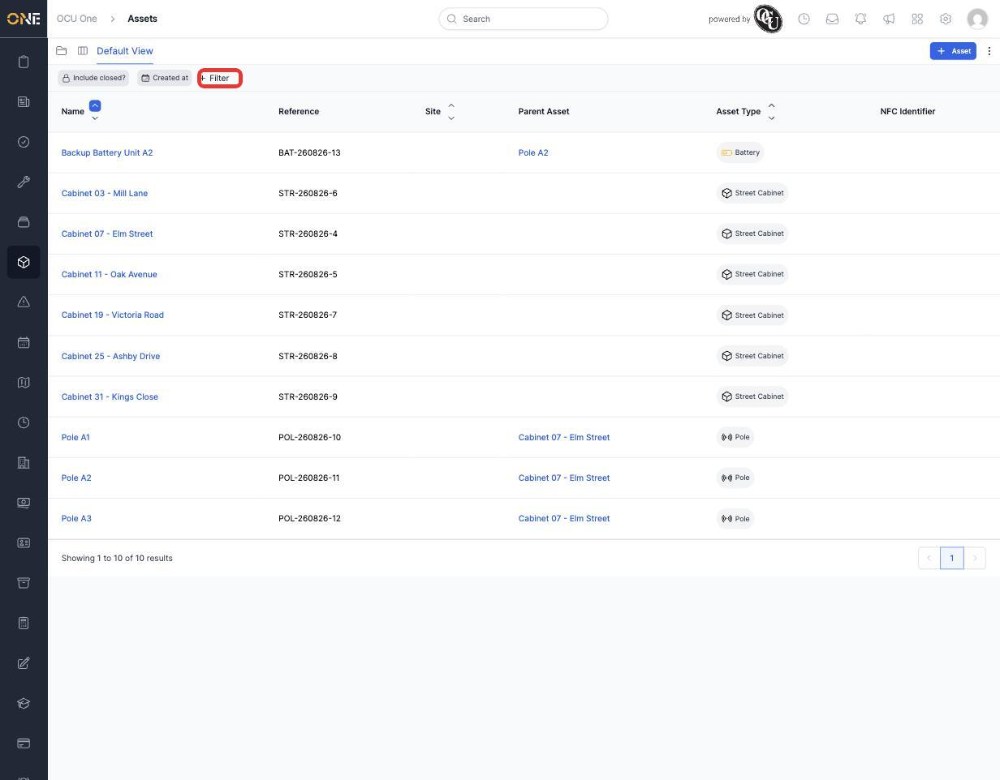
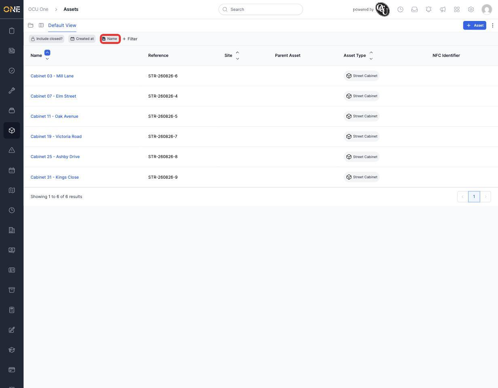

# Browsing assets in the table (list) view

Alongside the drilldown tree (see [[Browsing assets in the drilldown tree view]]), Assets can also be browsed as one flat, sortable table — every asset in one list, regardless of what it's inside. This is the better choice when you want to compare or search across assets of different types at once, rather than exploring one branch of the hierarchy at a time.

## Opening the table view

From the sidebar, open **Assets**, then switch to the table icon in the top-left corner (next to "Default View") if you're not already on it — the other icon takes you to the drilldown tree instead.

Every asset appears as its own row, whatever its type or position in the hierarchy: cabinets, poles, batteries and anything else side by side. Alongside **Name**, **Reference**, **Site** and **Asset Type**, this view adds a **Parent Asset** column, so you can see at a glance which assets sit inside another one without having to drill in.

*The table view. Every asset type appears together, and the Parent Asset column shows that the three poles here belong to "Cabinet 07 - Elm Street".*

## Filtering and searching

Click **+ Filter** to narrow the list down. You can filter on any column — Name, Reference, Site, Asset Type, Created at, and more — and combine several filters at once; each one appears as its own chip above the table that you can reopen to adjust, or remove entirely.

For example, searching by **Name contains "Cabinet"** narrows the table down to just the street cabinets:

*Filtered to Name contains "Cabinet" — only the street cabinets remain, all other asset types drop out of the list.*

A couple of things worth knowing about filtering here:
- **Include closed?** is off by default, so archived/deleted assets stay hidden unless you deliberately switch it on.
- Column headers with the up/down arrows (Name, Site, Asset Type) can also be clicked to sort the table by that column, which is a quicker way to group similar assets together than adding a formal filter.

## Switching to the tree view

If you'd rather explore an asset's contents one level at a time instead of seeing everything flattened, switch to the drilldown tree using the folder icon next to the table icon — see [[Browsing assets in the drilldown tree view]] for how that view works.
