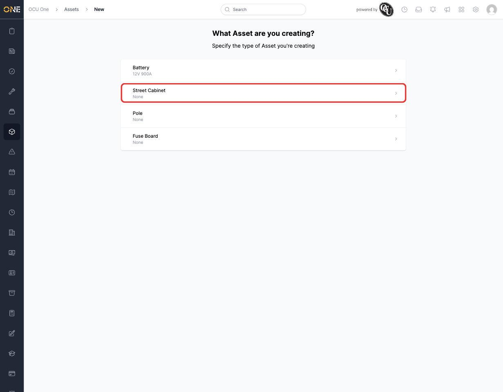
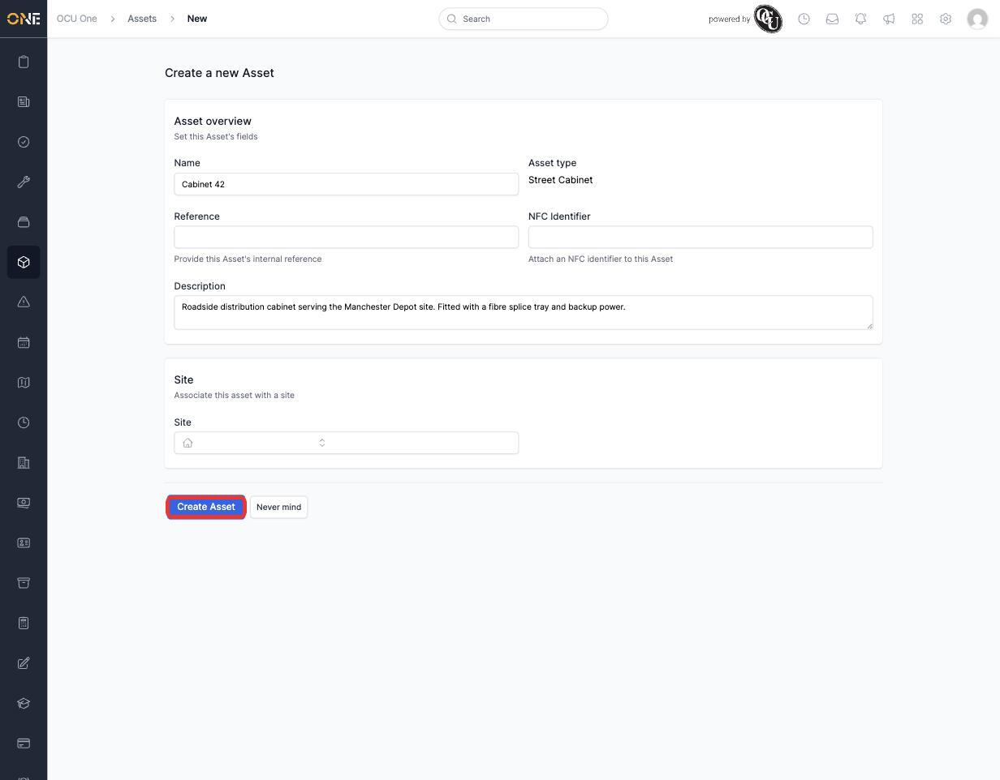
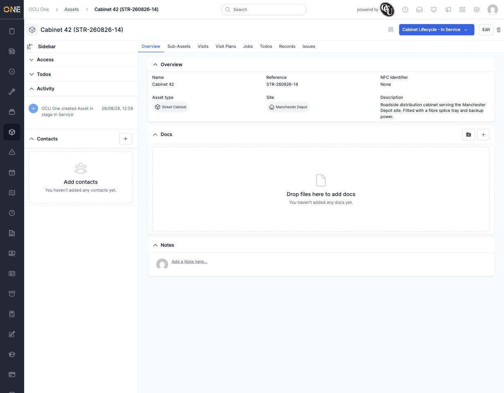

# Creating an asset

Whenever your organisation takes on a new piece of equipment or infrastructure to track — a cabinet, a pole, a battery, anything — you add it to Assets as a new record.

## Starting a new asset

From the **Assets** table view, click **+ Asset** in the top-right corner. You're first asked what type of asset you're creating — this list is set up in advance by an admin, and determines which fields appear next.

*Pick the asset type first. Here, "Street Cabinet" is being selected.*

## Filling in the details

Once you've picked a type, you get a form for that asset's details:

- **Name** — required. This is what identifies the asset everywhere else in the app.
- **Reference** — optional; leave it blank and the system generates one automatically from the asset type (for example, a Street Cabinet gets a reference starting "STR-").
- **NFC Identifier** — optional, for organisations that tag physical assets with scannable NFC chips.
- **Description** — optional free text for any extra detail worth recording.
- **Site** — optional; associates the asset with a site if it's tied to one.

*Name and Description filled in for "Cabinet 42". Click **Create Asset** once everything looks right.*

## After creating

You land on the new asset's overview page, showing everything you entered plus a set of tabs across the top — **Sub-Assets**, **Visits**, **Visit Plans**, **Jobs**, **Todos**, **Records**, and **Issues** — for everything else you can attach to it. If the asset's type has a pipeline configured, a coloured stage badge also appears in the top-right (covered in [[Viewing the assets board (pipeline)]] and [[Moving an asset through pipeline stages]]).

*Cabinet 42, freshly created — Site, Description and Asset type all carried over from the form, and it's already sitting in the "In Service" stage of the Cabinet Lifecycle pipeline.*

From here, see [[Viewing an asset's overview page]] for a full tour of everything on this page, or jump straight to whichever tab you need — [[Viewing and adding sub-assets]], [[Viewing an asset's Visits tab]], and so on.
