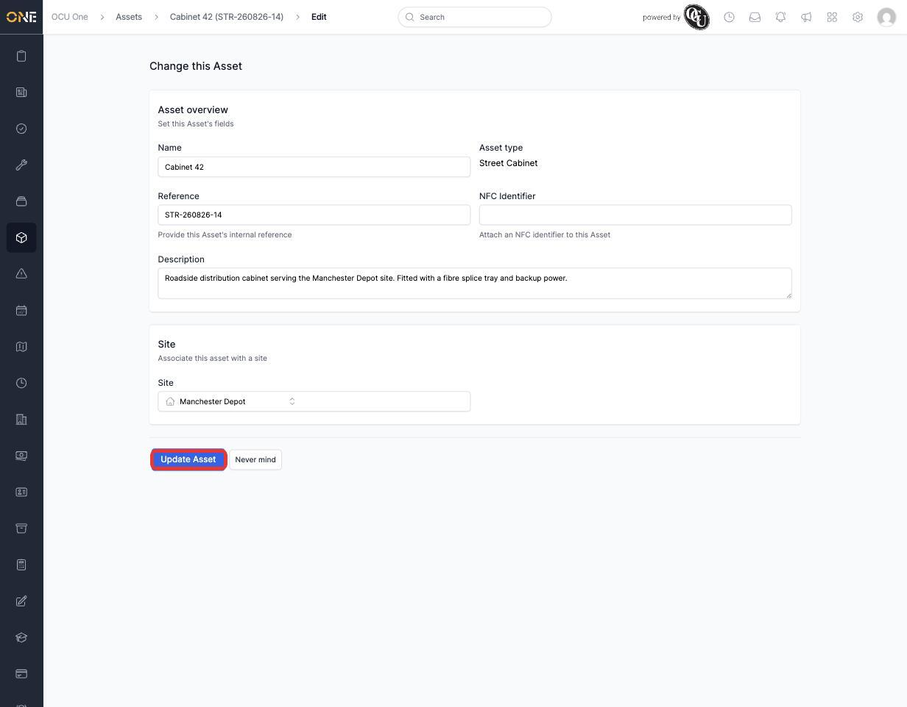
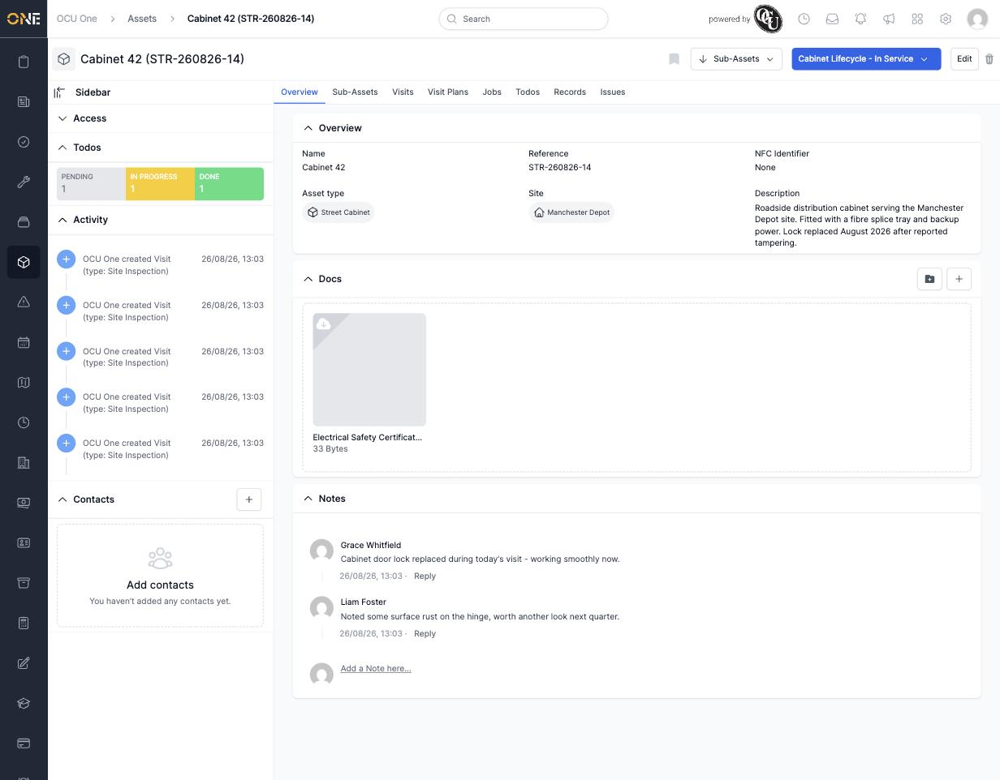
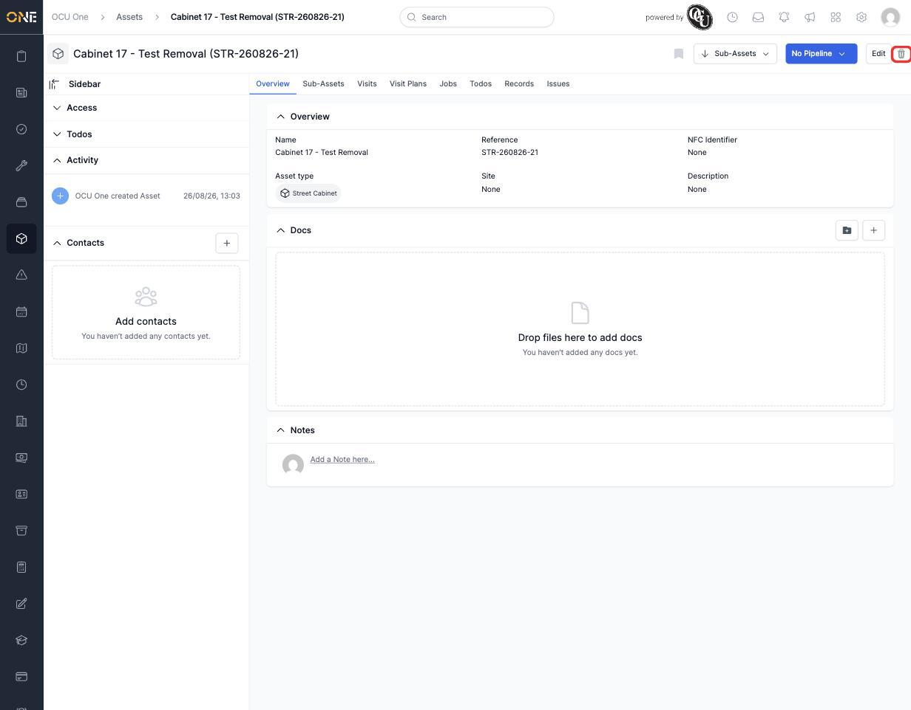
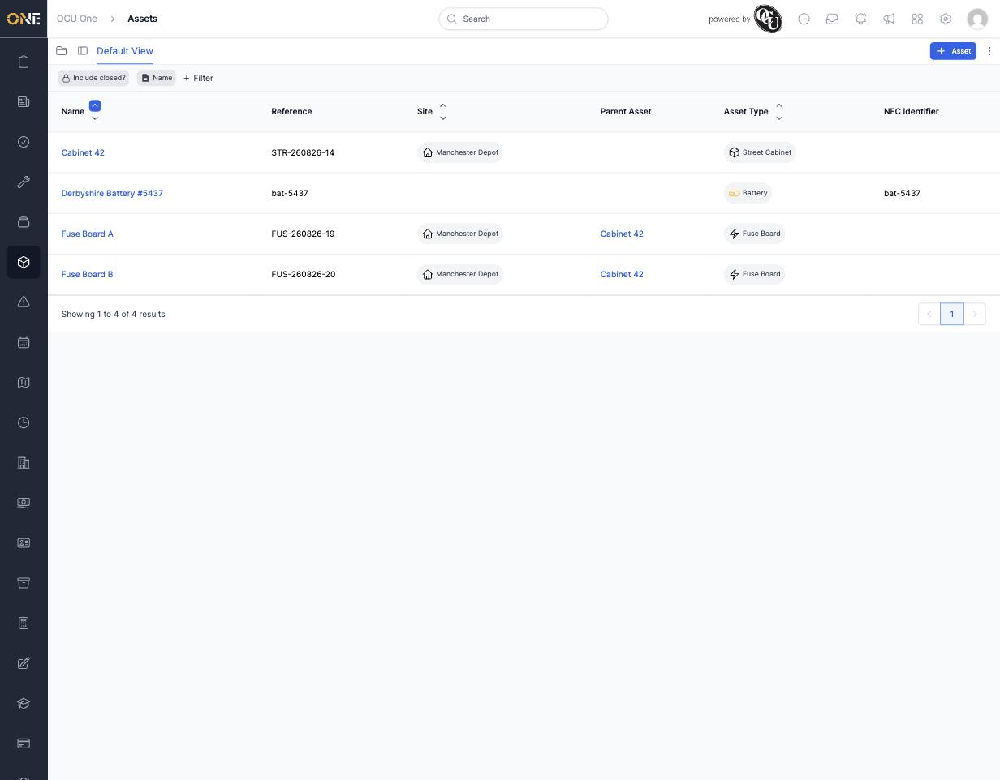

# Editing or deleting an asset

Asset details don't stay static forever — descriptions need updating as work gets done, and occasionally an asset needs removing altogether.

## Editing an asset

Open the asset and click **Edit** in the top-right corner. This opens the same form used to create the asset (see [[Creating an asset]]), pre-filled with its current Name, Reference, NFC Identifier, Description, and Site.

*Editing Cabinet 42 — every field from creation can be changed here. Click **Update Asset** to save.*

The change is reflected immediately on the asset's overview page:

*The description now includes a note about the lock being replaced.*

You won't see the Edit button — and can't save changes even by navigating there directly — if the asset is currently part of a booked job, or if its current pipeline stage is locked.

## Deleting an asset

Click the trash icon next to **Edit**. This is available under the same conditions as editing.

*Deleting isn't limited to assets with no children — "Cabinet 17 - Test Removal" here has two sub-assets, Pole T1 and Pole T2.*

Deleting an asset archives it rather than permanently erasing it, and — importantly — **archives every sub-asset nested inside it too**. Once confirmed, the asset (and its sub-assets) disappear from the default asset list, though administrators can still find archived assets by switching on **Include closed?** in the table view.

*Cabinet 17 - Test Removal and both its poles are gone from the default view after deletion.*

Think carefully before deleting an asset with sub-assets — there's no single-click way to bring back a whole branch of the tree once it's archived.
