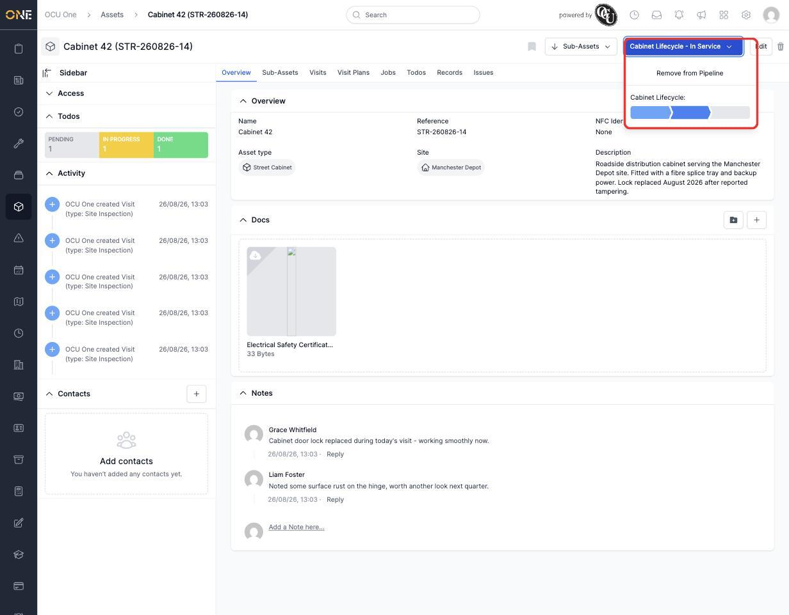
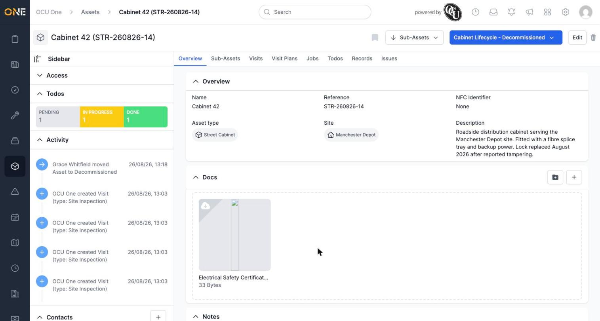
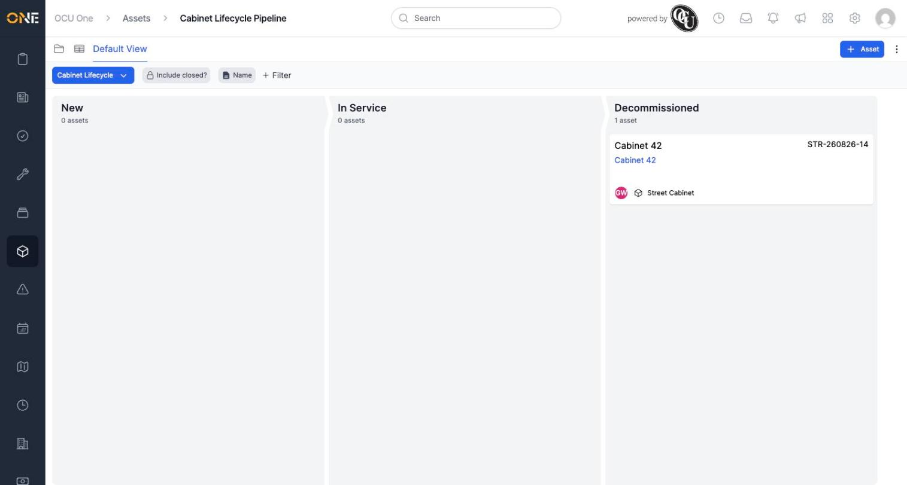

# Moving an asset through pipeline stages

If an asset's type is on a pipeline (see [[Viewing the assets board (pipeline)]]), you can move it from one stage to the next directly from its own page — no need to open the pipeline board just to update where it stands.

## Changing the stage

Open the asset and click the coloured stage button in the top-right — it shows the pipeline name and current stage together, for example "Cabinet Lifecycle - In Service". This opens a dropdown with a segmented progress bar showing every stage in the pipeline; the current one is highlighted.

*Cabinet 42 is currently in the "In Service" stage — the middle segment of three.*

Click the segment for the stage you want to move the asset to. The button updates immediately to reflect the new stage.

*Cabinet 42 is now "Decommissioned" — and the activity log on the left records exactly who moved it and when.*

## Seeing it reflected on the board

The same move shows up immediately on the pipeline board — the asset's card moves out of its old column and into the new one.

*Cabinet 42 now sits in the Decommissioned column, with New and In Service both empty.*

## Removing an asset from its pipeline

The same dropdown has a **Remove from Pipeline** option at the top, for taking an asset off the pipeline entirely rather than moving it to a different stage.
