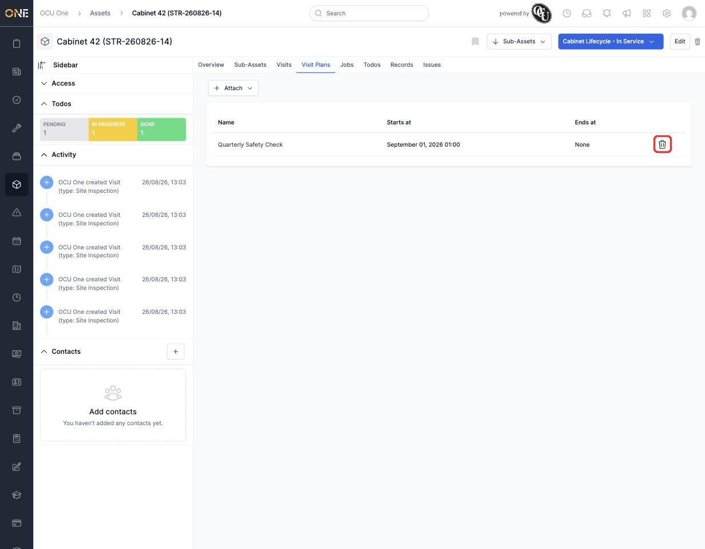
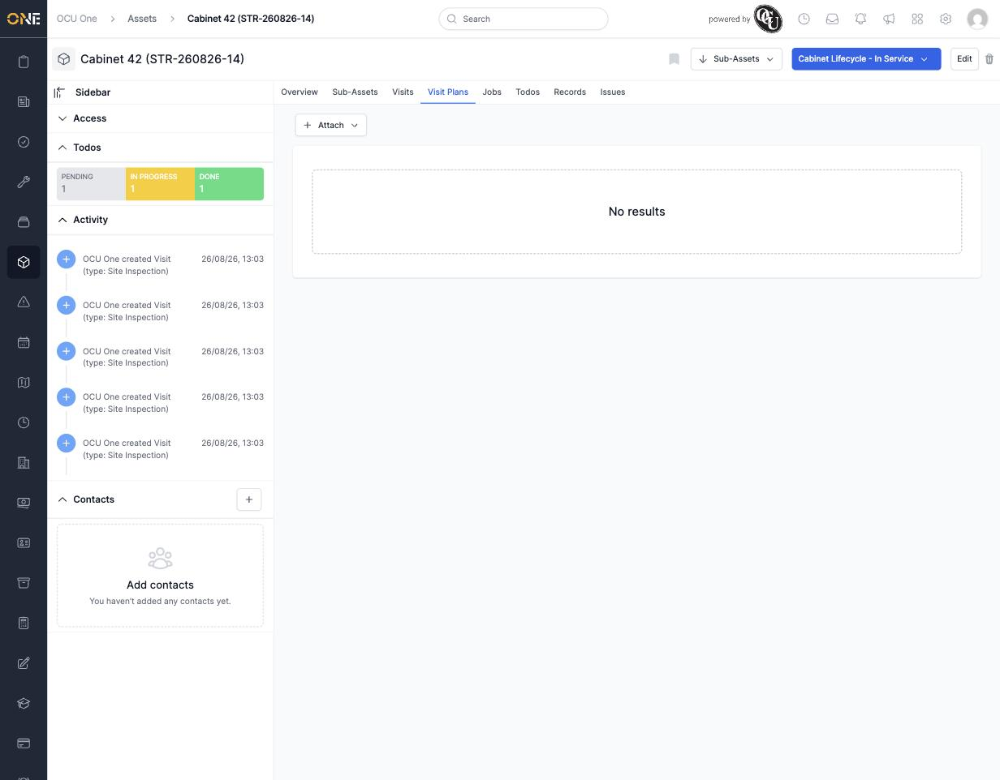

# Removing a visit plan from an asset

If a maintenance schedule no longer applies to a particular asset — it's been decommissioned, or you're moving it onto a different plan — you can detach the visit plan without affecting the plan itself or any other asset still using it.

## Where to find it

Open the asset, click the **Visit Plans** tab, and look at the right-hand end of the row for the plan you want to remove. A trash icon appears there for anyone with permission to edit the asset.

*Click the trash icon on the plan's row to detach it from this asset.*

Clicking it asks you to confirm, since this can't be undone from this screen — you'd need to re-attach the plan (see [[Scheduling a maintenance visit plan for an asset]]) if you remove it by mistake.

## After removing

The plan disappears from this asset's Visit Plans tab. The plan itself, and its attachment to any other assets, is unaffected.

*No visit plans left on Cabinet 42 — the Attach button is still there if you want to add one back.*

## Note

You won't see the trash icon if you don't have permission to edit the asset, or if the asset is currently part of a booked job — in that case, editing is locked until the job is no longer booked.
