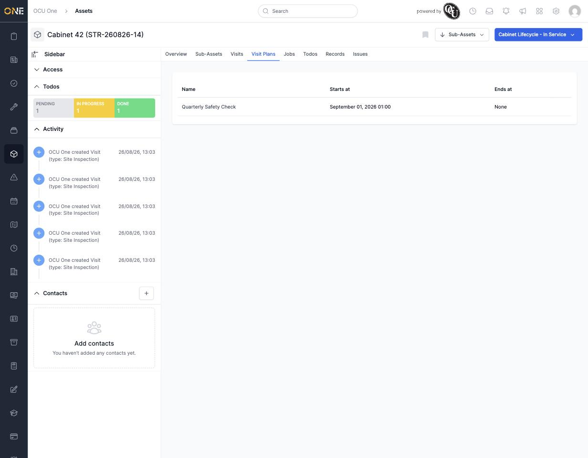

# Scheduling a maintenance visit plan for an asset

Rather than logging each visit to an asset one at a time, a **Visit Plan** lets you attach a recurring schedule to an asset once, and let it generate visits automatically going forward.

## Viewing an asset's visit plans

Open the asset and click the **Visit Plans** tab. Each row shows the plan's **Name**, when it **Starts at**, and when it **Ends at** (or "None" if it runs indefinitely).

*Cabinet 42 is on the "Quarterly Safety Check" plan, starting September 01, 2026, with no end date.*

## Attaching a plan

Click **+ Attach** above the list. You get two options:
- **New** — build a brand new visit plan from scratch (opens the visit plan creation flow).
- **Existing** — pick a visit plan that's already set up elsewhere and attach it to this asset too, so the same recurring schedule can cover many assets at once.

Whichever you choose, you'll set a **start date** for this asset specifically (and optionally an end date) — the plan itself defines how often visits get generated, but the dates here control when that schedule applies to this particular asset.

## Removing a plan later

See [[Removing a visit plan from an asset]] if a plan no longer applies to a given asset.
