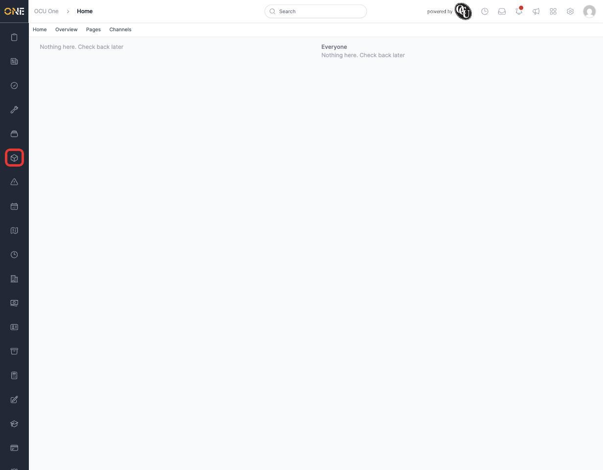
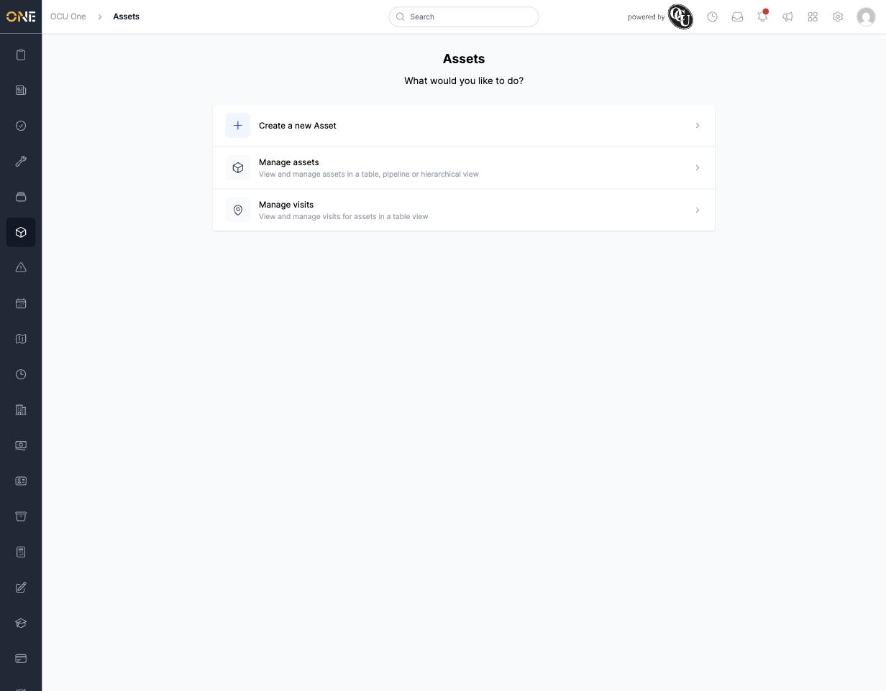

# Using the assets landing page

Assets are the physical things your organisation tracks and maintains — cabinets, vehicles, equipment, and so on. The assets landing page is the entry point for everything to do with them.

## Getting there

Click the assets icon in the left-hand sidebar.

## What's on this page

The landing page simply asks **"What would you like to do?"** and gives you three options:

- **Create a new Asset** — start adding a new asset to the system.
- **Manage assets** — view and manage your existing assets, in a table, pipeline, or hierarchical (tree) view.
- **Manage visits** — view and manage visits scheduled against your assets, in a table view.

Click any of these to go straight to that section. If you don't have permission to create new assets, the "Create a new Asset" option won't appear on your page at all.
