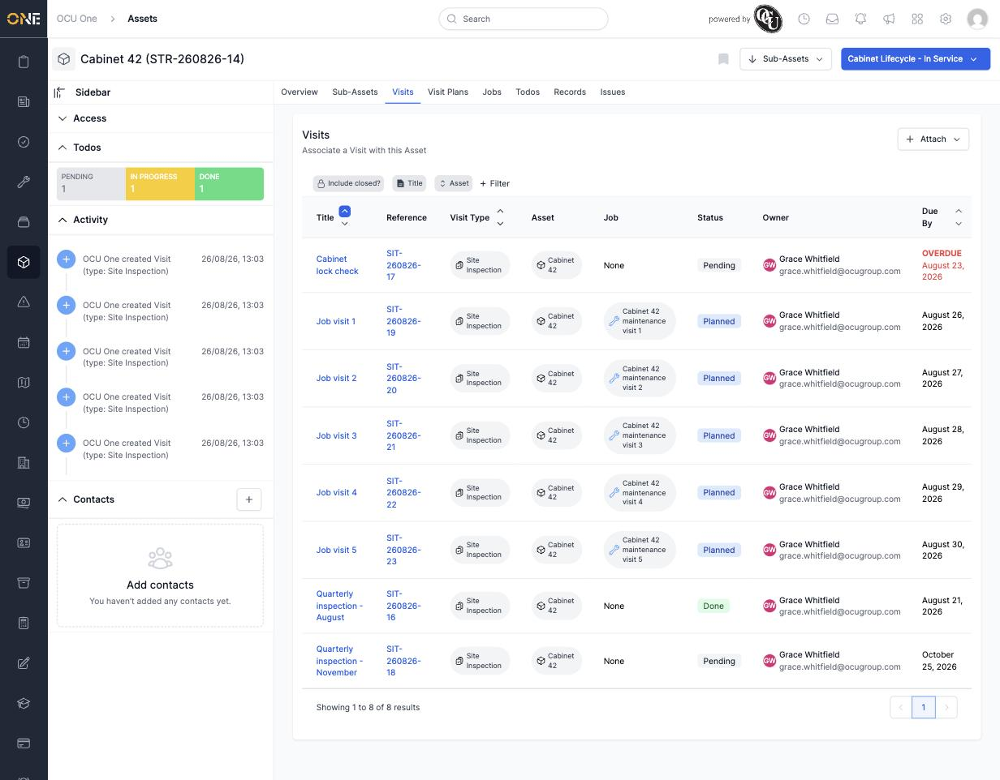

# Viewing an asset's Visits tab

A **Visit** records a trip out to an asset — an inspection, a check, any occasion someone needs to physically attend it. The **Visits** tab on an asset shows every visit logged against it, past, present and upcoming.

## Reading the list

Open the asset and click **Visits**. Each row shows:

- **Title** and **Reference** — what the visit was for, and its auto-generated ID.
- **Visit Type** — the category of visit (here, "Site Inspection").
- **Job** — if the visit was carried out as part of a booked job, that job appears here; otherwise it shows "None".
- **Status** — Pending, Planned, Failed, or Done.
- **Owner** — who's responsible for the visit.
- **Due By** — when the visit is/was expected, shown in red as **OVERDUE** once that date has passed and the visit still isn't marked Done.

*Eight visits on Cabinet 42: one overdue ("Cabinet lock check"), one already completed ("Quarterly inspection - August"), one still pending in the future ("Quarterly inspection - November"), and five more tied to booked jobs.*

## Filtering

Use **Include closed?**, the **Title** search, the **Asset** filter, or **+ Filter** to narrow the list down — handy once an asset has built up a long visit history.

## Attaching a new visit

Click **+ Attach** to log a new visit against this asset. See [[Scheduling a maintenance visit plan for an asset]] if you want visits to be created automatically on a recurring basis instead of logging them one at a time.
