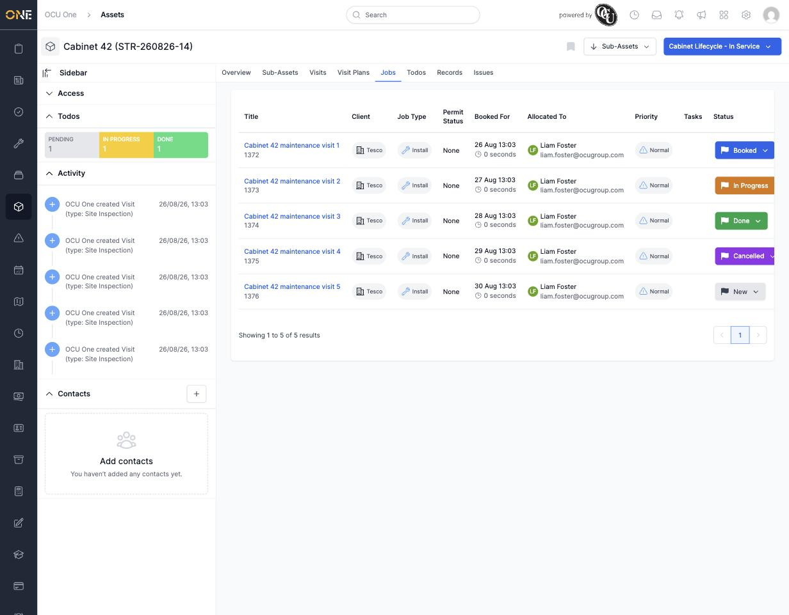

# Viewing an asset's linked jobs

An asset can end up connected to several jobs over its lifetime — whenever a visit to that asset is carried out as part of a booked job, that job shows up here. The **Jobs** tab gives you that full history in one place, without needing to check every visit individually.

## Reading the list

Open the asset and click **Jobs**. Each row shows:

- **Title** and job number.
- **Client** — who the job is being done for.
- **Job Type** — the category of work (here, "Install").
- **Permit Status**, if the job requires one.
- **Booked For** — the scheduled date/time.
- **Allocated To** — the engineer assigned.
- **Priority**.
- **Tasks** — a count of sub-tasks on the job, if any.
- **Status** — a coloured badge: Booked, In Progress, Done, Cancelled, New, and so on.

*Five jobs tied to Cabinet 42 via its visits, spanning every stage from newly created through to done and cancelled.*

## Why a job might not show up here

Jobs only appear once a **visit** on this asset has been linked to them — a job with no visit against this specific asset won't show up on its Jobs tab, even if the asset was involved some other way. See [[Viewing an asset's Visits tab]] for where that link is made.

## Clicking through

Click a job's title to open the job itself, where you can see its full detail, tasks, and history.
