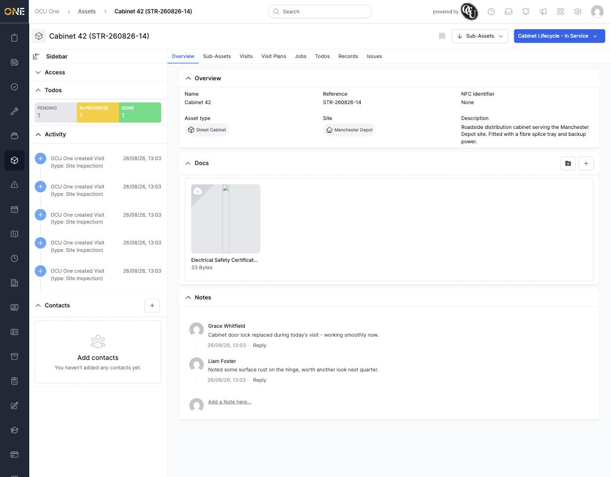

# Viewing an asset's overview page

Every asset has its own page bringing together its details, files, notes, and recent activity in one place — the natural starting point whenever you open an asset.

## Layout

Along the top sit the asset's tabs — **Overview**, **Sub-Assets**, **Visits**, **Visit Plans**, **Jobs**, **Todos**, **Records**, **Issues** — each covered in its own guide. Overview is where you land by default.

A sidebar on the left shows, at a glance:
- **Access** — who owns and can see this asset (collapsed by default).
- **Todos** — a quick count of open todos by status.
- **Activity** — a running log of what's happened to this asset (created, visits added, status changes, and so on), most recent first.
- **Contacts** — any people associated with the asset who aren't OCU One users themselves.

The main panel shows:
- **Overview** — Name, Reference, NFC Identifier, Asset type, Site, and Description.
- **Docs** — any files attached to the asset; drag a file straight onto this panel to add one.
- **Notes** — a simple comment thread for anyone with access to leave notes on the asset.

*Cabinet 42's overview: description and site on the left, an attached PDF under Docs, and two notes underneath from Grace Whitfield and Liam Foster.*

## Where the pipeline stage shows

If the asset's type is on a pipeline, a coloured stage button appears in the top-right next to the tabs (here, "Cabinet Lifecycle - In Service"). See [[Viewing the assets board (pipeline)]] and [[Moving an asset through pipeline stages]] for what that means and how to change it.

## What's covered elsewhere

- Adding or removing sub-assets: [[Viewing and adding sub-assets]]
- Visits and visit plans: [[Viewing an asset's Visits tab]], [[Scheduling a maintenance visit plan for an asset]]
- Jobs the asset has been part of: [[Viewing an asset's linked jobs]]
- Todos, records and issues: [[Viewing an asset's to-dos]], [[Viewing an asset's records]], [[Viewing and raising issues against an asset]]
- Editing the details shown here, or deleting the asset entirely: [[Editing or deleting an asset]]
