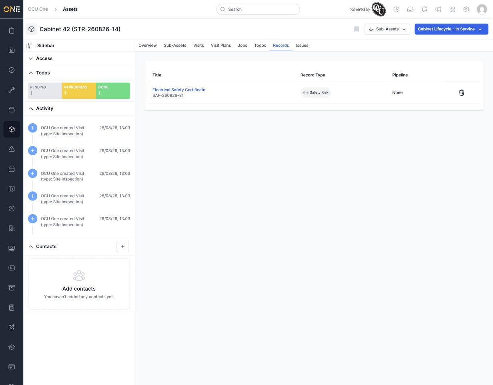

# Viewing an asset's records

Records hold structured documentation attached to something — certificates, reports, forms — and the **Records** tab on an asset shows every record that's been linked to it.

## Reading the list

Open the asset and click **Records**. Each row shows the record's **Title**, its **Record Type**, and the **Pipeline** it's on (if the record type is tracked through one).

*Cabinet 42 has one linked record: "Electrical Safety Certificate," categorised under the "Safety Risk" record type.*

Click the record's title to open it and see its full detail, fields, and any documents attached to the record itself (separate from the asset's own Docs section on its overview page).

## Detaching a record

The trash icon at the end of a record's row unlinks it from this asset — the record itself isn't deleted, just its connection to this particular asset.

## Where records come from

A record gets linked to an asset either by creating it directly from the asset (if that option is available for the record types your organisation uses), or by attaching an existing record from the record's own side.
