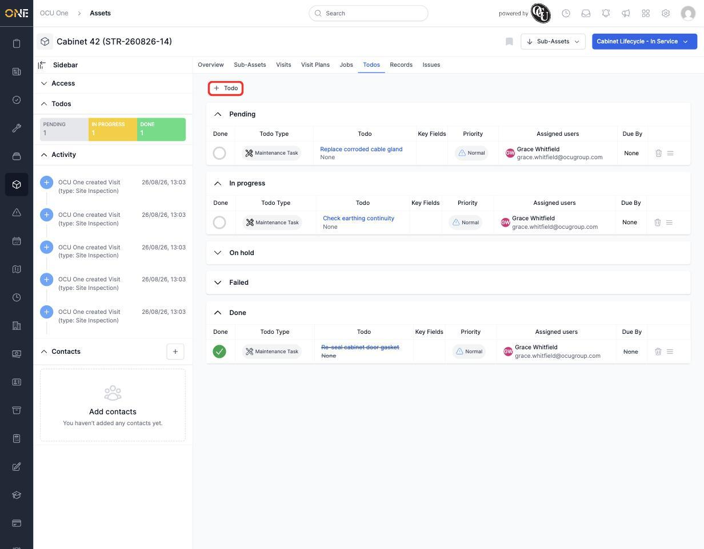

# Viewing an asset's to-dos

Todos are small, trackable tasks tied to an asset — a repair, a check, anything that needs doing but doesn't warrant a full job or visit of its own. The **Todos** tab groups them by status so you can see what's outstanding at a glance.

## Reading the list

Open the asset and click **Todos**. Todos are grouped into five collapsible sections — **Pending**, **In progress**, **On hold**, **Failed**, and **Done** — each showing a count. Within a section, each row shows the **Todo Type**, the todo's name, any **Key Fields**, **Priority**, who it's **Assigned** to, and its **Due By** date. Ticking the circle in the Done column marks a todo complete.

*Three todos on Cabinet 42: one pending ("Replace corroded cable gland"), one in progress ("Check earthing continuity"), and one already done ("Re-seal cabinet door gasket," shown struck through).*

The sidebar on the asset's overview page also shows a quick summary of these counts, so you don't need to open the tab just to see how many todos are outstanding.

## Adding a todo

Click **+ Todo** to create a new one against this asset. You'll be asked for a **Todo Type** (set up in advance, similar to asset types), a name, priority, and who it's assigned to.
