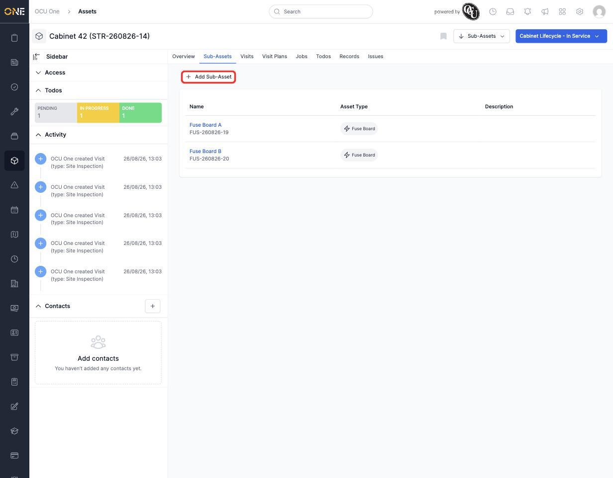

# Viewing and adding sub-assets

Some assets are made up of smaller parts worth tracking individually — a cabinet's fuse boards, a pole's fittings. The **Sub-Assets** tab on an asset's page lists exactly those.

## Viewing sub-assets

Open the asset and click the **Sub-Assets** tab. Each sub-asset appears as a row with its **Name**, **Asset Type**, and **Description**, and clicking a row's name takes you straight to that sub-asset's own page (where it can have its own sub-assets, tabs, and everything else a top-level asset has).

*Cabinet 42 has two sub-assets, both Fuse Boards.*

## Adding a sub-asset

Click **+ Add Sub-Asset**. This takes you through the same type-picker-then-form flow as creating any other asset (see [[Creating an asset]]), except the **Parent Asset** is already filled in for you — the new asset is automatically nested under the one you started from.

## Why this matters

Nesting assets this way means the tree view (see [[Browsing assets in the drilldown tree view]]) shows the real physical relationship between them, and archiving a parent asset archives everything nested inside it too (see [[Editing or deleting an asset]]).
