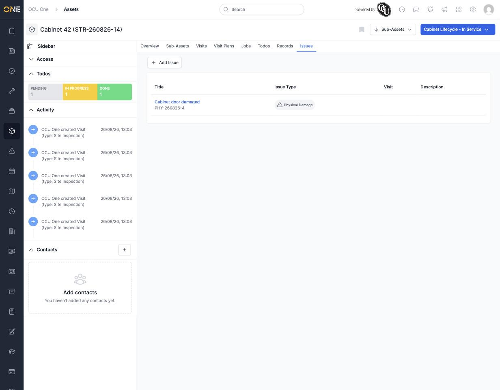
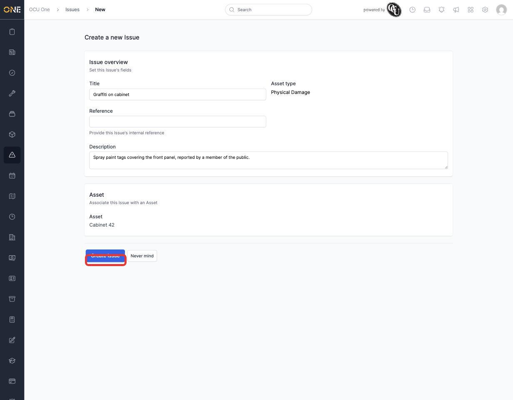
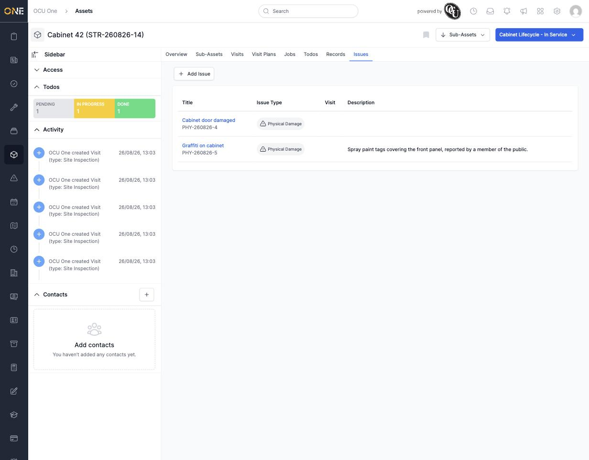

# Viewing and raising issues against an asset

An **Issue** flags a problem with an asset — damage, a fault, anything that needs attention and tracking through to resolution. The **Issues** tab on an asset shows every issue raised against it.

## Viewing existing issues

Open the asset and click **Issues**. Each row shows the issue's **Title**, its **Issue Type**, which **Visit** (if any) it was raised during, and its **Description**.

*One issue already on record for Cabinet 42.*

## Raising a new issue

Click **+ Add Issue**. As with assets, you first pick the **Issue Type** — this determines what the issue gets categorised as and which fields appear. Then fill in:

- **Title** — a short summary of the problem.
- **Reference** — optional; auto-generated if left blank.
- **Description** — the detail of what's wrong.

The **Asset** is pre-filled with the one you started from.

*Raising a second issue, "Graffiti on cabinet," under the Physical Damage type. Click **Create Issue** to save it.*

Once created, it joins the list alongside any existing issues:

*Both issues now visible on Cabinet 42.*

## Following up

Click an issue's title to open it and track it through to resolution — issues have their own lifecycle, comments, and fields separate from the asset itself.
