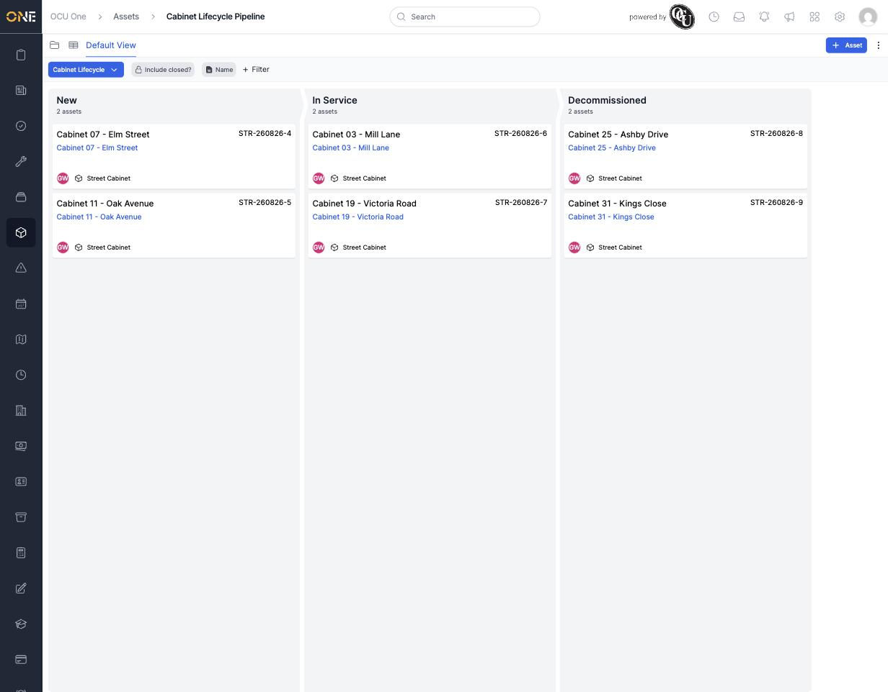

# Viewing the assets board (pipeline)

Some asset types are tracked through a lifecycle — stages an asset moves through over time, like New, In Service, and Decommissioned. Where that's set up, the **pipeline board** gives you a Kanban-style view of every asset at each stage, instead of a plain list.

## Opening the board

From the sidebar, open **Assets**, then look for a pipeline name button above the list (it sits alongside the view's other quick filters). Clicking it — or navigating to the pipeline directly — shows every asset of that type as a card, grouped into columns by its current stage.

*The "Cabinet Lifecycle" board. Each column is a stage, and the count under the stage name tells you how many assets currently sit there.*

Each card shows the asset's name, its reference, its asset type, and who owns it. Clicking a card's name takes you straight to that asset's own detail page.

## If more than one pipeline exists

If your organisation has set up more than one pipeline for assets, the pipeline name button in the top-left becomes a dropdown — click it to switch between them. With only one pipeline configured, as here, there's nothing to switch between.

## Filtering the board

The same **Include closed?** toggle and **+ Filter** options from the list views are available here too, so you can narrow the board down to a specific site, asset type, or name — useful once a pipeline has too many cards per column to scan comfortably.

## Moving an asset between stages

The board is for viewing where things stand — moving an asset from one stage to the next is covered separately in [[Moving an asset through pipeline stages]].
