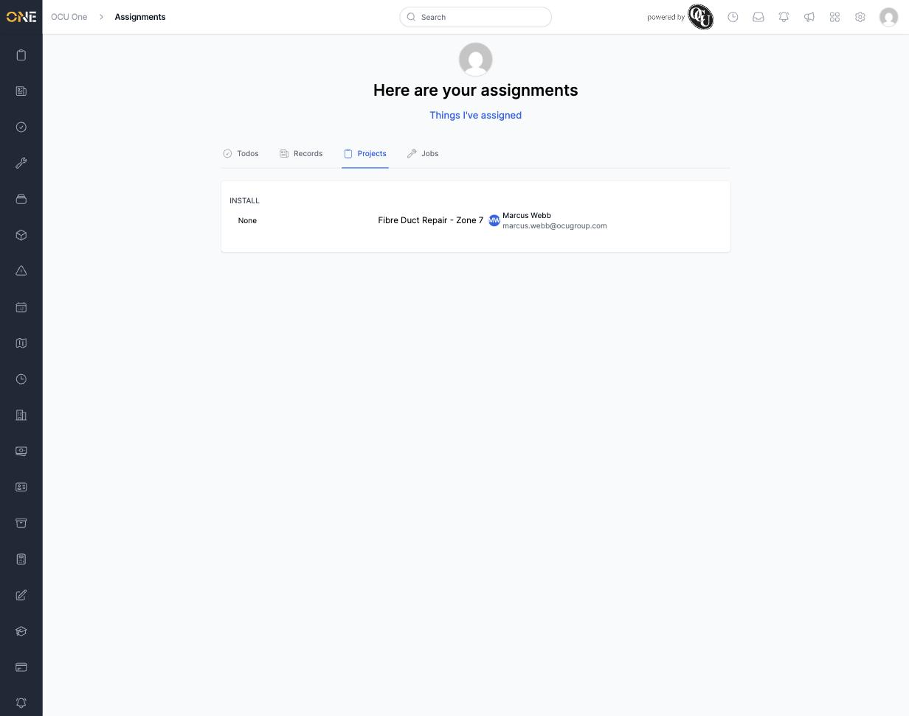

# Viewing assigned projects in your Assignments inbox

Your Assignments inbox is a personal view of everything that's been assigned specifically to you, across the app. The **Projects** tab shows just the projects you've been assigned to — a quick way to see what you need to work on without filtering the full Projects list.

## What's on this page

Projects are grouped by project type, and each one shows its current pipeline stage alongside who it's assigned to:

A project with no pipeline stage set shows "None" where the stage would normally appear.

The Assignments inbox has three other tabs alongside Projects — **Todos**, **Records**, and **Jobs** — each showing that same "assigned to me" view for its own type of record.

## Switching to what you've assigned to others

Above the tabs is a **"Things I've assigned"** link. Clicking it switches the whole inbox — including the Projects tab — from "assigned to me" to projects you own that you've assigned to someone else, and the page title changes to "Things you've assigned" with a **"My Assignments"** link to switch back.

At the time of writing, this toggle does not actually show anything on the Projects tab (or any other tab) even when it should — see the known bug `Zz - Known Bugs/assigned-by-me-tab-always-shows-nothing-here.md` for details.

## Things to know

- Only projects still in an open stage show up here — once a project moves to a closed pipeline stage, it drops off this list.
- This is a personal view: it only ever shows what's assigned to you, not your whole team's work. For a team-wide view, use the main Projects list instead.
