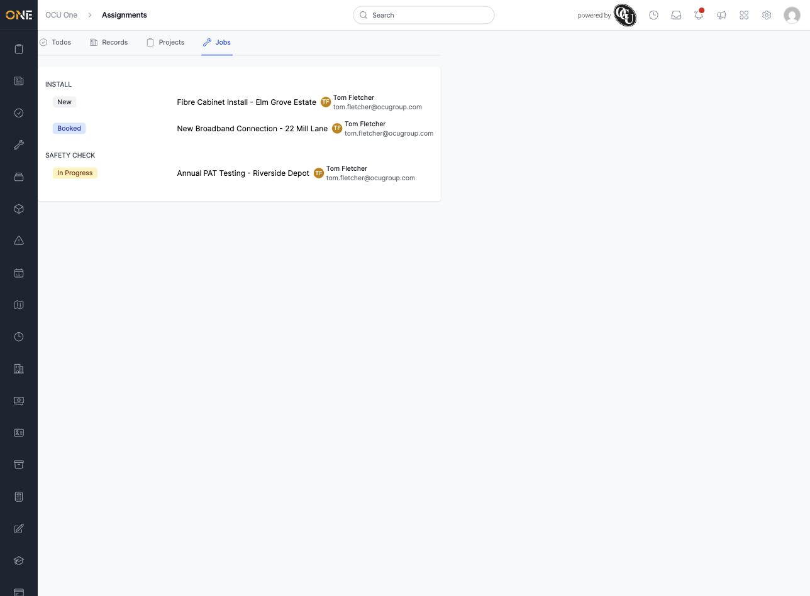

# Viewing my assigned jobs

Your Assignments inbox is a personal view of everything that's been assigned specifically to you, across the app. The **Jobs** tab shows just the jobs you've been assigned to — a quick way to see your own workload without filtering the full Jobs list.

## What's on this page

Jobs are grouped by job type, and each one shows its current status as a coloured badge, along with who it's assigned to:

The Assignments inbox has three other tabs alongside Jobs — **Todos**, **Records**, and **Projects** — each showing that same "assigned to me" view for its own type of record.

## Things to know

- Only jobs that are still open show up here — once a job is completed, cancelled, or otherwise closed out, it drops off this list.
- This is a personal view: it only ever shows what's assigned to you, not your whole team's work. For a team-wide view, see the main Jobs list or the scheduling board instead.
