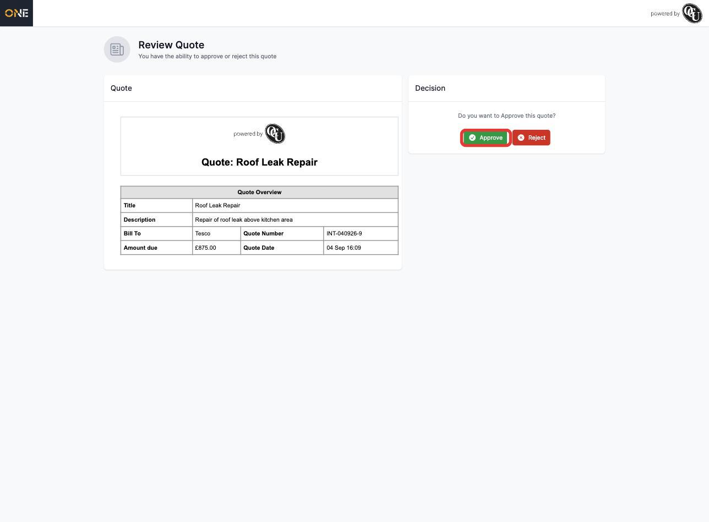
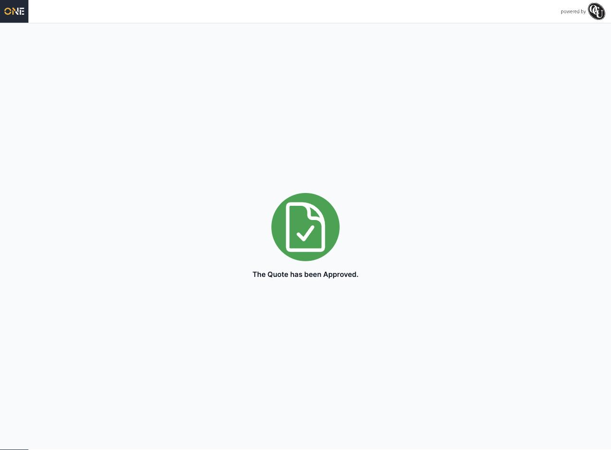

# Approving or rejecting a quote via a client portal link

If a business has sent you a quote through OCU One, you don't need an account to review it — you'll be sent a link by email that takes you straight to the quote. This guide covers what that page looks like and how to respond.

## Opening your quote

Opening the link takes you straight to a **Review Quote** page. No sign-in is needed — the link itself identifies which quote is yours.

The page is split into two parts: the quote itself on the left, and your decision on the right.

The **Quote** panel shows the details you're being asked to approve:
- **Title** and **Description** of the work
- **Bill To** — who the quote is addressed to
- **Quote Number** and **Quote Date**
- **Amount due**

## Approving or rejecting

In the **Decision** panel, you're asked **"Do you want to Approve this quote?"** with two buttons:

- **Approve** — accept the quote as shown
- **Reject** — decline the quote

Clicking either one asks you to confirm ("Are you sure you want to Approve/Reject this quote?") before it's final — this can't be undone from this page, so make sure you've checked the quote details first.

## After you decide

Once you've made a decision, the page updates to a simple confirmation screen. If you approved, it shows a green check with **"The Quote has been Approved."**:

Rejecting shows the same style of confirmation, with a red icon and "The Quote has been Rejected." instead.

## Things to know

- If you revisit the link after you've already responded, you'll see the same confirmation screen rather than the original quote — your decision has already been recorded.
- If the quote isn't ready yet (for example, it's still being prepared on the business's side), the link will show a "Sorry, this quote isn't ready yet. Check back later" message instead of the quote details.
- The link is personal to your quote — if the page can't match it to a valid quote, you'll be told the link couldn't be used, so double-check you've copied the whole link from the email if that happens.
