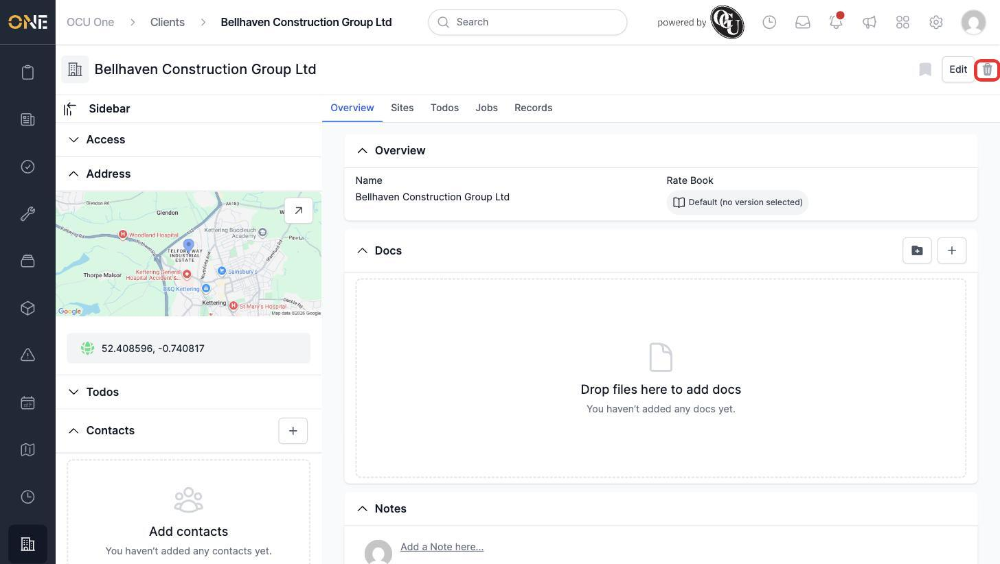
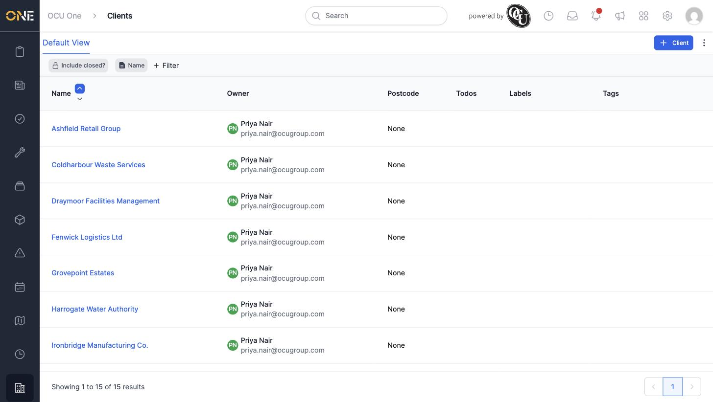

# Archiving a client

If a client is no longer active — for example, all their work is finished and there's nothing outstanding — you can archive it so it's removed from the active Clients list.

1. Open the client's overview page.

2. Click the trash icon in the top right.

   

3. Confirm the prompt asking "Are you sure you want to delete this?".

4. The client disappears from the Clients list.

   

## Things to know

- This doesn't permanently delete the client's data — it archives it, which is why the app calls this "archiving" even though the button shows a trash icon and the confirmation says "delete".
- A client with open jobs linked to it may not archive successfully — clear or complete those first if you run into an error.
- Once archived, a direct link to the client's page will no longer work.
