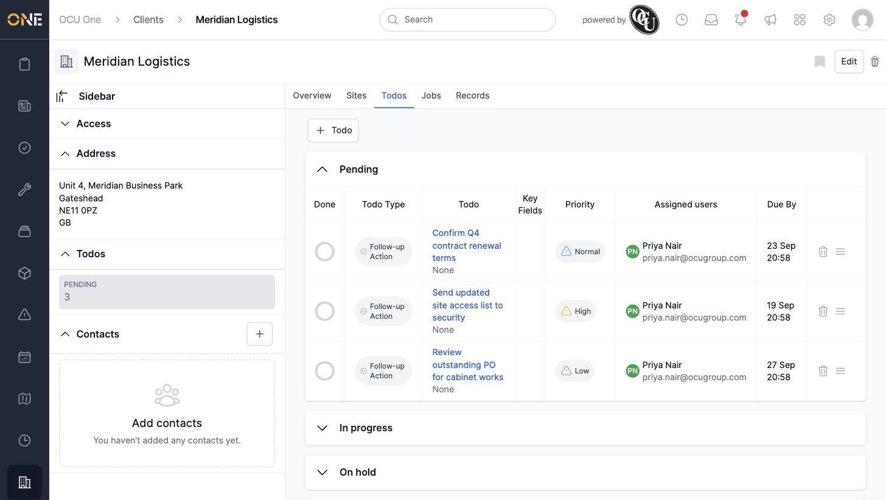
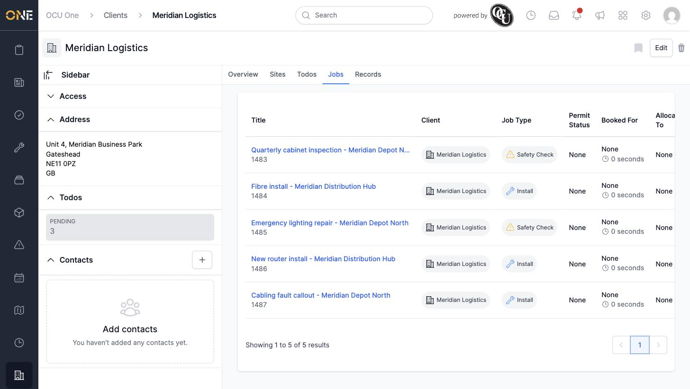
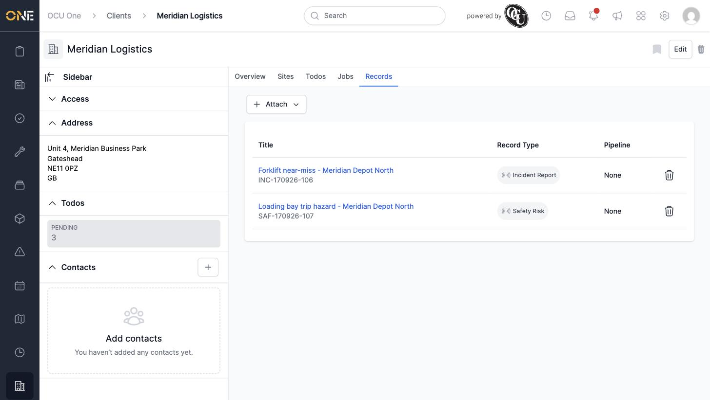

# Client overview, todos, jobs, and linked records tabs

Once you open a client, its tabs let you see everything about that client at a glance — its details, outstanding work, jobs, and any records linked to it.

## Overview

The **Overview** tab shows the client's name and rate book, along with its Docs and Notes sections. The sidebar down the left also shows the client's Access panel, Address, a Todos summary, and its Contacts.

## Todos

The **Todos** tab lists every to-do raised against this client, grouped by status (Pending, In progress, On hold, and so on). Each row shows the todo type, its priority, who it's assigned to, and when it's due. Click **+ Todo** to add a new one.

## Jobs

The **Jobs** tab lists every job booked for this client, showing the job type, permit status, and who (if anyone) it's booked for and allocated to. Click a job's title to open it.

## Records

The **Records** tab lists any records attached to this client — surveys, inspections, incident reports, and so on. Click **+ Attach** to link an existing record, or click a record's title to open it.

## Things to know

- The sidebar's Todos summary only shows a pending count — open the Todos tab itself to see the full breakdown by status.
- A record's **Pipeline** column shows "None" if the record's type isn't attached to a pipeline.
- Deleting a job or todo from these tabs doesn't affect the client itself, only that individual record.
