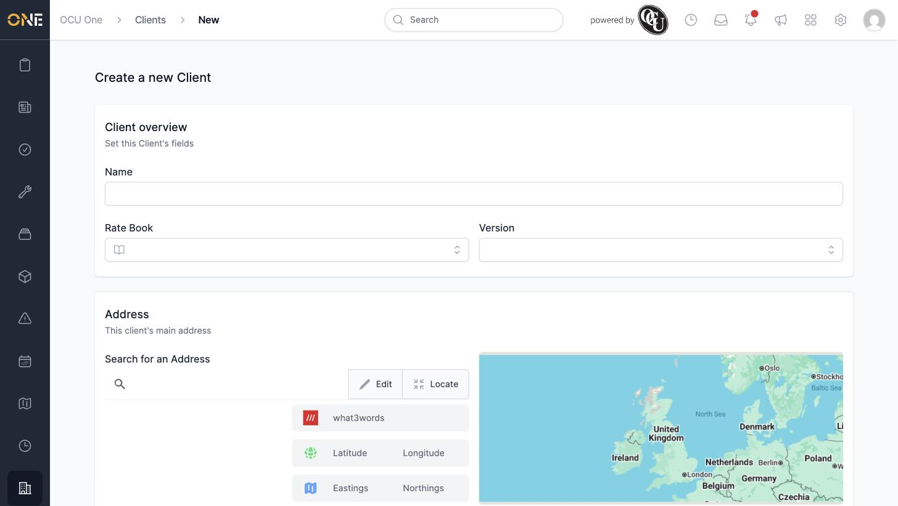
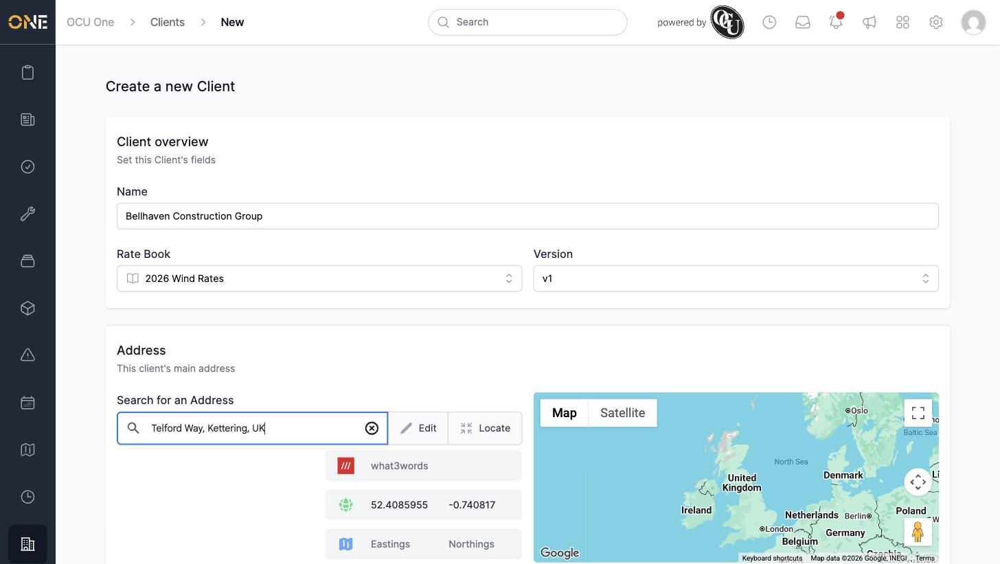
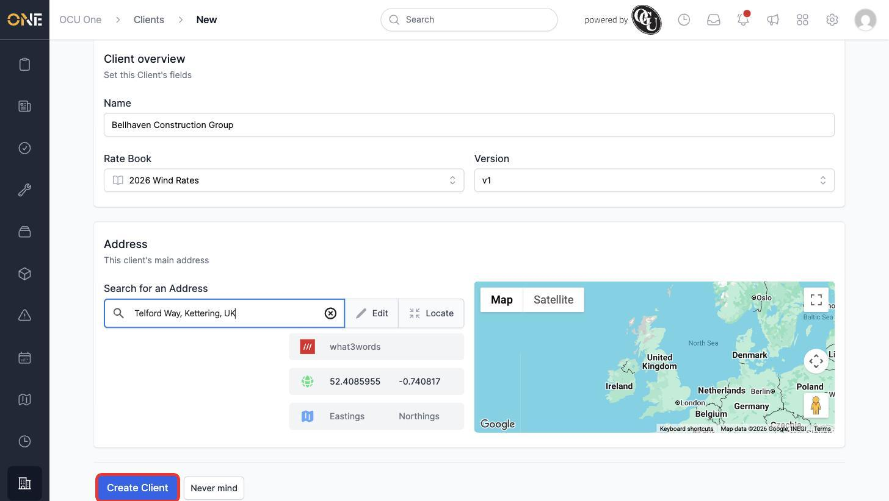
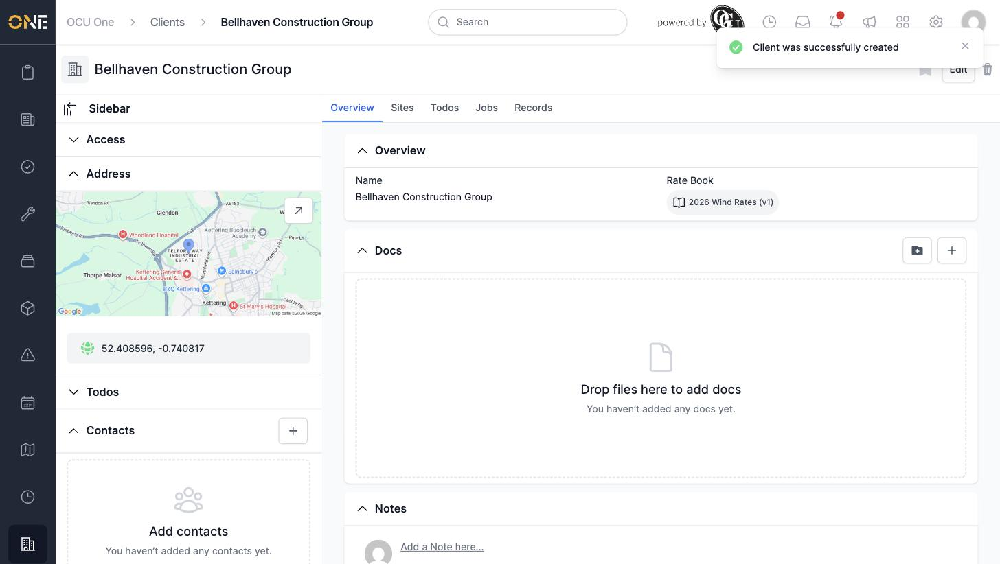
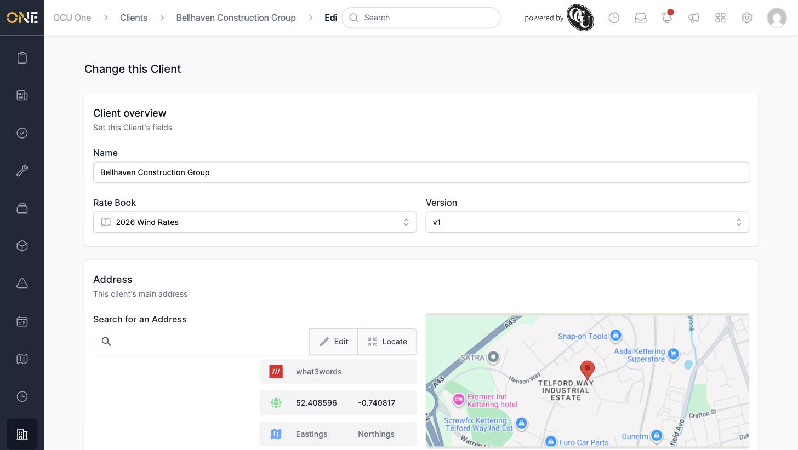
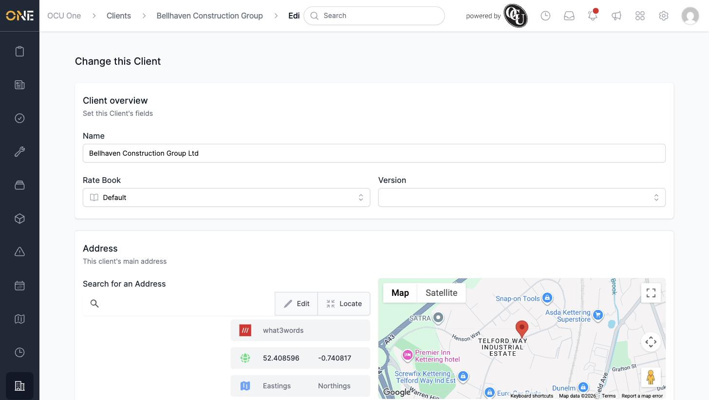
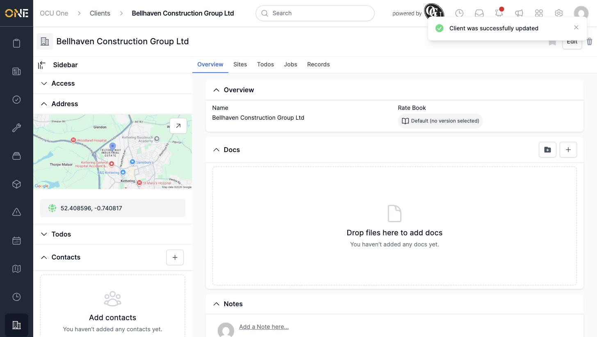

# Creating and editing a client

This guide covers adding a new client to OCU One, and updating a client's details afterwards.

## Creating a new client

Open **Clients** from the sidebar and click **+ Client**. This opens the new client form.

Fill in:

- **Name** — the client's company name.
- **Rate Book** and **Version** — the rate book this client's work should be priced against, and which version of it. Both are optional.
- **Address** — start typing in the **Search for an Address** box and pick a match from the suggestions. The map, latitude/longitude, and (if available) what3words fill in automatically.

Once an address is selected, the map updates to show the pin.

Click **Create Client** to save.

## Editing an existing client

Open the client and click **Edit** in the top-right corner. This opens the same form pre-filled with the client's current details, and the address map is now zoomed into the client's actual location.

Change whatever needs updating — for example, the name, or the rate book and version. Rate books without any versions (like "Default") don't show a Version field.

Click **Update Client** to save your changes.

## Things to know

- The client's name is the only required field — everything else can be left blank and filled in later.
- Switching to a rate book with no versions (like "Default") clears any previously selected version.
- Editing a client doesn't affect any jobs, sites, or records already linked to it — only the client's own details change.
