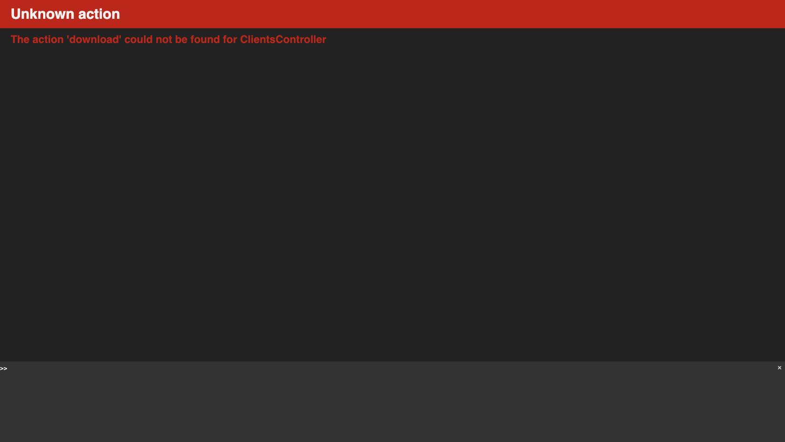

# Downloading a client PDF summary

This guide covers downloading a PDF summary of a client — but confirmed live, this doesn't currently work anywhere in the app.

## What's there today

A client's page has no Download or PDF option anywhere — not in the header buttons next to Edit and Delete, not on the Overview tab, and not in the sidebar.

## What happens if you try

The only way to reach a client PDF download is by typing the address directly into the browser (`/clients/:id/pdf/download`) — nothing in the app links to it. Doing so doesn't produce a PDF; it crashes with an application error.

## Things to know

- There is currently no way to download a PDF summary of a client.
