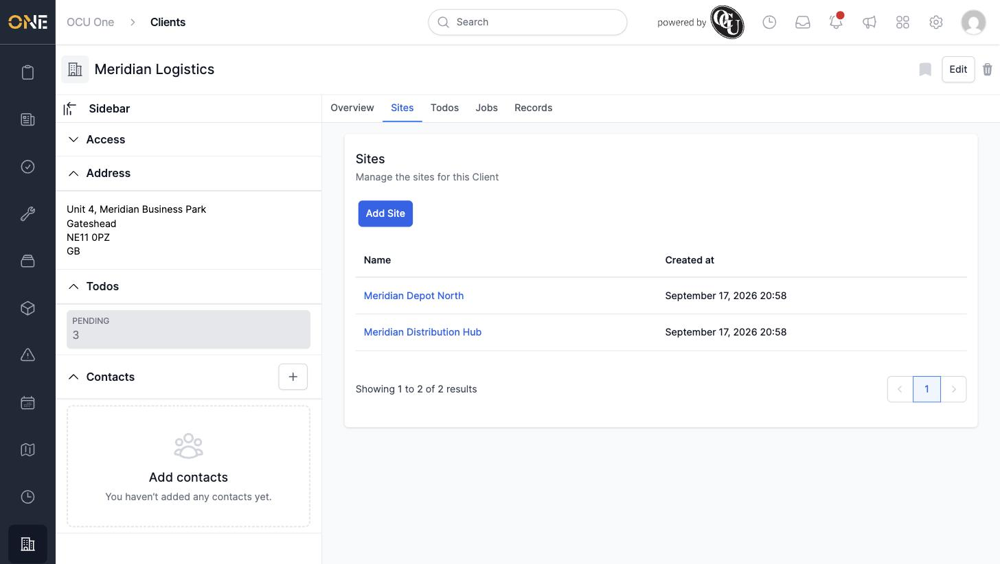
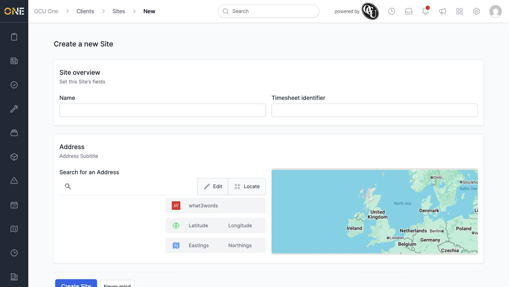
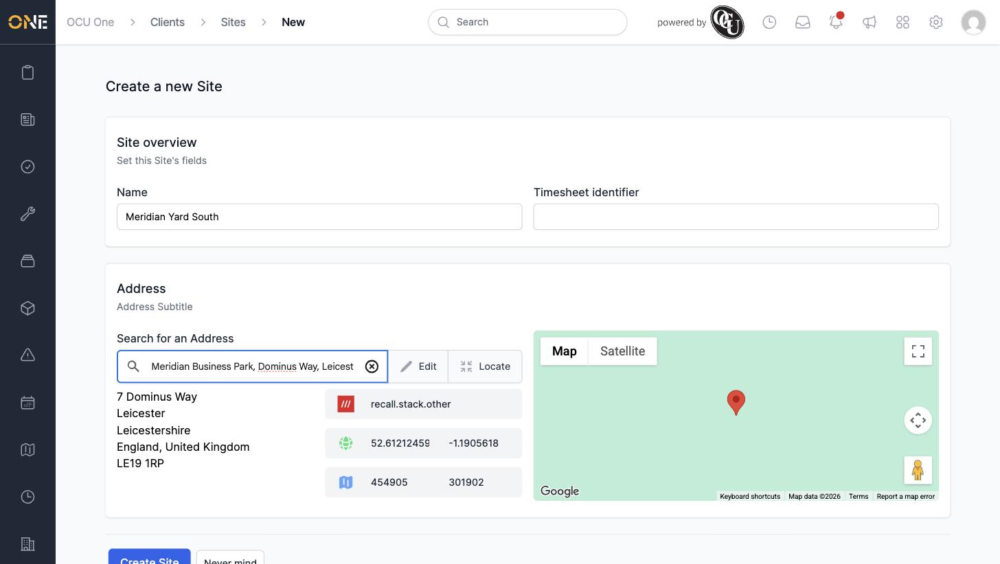
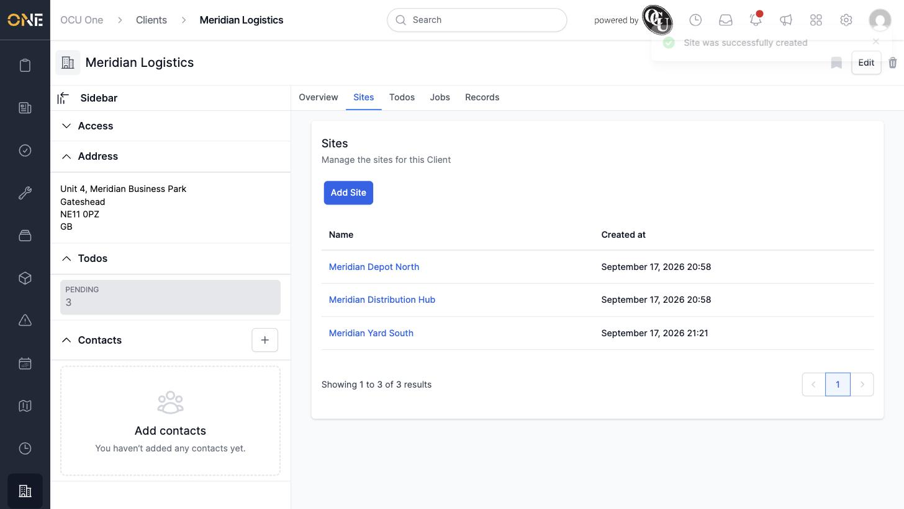
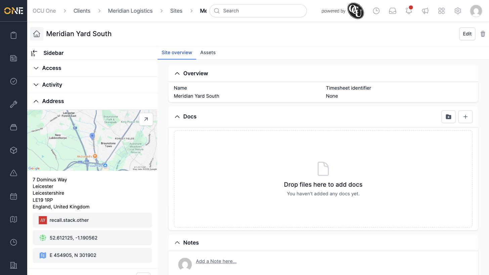

# Managing a client's sites

**Sites** are the specific locations where a client operates or where work takes place — a depot, a distribution hub, a retail unit, and so on. This guide covers viewing, adding, and removing a client's sites.

## Viewing a client's sites

Open a client and click the **Sites** tab. It lists every site attached to the client, with its name and when it was created.

## Adding a site

Click **Add Site** to open the new site form.

Fill in:

- **Name** — the site's name.
- **Timesheet identifier** — optional, used to match this site up with timesheet records.
- **Address** — search for and select the site's address the same way as a client's address.

Click **Create Site** to save it.

## Opening a site

Click a site's name to open its own page, which has its own **Site overview** and **Assets** tabs, plus Edit and Delete buttons in the top-right corner.

## Removing a site

Click the trash icon in the top-right corner of a site's page to delete it. A confirmation dialog ("Are you sure you want to delete this?") appears before anything is removed — confirming deletes the site permanently.

## Things to know

- A site's address is searched and selected the same way as any other address field in the app.
- Deleting a site is permanent — there's no separate archive step first.
