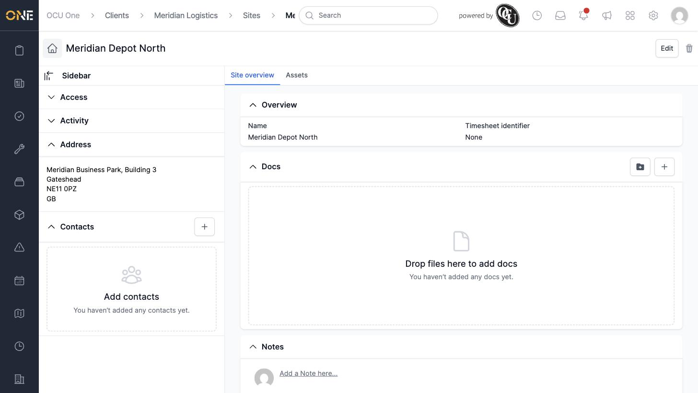
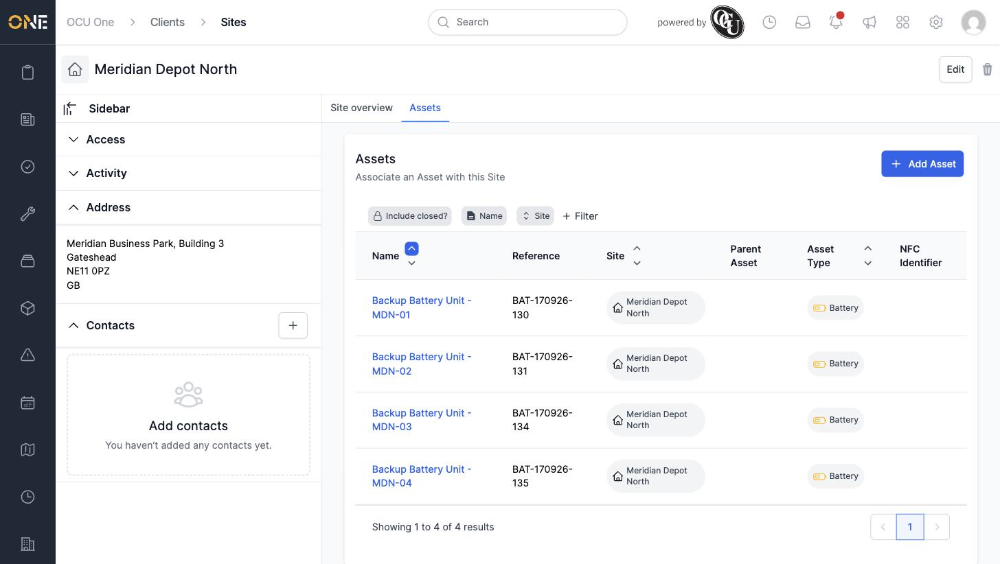

# Site detail — overview and linked assets

Opening a site from a client's Sites tab takes you to its own page, with an **Site overview** tab and an **Assets** tab.

## Site overview

Shows the site's name, timesheet identifier, address (with a map), Docs, and Notes — the same layout as a client's own Overview tab. The sidebar also shows the site's Access panel and Activity feed.

## Assets

The **Assets** tab lists every asset registered at this site — for example, on-site equipment like batteries or routers. Each row shows the asset's reference, its site, any parent asset, its asset type, and NFC identifier. Click **+ Add Asset** to register a new one, or use the filters above the table (**Include closed?**, **Name**, **Site**, **+ Filter**) to narrow the list.

## Things to know

- Click an asset's name to open its own record.
- The **Parent Asset** column is blank unless an asset has been nested under another one.
- Assets stay linked to a site until reassigned or deleted — deleting the site itself doesn't delete its assets.
