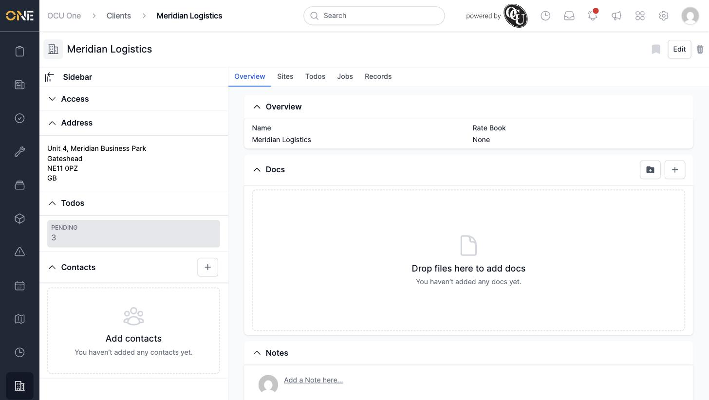
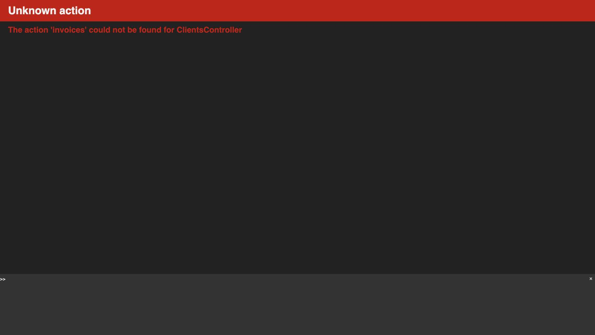

# Viewing a client's invoices

This guide covers viewing a client's invoices — but confirmed live, this doesn't currently work anywhere in the app.

## What's there today

A client's page only ever shows five tabs: **Overview**, **Sites**, **Todos**, **Jobs**, and **Records**. There is no "Invoices" tab, and no other link on the client's page leads anywhere invoice-related.

## What happens if you try

The only way to reach an invoices view for a client is by typing the address directly into the browser (`/clients/:id/tabs/invoices`) — nothing in the app links to it. Doing so doesn't show any invoices; it crashes with an application error.

## Things to know

- There is currently no way to view a client's invoices from the client record itself. To see a client's invoices, use the main **Invoices** list and filter by client instead.
