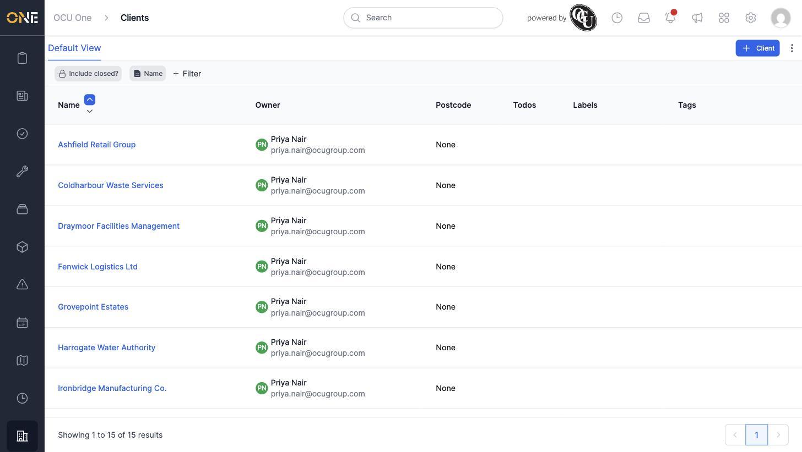
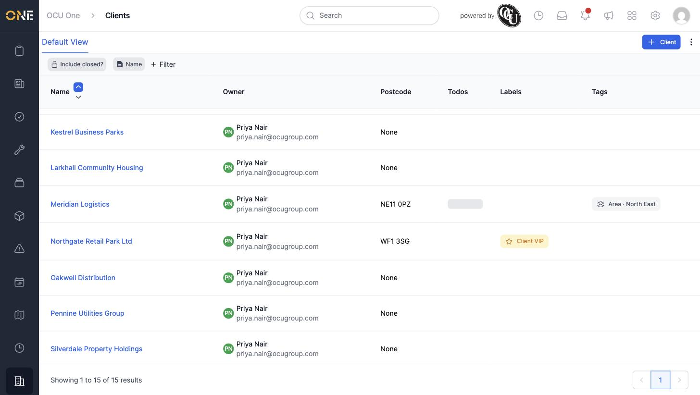
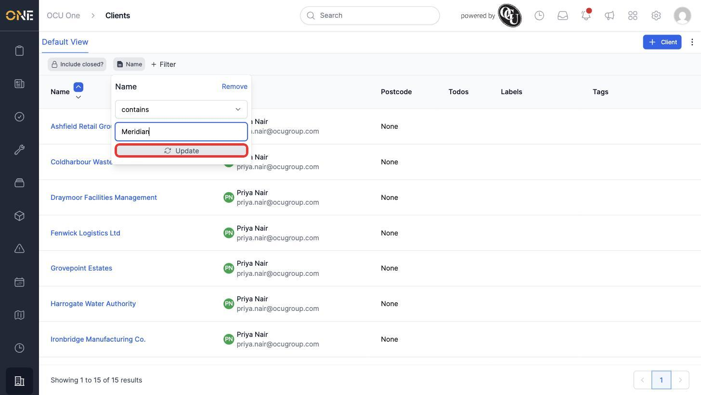
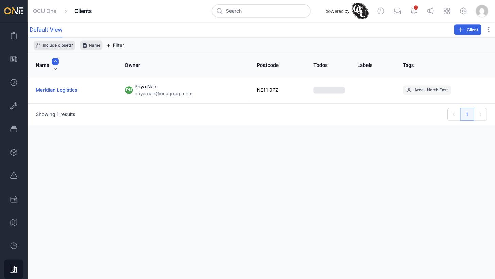
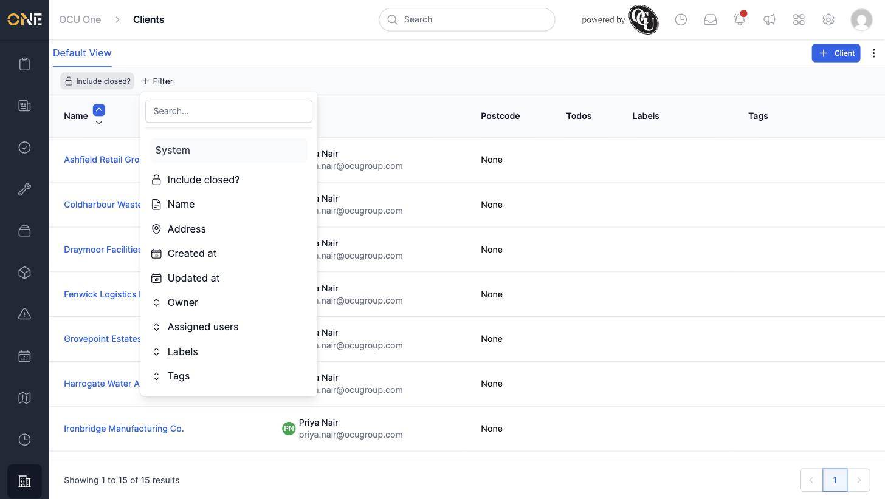

# Viewing and filtering the client list

The **Clients** list shows every client your company has worked with or is currently working with. This guide covers browsing the list and narrowing it down with filters.

## The list view

Open **Clients** from the sidebar. Each row shows the client's name, owner, postcode, any outstanding todos, and its labels and tags.

Labels and tags appear as coloured chips when a client has them — for example, a client labelled "Client VIP" or tagged to an area.

## Filtering the list

Two filter chips sit above the list by default: **Include closed?** and **Name**.

Click the **Name** chip to open its filter panel. Choose a condition (for example "contains"), type a search term, and click **Update**.

The list narrows to only the clients matching that term.

To remove a filter, open its panel and click **Remove**.

### Adding more filters

Click **+ Filter** to see every other filter available for this list: **Address**, **Created at**, **Updated at**, **Owner**, **Assigned users**, **Labels**, and **Tags**. Pick any of these to add it as another chip, then set its value the same way as the Name filter.

Multiple filters combine together — for example, Owner **and** Name narrows the list to clients matching both at once.

## Things to know

- **Include closed?** is a separate toggle, not a text filter — switch it on to also show clients that have been marked as closed, which are hidden from the list by default.
- Filters you add stay on the page while you're browsing, but aren't saved once you navigate away — you'll need to re-add them next time unless you save a custom view.
- Click a client's name in the list to open its overview.
