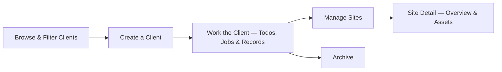

# Clients — Overview

**Clients** are the companies and organisations you actively do business with — the customer side of every job, site, and piece of work you carry out. This area covers browsing, creating, and working a client record, and what happens once a client's work is finished.

## The core pieces

A **Client** has a name, an optional **Rate Book** (and version) that its work is priced against, and a primary address. Like a lead, it can have **Sites** (specific locations where work happens) and **Todos** (follow-up tasks). Beyond that, a client also tracks the **Jobs** booked for it and any **Records** (surveys, inspections, and so on) linked to it.

## The end-to-end flow

It starts with **browsing what's out there** — see [Viewing and filtering the client list](Viewing%20and%20filtering%20the%20client%20list.md) for the list view and its filters.

A new customer is added with [Creating and editing a client](Creating%20and%20editing%20a%20client.md), which also covers updating a client's details later — for example, switching its rate book.

Day-to-day work on a client — its overview, todos, jobs, and any linked records — is covered in [Client overview, todos, jobs, and linked records tabs](Client%20overview%2C%20todos%2C%20jobs%2C%20and%20linked%20records%20tabs.md). Two related areas, [Viewing a client's invoices](Viewing%20a%20client's%20invoices.md) and [Downloading a client PDF summary](Downloading%20a%20client%20PDF%20summary.md), are covered separately — both are currently blocked by open app bugs (see below).

A client's physical locations are managed under [Managing a client's sites](Managing%20a%20client's%20sites.md), and each site's own page — its overview and any assets registered there — is covered in [Site detail — overview and linked assets](Site%20detail%20%E2%80%94%20overview%20and%20linked%20assets.md).

Once a client's work is finished and there's nothing outstanding, [Archiving a client](Archiving%20a%20client.md) covers removing it from the active list.

## The flow at a glance

- **Browse & Filter Clients** — find the ones relevant to you.
- **Create a Client** — add a new customer with a name, rate book, and address.
- **Work the Client** — track todos, jobs, and linked records while work continues.
- **Manage Sites** — add and remove the client's physical locations.
- **Site Detail** — see a site's own overview and the assets registered there.
- **Archive** — once there's nothing outstanding, remove it from the active list.

## Known issues

Two guides in this area — [Viewing a client's invoices](Viewing%20a%20client's%20invoices.md) and [Downloading a client PDF summary](Downloading%20a%20client%20PDF%20summary.md) — document features whose routes exist in the app but have no working controller action, view, or UI entry point. Both are confirmed broken and blocked from human verification; see `Zz - Known Bugs/` for the full write-ups.
