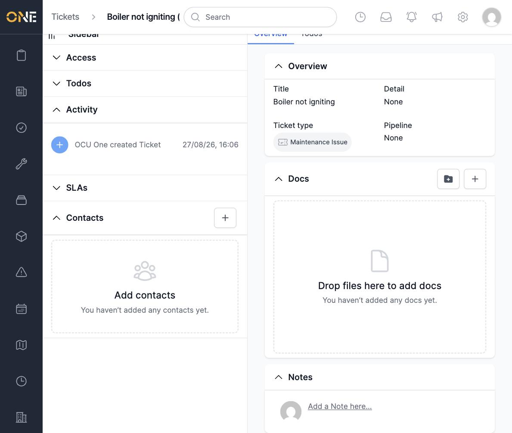
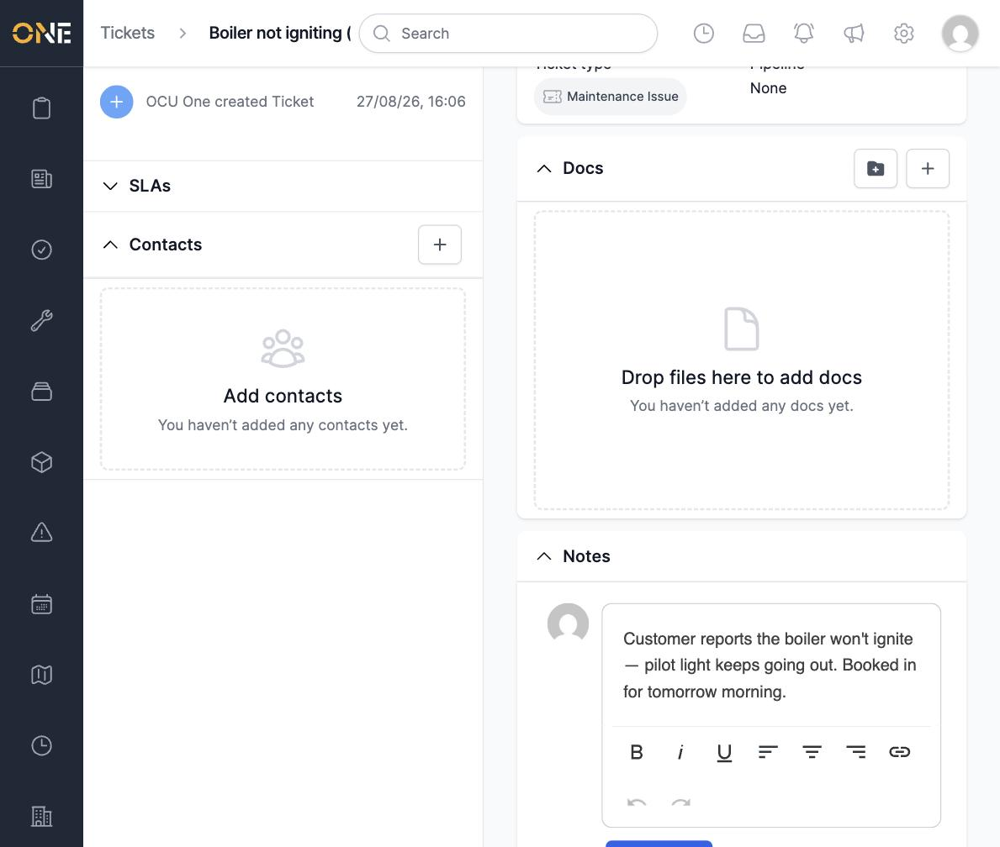
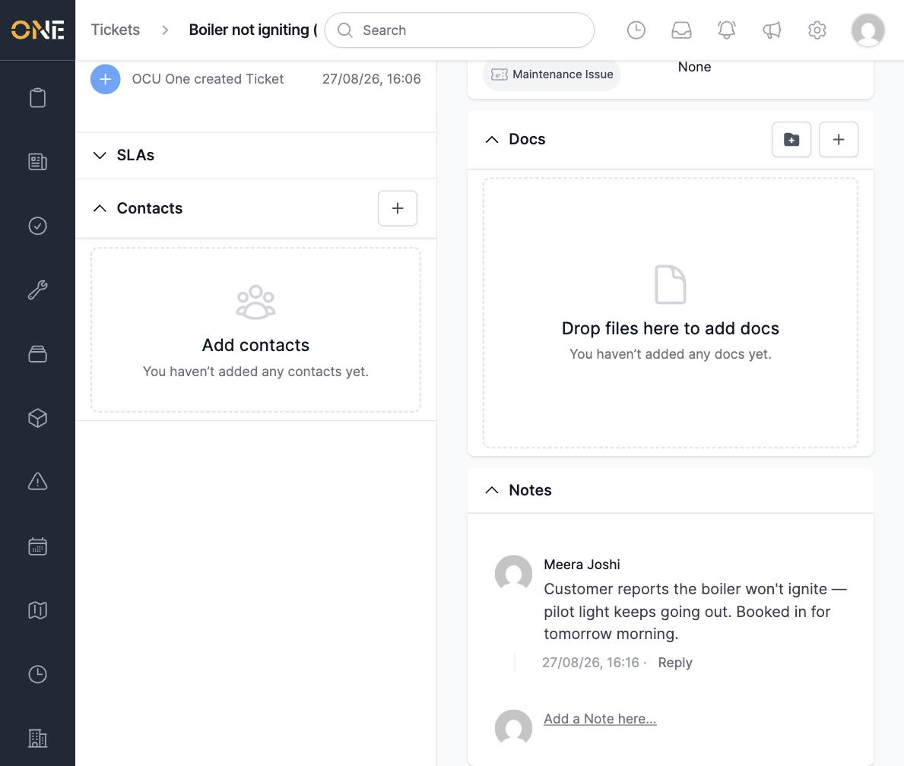
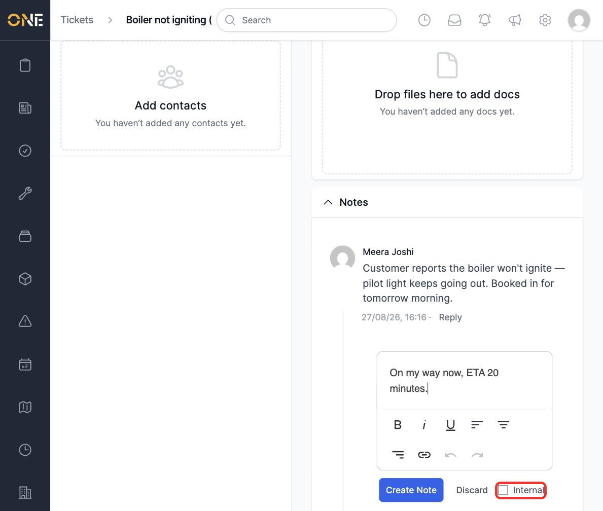
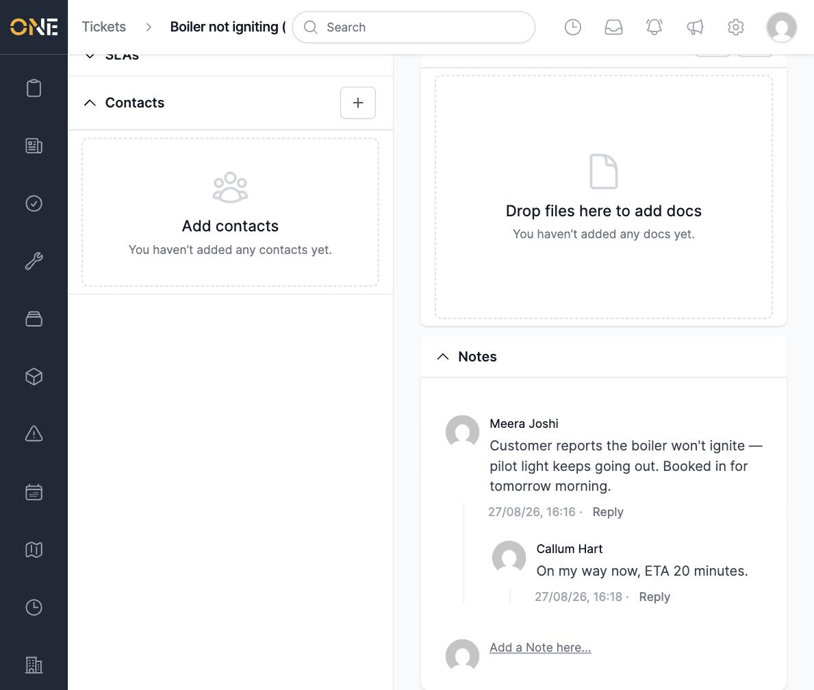
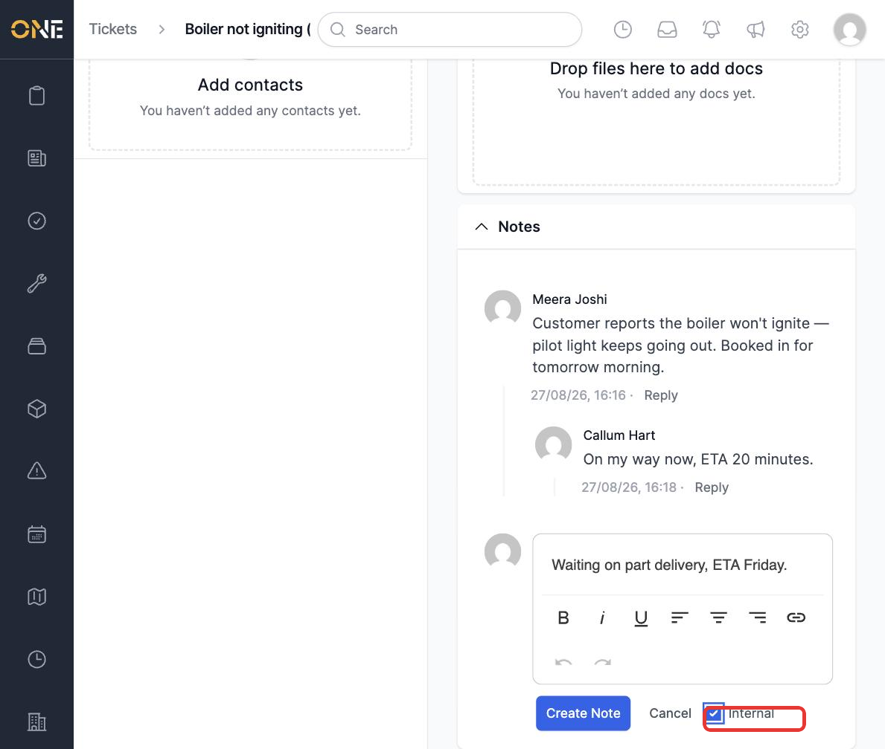
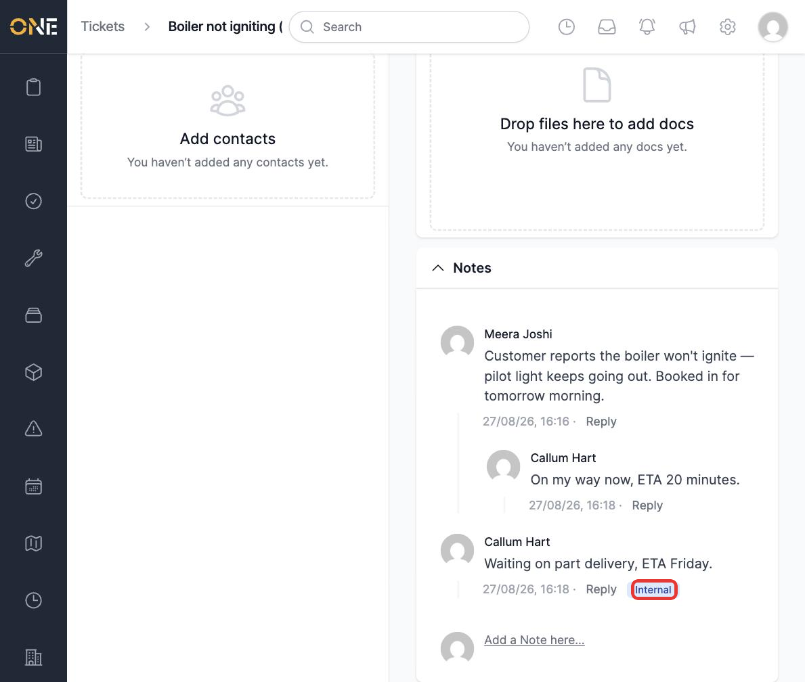

# Commenting on any record, with replies and internal notes

Most records in OCU One — tickets, jobs, documents, and more — have a comment thread where your team can discuss them. You can reply directly under a specific comment to keep a conversation threaded, and on a Ticket you can mark a comment as **Internal** so it's understood to be for your team only, not the customer.

The section is usually labelled **Notes** rather than "Comments" on screen, even though it's the same feature throughout the app.

## Adding the first comment

Open a record's page and scroll to **Notes**.

*Ticket "Boiler not igniting", not yet commented on.*

Click **Add a Note here...**, type your comment, and click **Create Note**.

*Logged in as the ticket's owner — no Internal checkbox appears, since it only applies to other people commenting on your ticket.*

## Replying to a comment

Click **Reply** under a comment to open a reply box threaded directly beneath it, rather than adding a new comment at the top level.

*A different user, replying to someone else's ticket, now sees the Internal checkbox.*

Type your reply and click **Create Note**. It appears indented under the comment it's replying to.

## Marking a note as internal

On a Ticket, if you're not the ticket's owner, adding a note shows an **Internal** checkbox. Tick it before posting to flag the note as team-only.

Once posted, an internal note is marked with a blue **Internal** badge so it's clearly distinguished from the rest of the thread.

