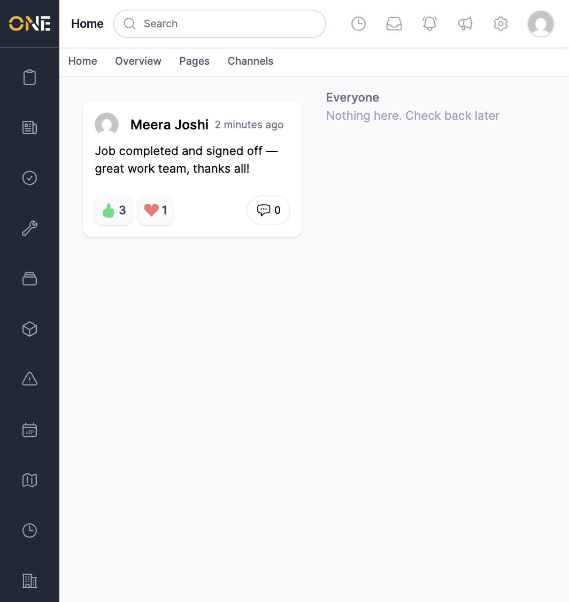
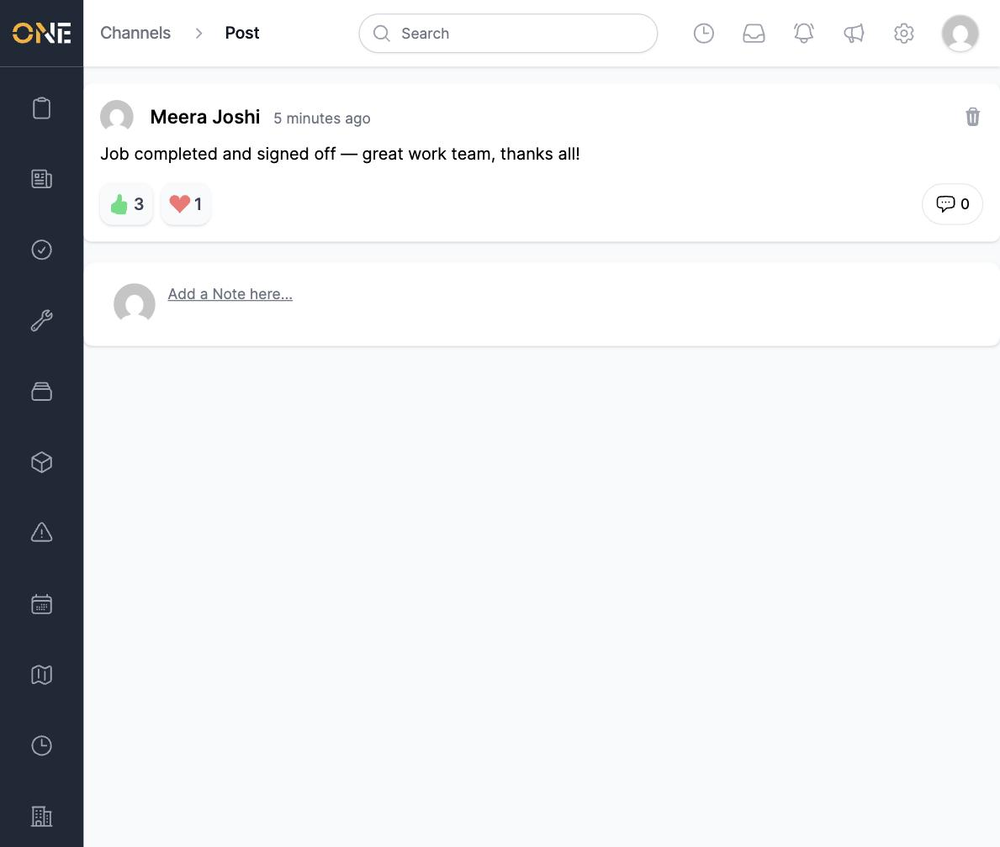
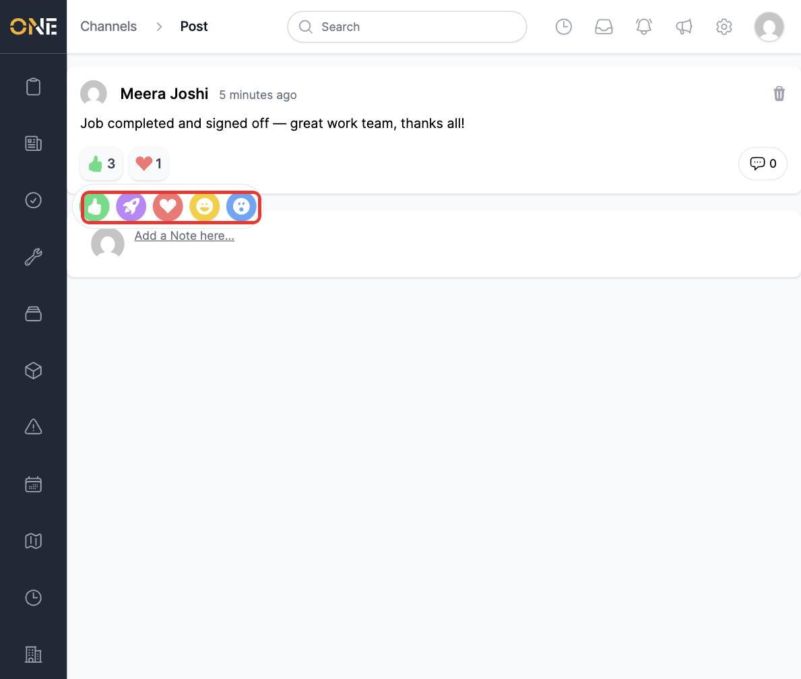
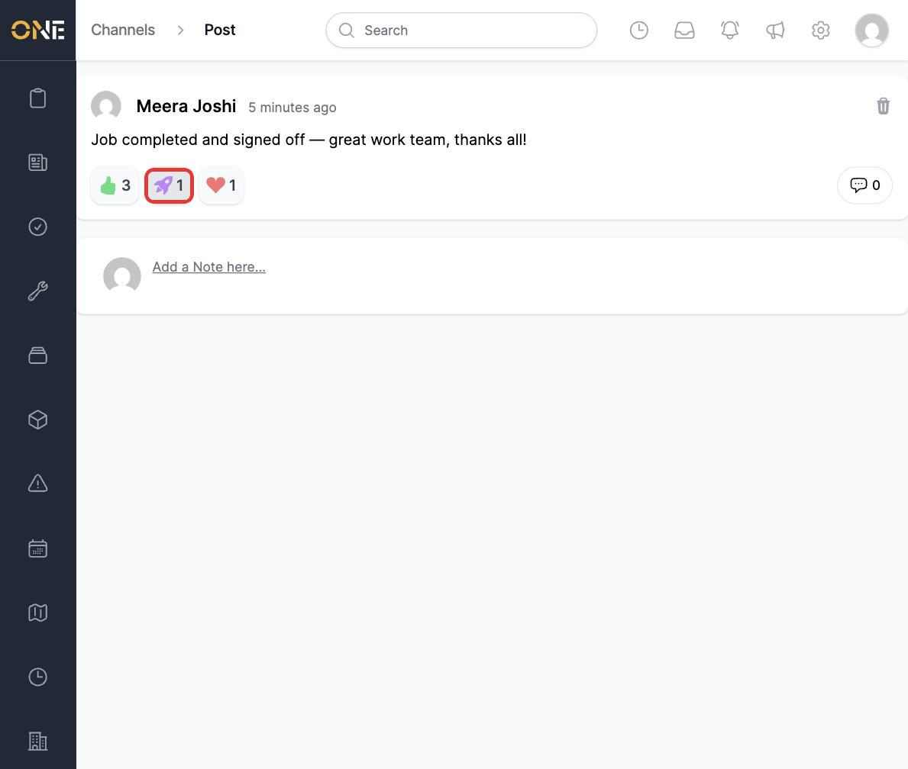

# Reacting to a comment

Instead of writing "nice work" as a reply, you can react to a post or comment with a quick icon. Reaction counts show up right in the feed, so you can see at a glance how colleagues responded without opening every thread.

## Seeing reactions in the feed

Reaction pills appear directly under a post wherever it's shown, including on your Home feed.

*Three people have given this a thumbs-up, one has given it a heart.*

Click the post to open its full page.

## Adding your own reaction

Hover over the reaction pills to reveal the full set of options: thumbs-up, applaud, love, laugh, and surprise.

Click any icon to add that reaction. The pill for your chosen sentiment appears (or its count goes up if someone's already used it), and it's highlighted to show it's yours.

You can only hold one reaction on a post at a time — picking a different icon swaps your reaction rather than adding a second one.

## Removing a reaction

Click your own highlighted reaction pill again to remove it.

