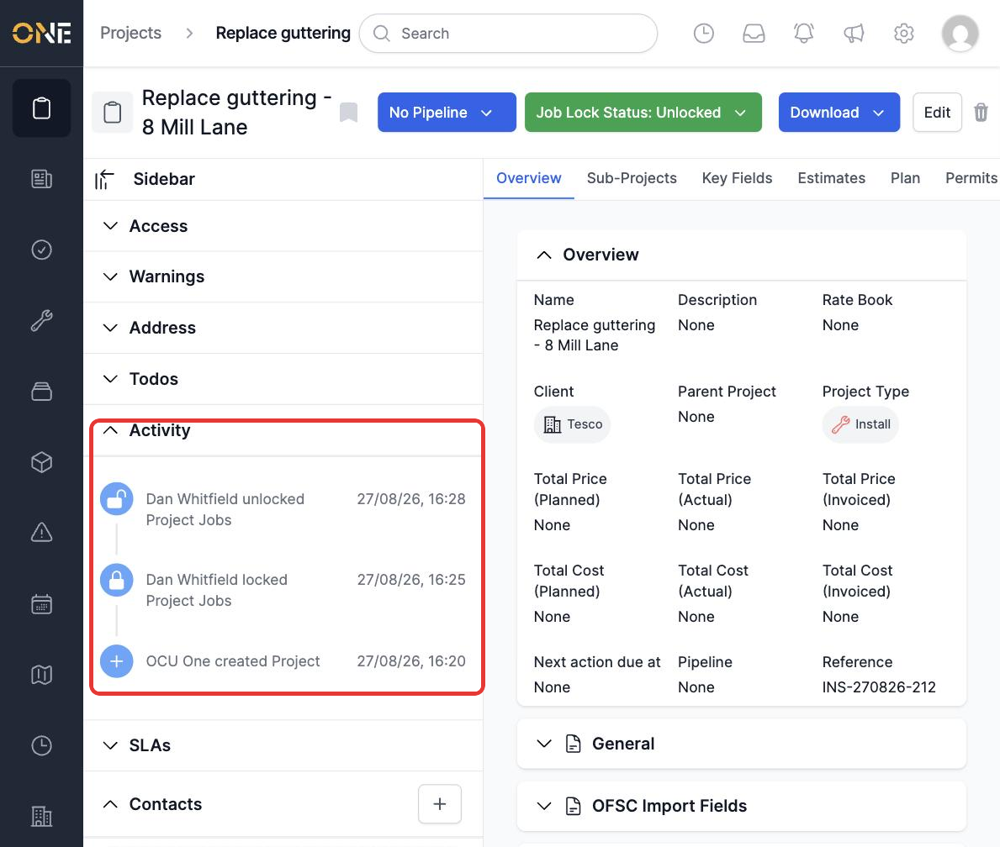
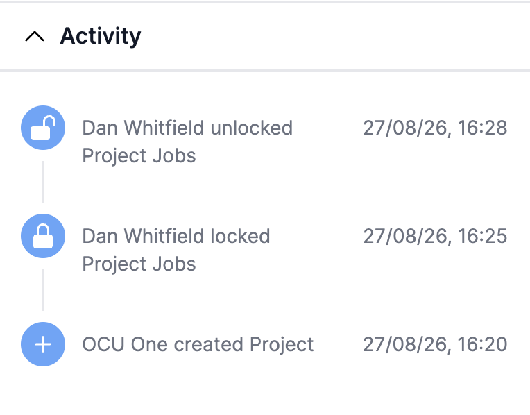

# Viewing a record's activity feed

Most records — Projects, Tickets, Jobs, and more — keep an **Activity** log tracking what's happened to them: when they were created, and when certain key actions are taken. It's a quick way to see the recent history of a record without digging through comments or docs.

## Finding the Activity feed

Open a record's page and look for the **Activity** section (usually in the sidebar). Each entry shows an icon, a description of what happened and who did it, and a timestamp — most recent first.

*Project "Replace guttering - 8 Mill Lane": created, then its Jobs locked and unlocked.*

Not every change to a record shows up here — only specific tracked actions do (for example, locking or unlocking a Project's Jobs). Adding a doc or a comment doesn't currently create an activity entry.

> **Note:** the row hint used to plan this guide expected the feed to paginate after 10 entries. In the current app, this record's Activity feed showed all its entries at once with no "See more" control, even at 3 entries — narrower than what was expected. This is documented as observed rather than assumed.
