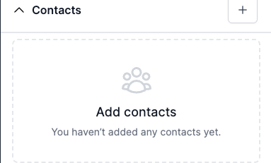
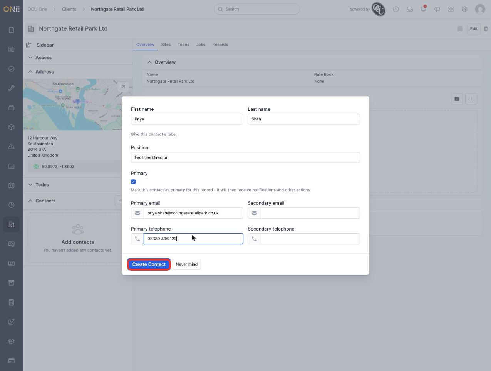
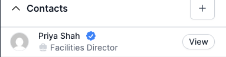
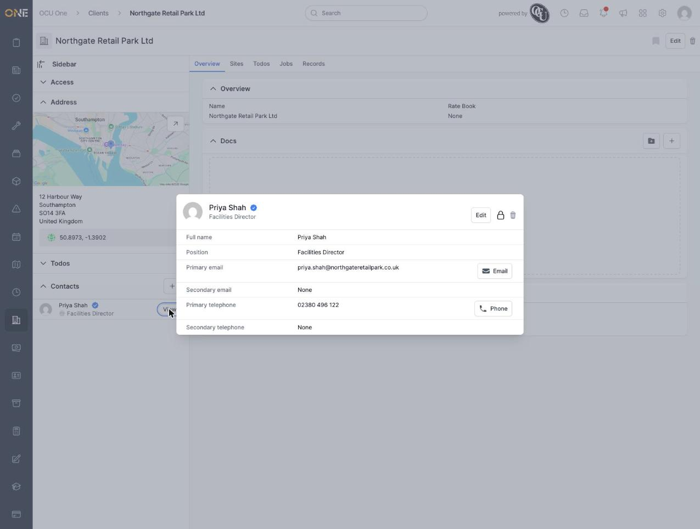
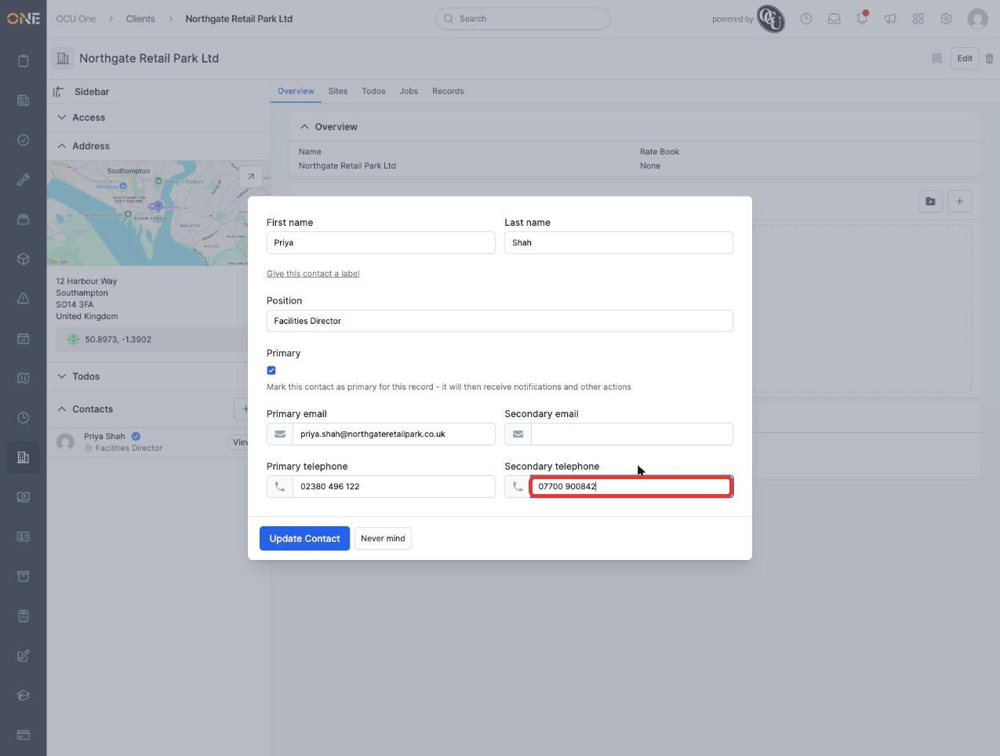
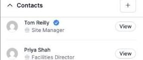
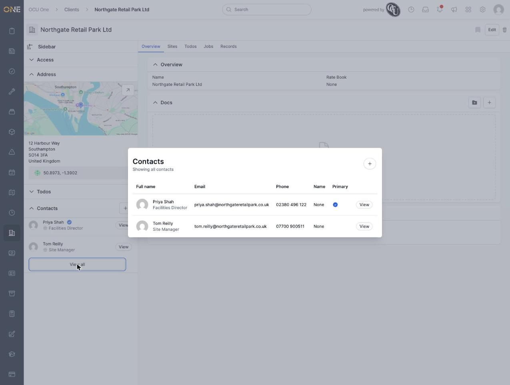
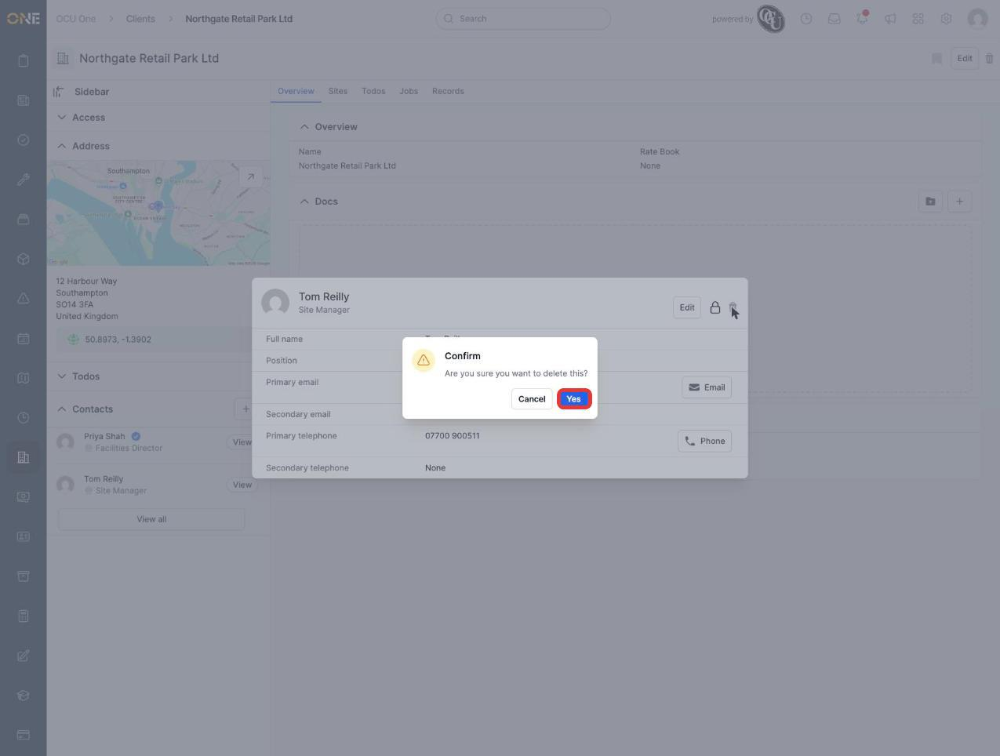

# Managing contacts on a client, lead, or other record

A **Contacts** card appears in the sidebar of a client, lead, and most other kinds of record (records, tickets, jobs, and more) — anywhere you might need to keep track of a real person associated with that item, separately from the OCU One users who work on it. Each contact has a name, position, and contact details of their own.

## Where to find it

Open any client (or lead, record, ticket, job, etc.) and look at the sidebar. If a record has no contacts yet, the Contacts card shows an empty state:

## Adding a contact

Click the **+** button on the Contacts card. A form opens with:

- **First name** and **Last name** (both required)
- **Give this contact a label** — an optional expander that reveals a **Name** field, for giving the contact a label like "Billing Contact" or "Sales Contact", separate from their actual name
- **Position** — their job title
- **Primary** — a checkbox. Marking a contact as primary means it will then receive notifications and other actions for this record
- **Primary email** / **Secondary email**
- **Primary telephone** / **Secondary telephone**

Once saved, the contact appears in the card. A primary contact shows a blue check-badge next to their name:

## Viewing a contact's details

Click **View** on any contact to open their full details — full name, position, both email addresses, and both phone numbers, with quick **Email** and **Phone** action buttons next to whichever ones are filled in:

## Editing a contact

From the detail view, click **Edit** to update any of the same fields used when creating the contact:

## Changing who's primary

Only one contact on a record can be primary at a time. Marking a different contact as primary automatically un-marks whichever contact had it before — their badge disappears and moves to the new one:

## Viewing all contacts

If a record has more than one contact, the Contacts card shows a **View all** button underneath the list. This opens the full contacts list as a table, with columns for email, phone, the optional label, and which contact is primary:

**Note:** at the time of writing, this "View all" button doesn't appear the very first time you add a contact to a record that previously had none — it only shows up after the page has been reloaded. See `Zz - Known Bugs/view-all-contacts-button-missing-until-page-reload.md` for details. It appears normally for every contact added after that.

## Deleting a contact

From a contact's detail view, click the trash icon next to Edit, then confirm:

The contact is removed from the list immediately.
