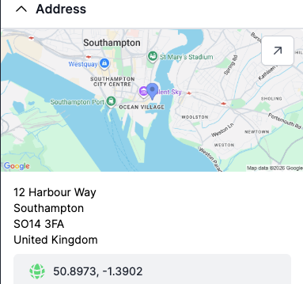
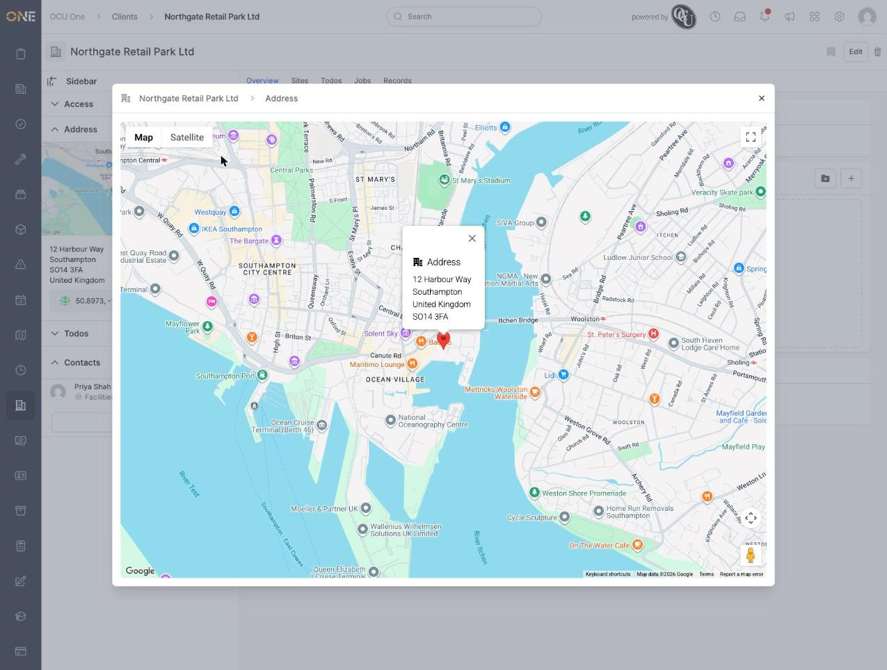
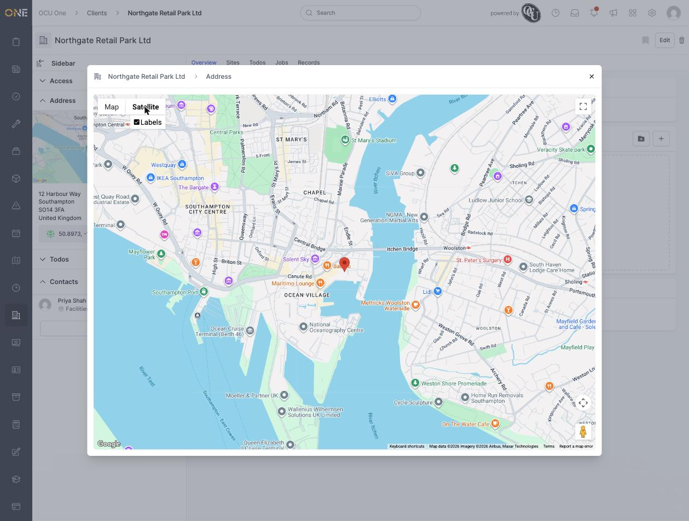

# Viewing an address on a map

Clients, leads, projects, jobs, sites, permits, and estimates can all have an **Address** card in their sidebar. Whenever that address has coordinates set, the card shows a small map preview you can expand into a full interactive map.

## The address card

The Address card shows a small map thumbnail (when the address has coordinates), the address written out, and a coordinates badge underneath:

## Opening the full map

Click the arrow icon in the top-right corner of the map thumbnail to open a full-size interactive map in a pop-up window:

The pop-up's title bar shows a breadcrumb (the record's name, then "Address") so you always know which record's location you're looking at. Clicking the pin re-opens its info window if you've closed it, showing the address again.

## Map and Satellite views

Above the map, **Map** and **Satellite** buttons let you switch between the standard street map and satellite imagery (with an option to toggle place labels on or off in Satellite view):

## Things to know

- The expand-to-map arrow only appears when the address actually has coordinates set — an address without them just shows its written-out text in the card, with no map.
- Close the map pop-up with the **×** in its top-right corner, or by clicking outside it.
