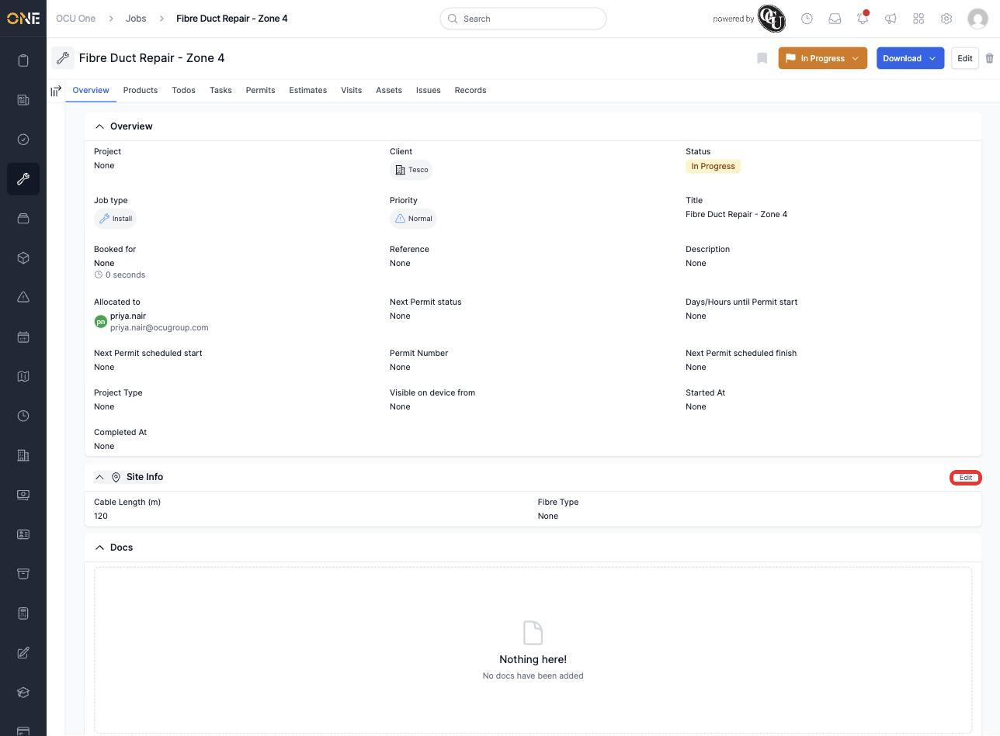
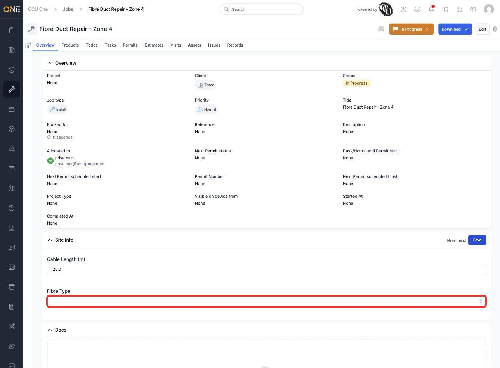
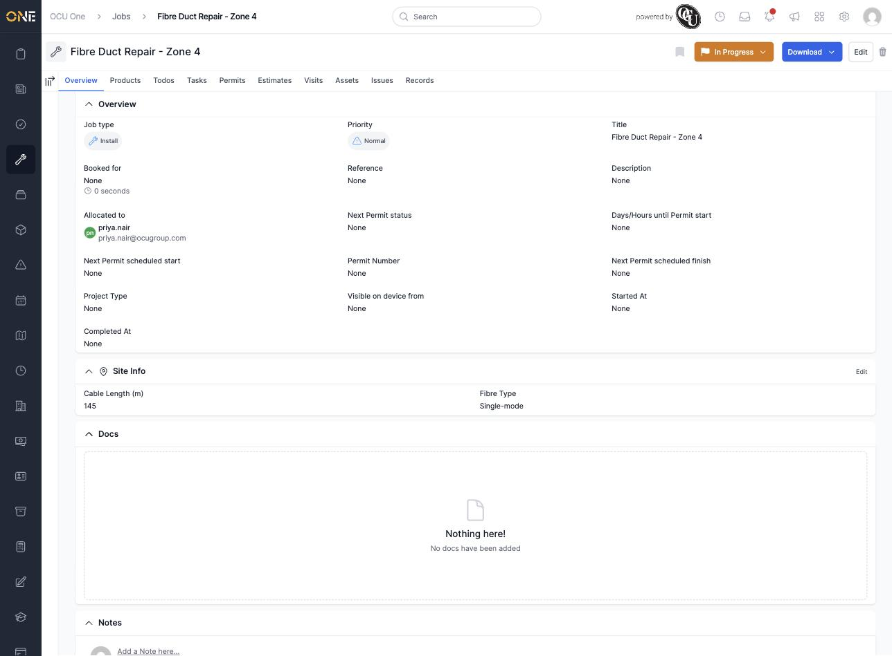

# Filling in and editing custom field values on a record

Some records have extra sections of fields specific to your organisation — for example site details on a job, or extra information your team tracks for a particular type of work. These show up as their own named section on the record's overview page, alongside the standard fields.

## Finding a custom field section

Scroll down the record's overview page and you'll see it as its own titled section — in this example, **Site Info** on a Job:

Not every record has one of these — it depends on what's been set up for that type of record. If there isn't one, you won't see anything extra here.

## Filling in or changing the values

Click **Edit** next to the section's title to make its fields editable:

Each field works like you'd expect for its type — a plain box for a number, a dropdown for a field with a fixed list of options, and so on. Fill in or change whatever you need, then click **Save** to keep your changes, or **Never mind** to discard them and leave the section as it was.

Once saved, the section shows your updated values:

## Things to know

- These sections are the same wherever they appear — jobs, projects, tickets, and other record types can all have their own custom field sections, and you fill them in and edit them the same way everywhere.
- You can come back and edit these values at any time by clicking **Edit** again.
