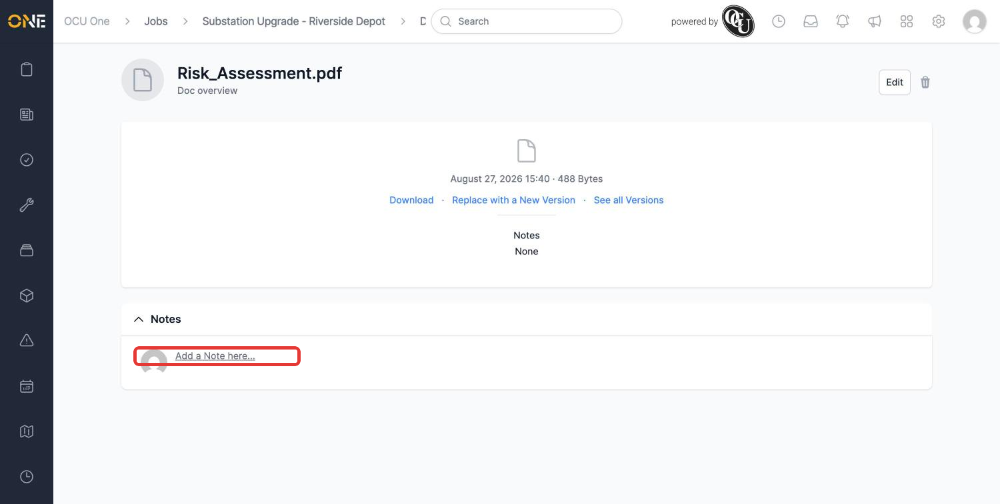
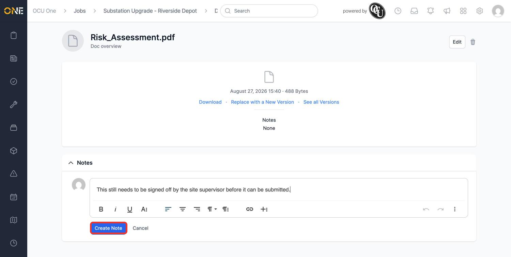
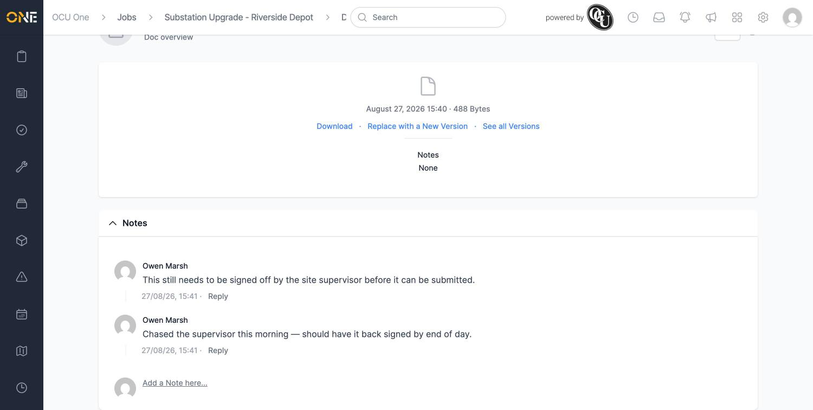

# Commenting on a document

Like most records in OCU One, a document has its own comment thread — a place to discuss it with colleagues without leaving a note buried in an email or chat. On a document's page, this section is labelled **Notes**, not Comments, but it's the same discussion feature used throughout the app.

## Finding the Notes section

Open a document's full page (click **Go to file** from its preview, or open it directly) and scroll to **Notes**, below the file details.

*"Risk_Assessment.pdf" has no comments yet.*

## Adding a comment

Click **Add a Note here...** to open a rich-text editor, type your comment, and click **Create Note**.

*Flagging that the document still needs sign-off.*

The comment appears immediately, showing who posted it and when, with a **Reply** link underneath.

Click **Add a Note here...** again — it reappears below the existing comment — to add a follow-up.

*A short back-and-forth building up on the same document. Click Reply under a specific comment to thread a response directly under it, rather than adding a new top-level comment.*
