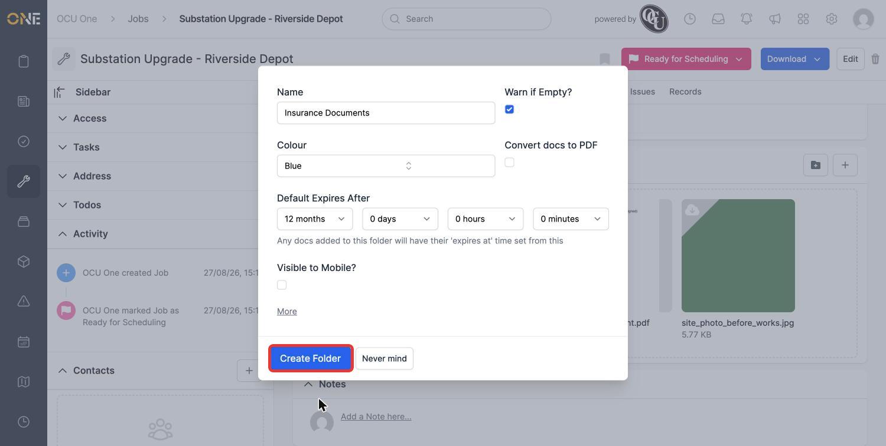
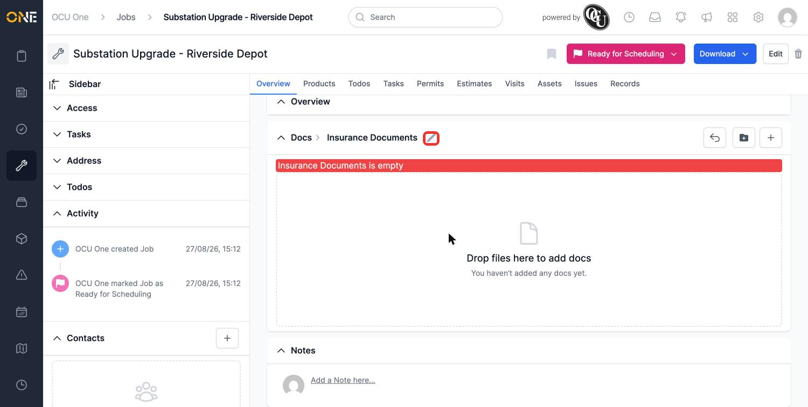
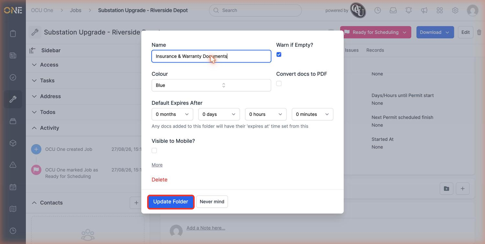
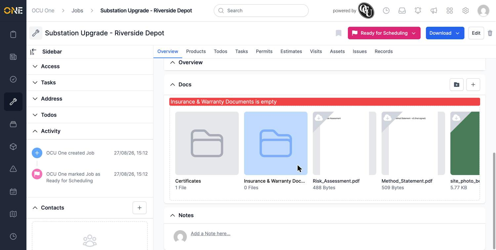

# Creating and configuring a folder

Folders keep related documents together within a record's Docs area — for example, all the certificates for a job, kept separate from site photos and method statements. This guide covers the folder's own settings in full; for the basics of getting a document into one, see [[Uploading and organising documents on a record]].

## Creating a folder

From the Docs area, click the folder icon to open the new folder form.

- **Name** — required.
- **Warn if Empty?** — shows a warning banner on the folder if it has no documents in it, useful for a folder that's expected to always contain something (like a mandatory certificate).
- **Colour** — sets the folder's tile colour, to help it stand out or group visually with related folders.
- **Convert docs to PDF** — automatically converts any file uploaded into this folder to PDF.
- **Default Expires After** — automatically sets an expiry date on any document uploaded into this folder, counted from its upload date. Leave every field at 0 for no automatic expiry.
- **Visible to Mobile?** — controls whether this folder (and its contents) shows up in the mobile app.
- **More** — expands to show a few additional settings: cache strategy, a description, an expiry warning type, and (where relevant) an internal-only toggle.

*A folder set up to warn if it's ever empty, and to expire any document added to it after 12 months.*

Click **Create Folder** to save it.

*Because "Warn if Empty?" was turned on, the folder immediately shows a warning banner until at least one document is added.*

## Editing a folder

Open the folder and click the pencil icon next to its name in the breadcrumb.

*The same warning banner also appears inside the folder itself, not just on its tile.*

This reopens the same form, pre-filled with the folder's current settings — including a **Delete** link if you need to remove the folder entirely. Change whatever's needed; here, the name is being updated.

*Renaming the folder to better reflect what's kept in it.*

Click **Update Folder** to save. The new name is reflected everywhere the folder appears.

*The rename takes effect immediately, including in the warning banner text.*
