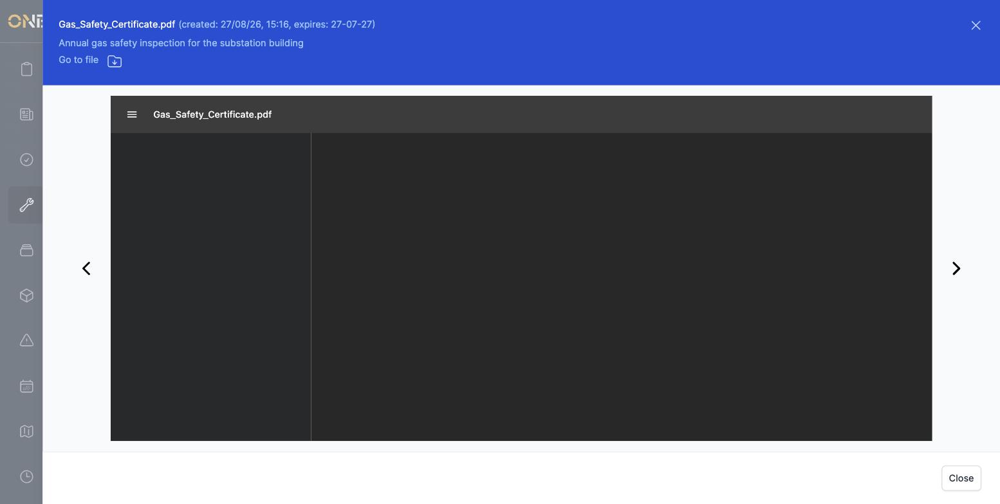
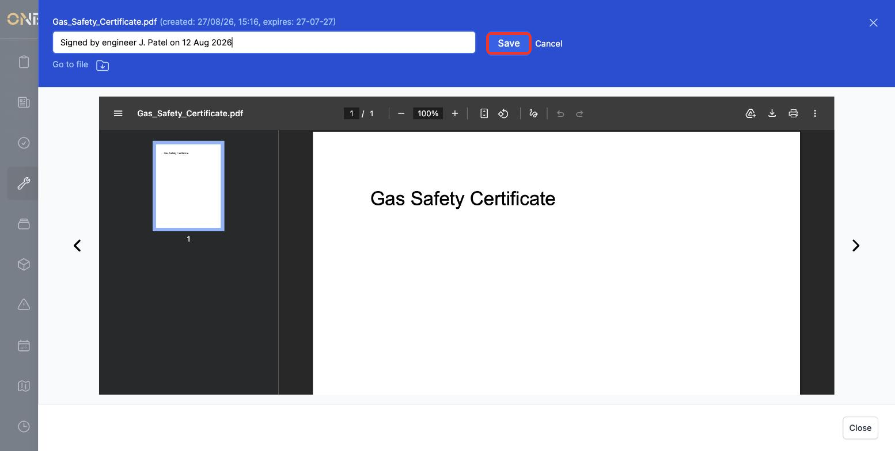
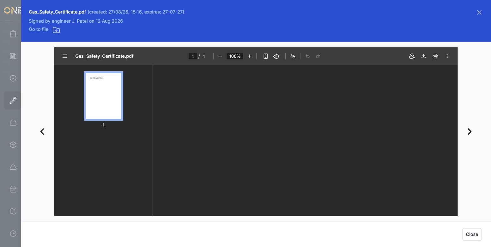
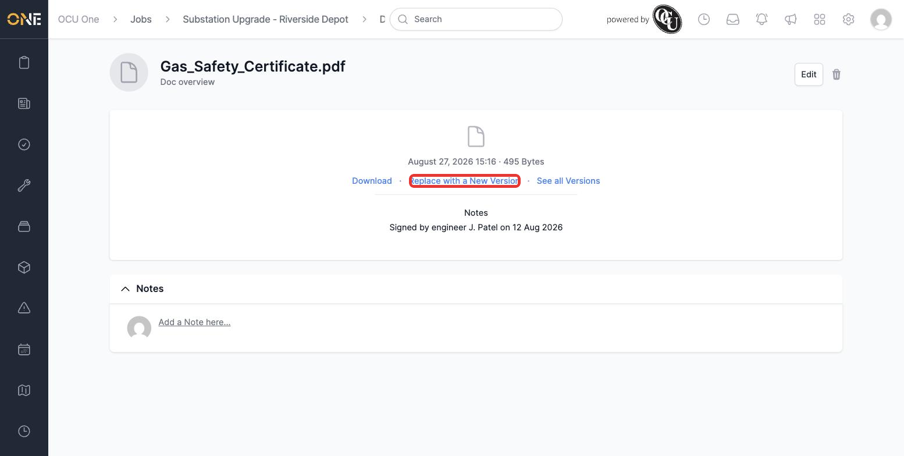
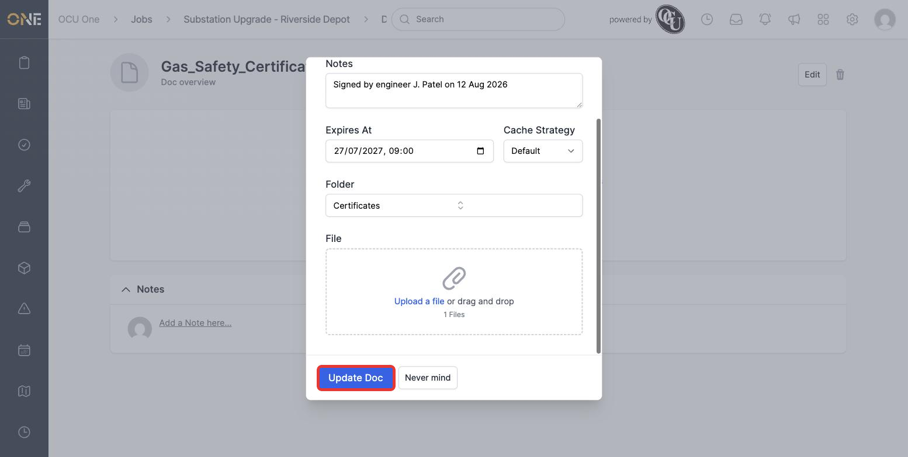
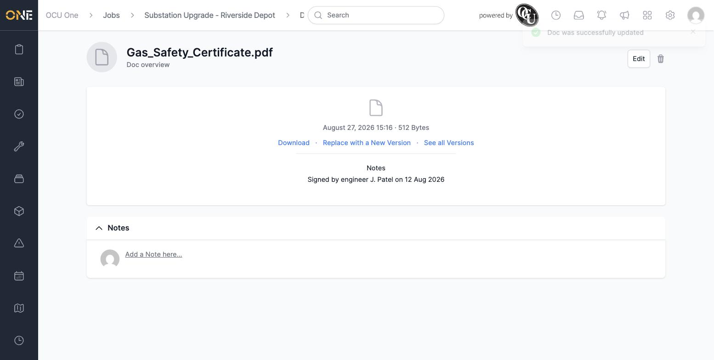

# Previewing, replacing, and annotating a document

Once a document is uploaded, you don't need to download it to check its contents, add context for whoever looks at it next, or swap in an updated copy. This guide walks through all three, using an uploaded gas safety certificate as the example.

## Previewing a document

Click a document's tile to open a quick preview without leaving the page.

*The preview shows the file itself alongside its notes and details. Use the arrows either side to move to the next or previous document in the same folder.*

## Annotating a document

Click the notes text under the document's name to add or edit a short annotation — useful for recording something like who signed it off and when.

*Typing an annotation directly in the preview panel.*

Click **Save**, and the note appears immediately under the document's title.

*The annotation is saved and visible right away — no need to reopen the document.*

## Replacing a document with a new version

Click **Go to file** from the preview to open the document's full page. From there, you'll see **Download**, **Replace with a New Version**, and **See all Versions**.

*The document's own page — the same notes you added earlier are shown here too.*

Click **Replace with a New Version**. This opens the same form used to edit the document's details, with a **File** field where you can attach the new copy.

*Attaching a rescanned copy of the certificate. The name, notes, expiry date, and folder all carry over unless you change them.*

Click **Update Doc** to confirm.

*The document now points to the new file. The previous version isn't lost — see [[Viewing a document's version history]] for how to look back at earlier copies.*
