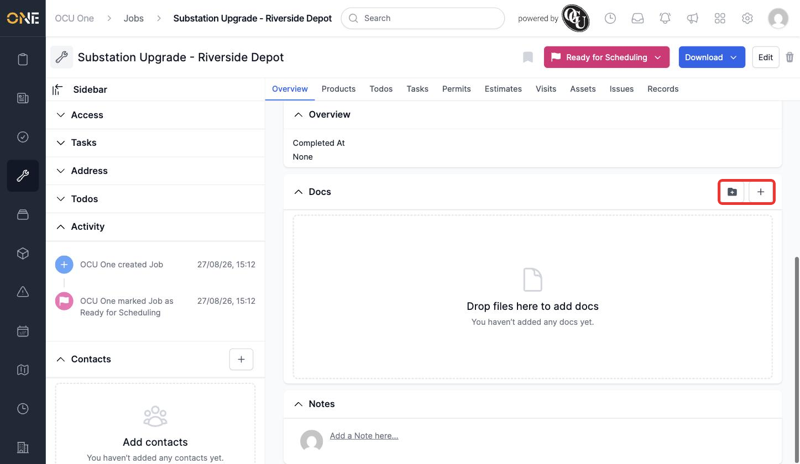
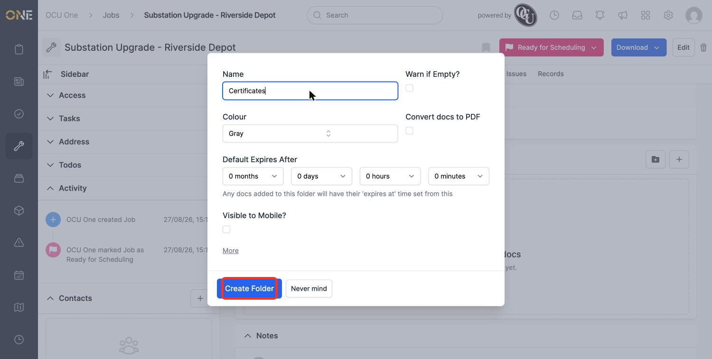
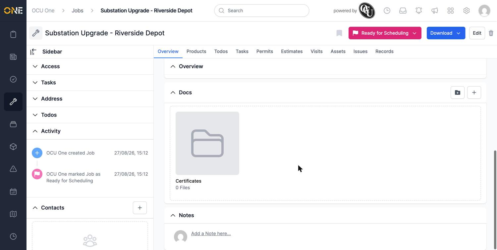
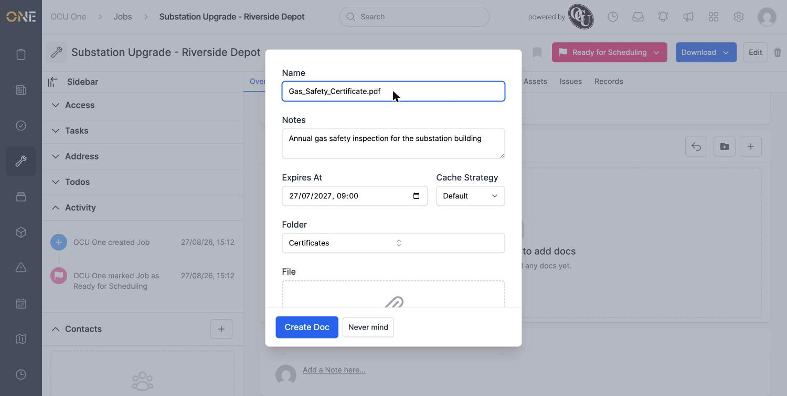
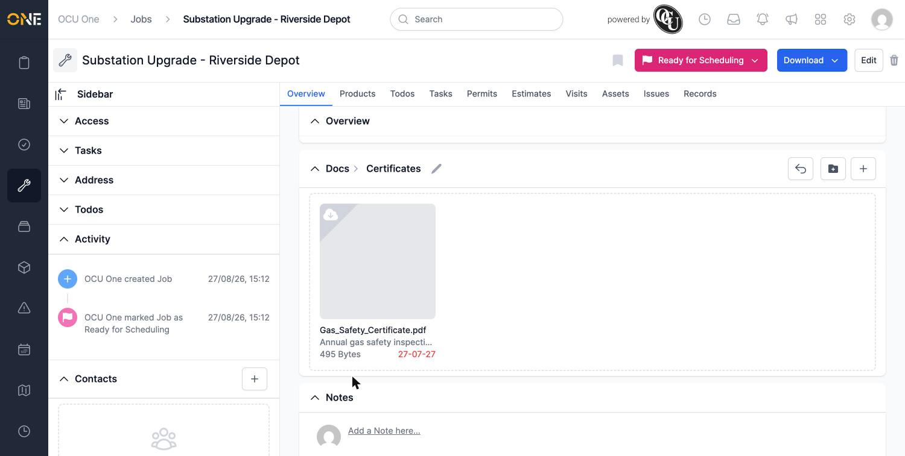
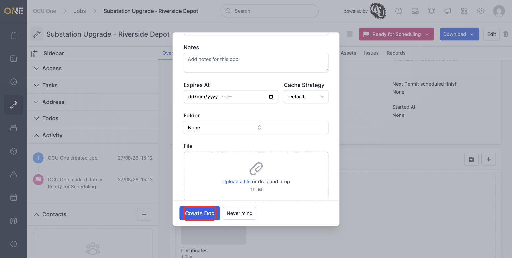
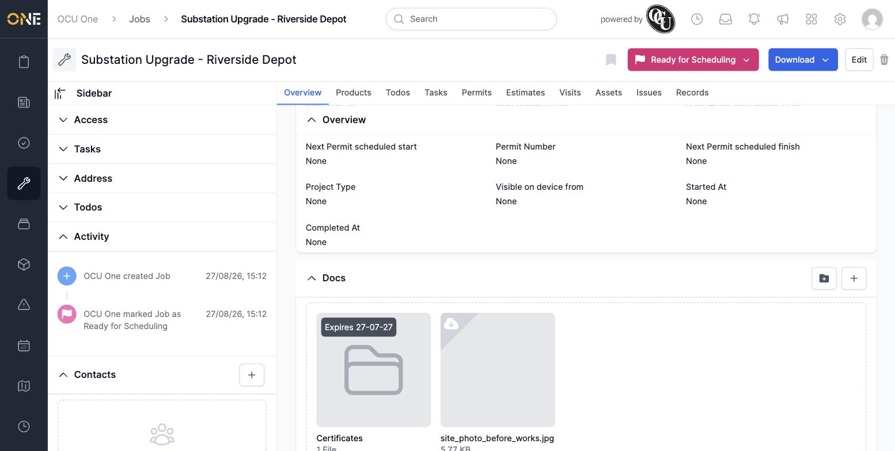

# Uploading and organising documents on a record

Most records in OCU One — jobs, projects, tickets, and more — have a **Docs** area where you can upload files, organise them into folders, and keep track of things like certificates or site photos. This guide uses a job's Docs area as the example, but the same layout and controls appear anywhere Docs shows up.

## The Docs area

Scroll to the **Docs** section on the record. It starts as an empty drag-and-drop zone with two buttons in the top-right: a folder icon to add a folder, and a **+** to add a document directly.

*An empty Docs area, ready for its first folder or file.*

## Creating a folder

Click the folder icon to create a folder to keep related documents together — useful for something like a set of certificates that belong together. Give it a name; the rest of the folder's settings are covered in [[Creating and configuring a folder]].

*Naming a new "Certificates" folder.*

Once created, the folder appears as a tile in the Docs area.

*A folder starts out empty — click it to go inside.*

## Uploading a document into a folder

Click into a folder, then click **+** to upload a file into it. Give the document a name, an optional note, and — if it needs one — an expiry date.

*Uploading a certificate with an expiry date roughly 11 months out.*

Once created, the document appears in the folder, showing its expiry date if it has one.

*The certificate is now filed under Certificates, with its expiry date shown on the tile.*

## Uploading a document without a folder

Not every file needs to be filed away — a quick site photo, for example, can just as easily sit loose in the Docs area. Go back to the top-level Docs view and click **+** there instead; leave the **Folder** field set to **None**.

*Uploading a photo directly into the Docs area, with no folder selected.*

**Worth knowing:** you can also drag a file straight from your computer and drop it anywhere on the Docs area to upload it the same way, without opening the form first — useful when you've already got a file open and ready to go.

Loose files and folders sit side by side in the same view.

*A folder and a standalone file, both visible at the top level of Docs.*
