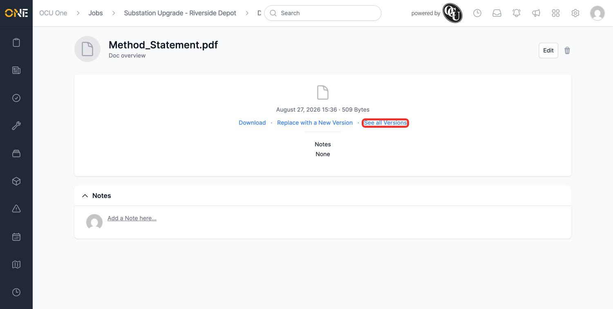
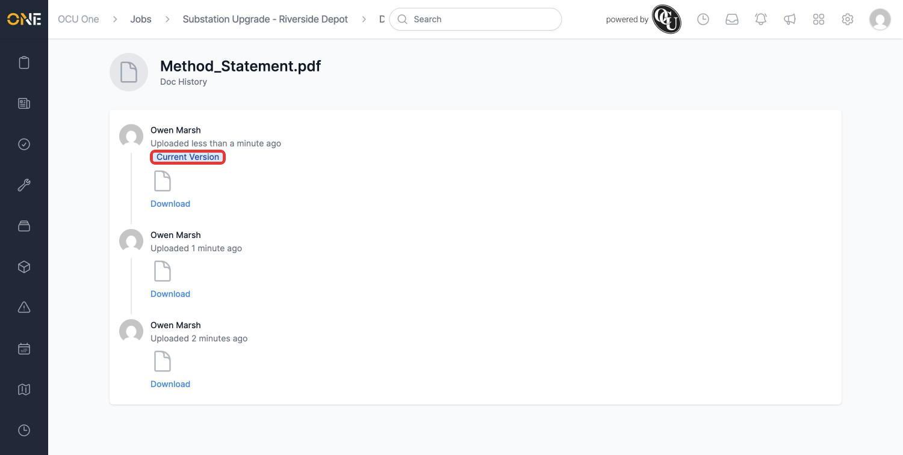

# Viewing a document's version history

Every time a document is replaced with a new version (see [[Previewing, replacing, and annotating a document]]), the previous copy is kept rather than thrown away. This guide covers looking back through that history.

## Opening the version history

From a document's own page, click **See all Versions**.

*"Method_Statement.pdf" has been replaced twice since it was first uploaded.*

This opens the document's history, newest first, with a **Current Version** badge on the one currently in use. Each entry shows who uploaded it, how long ago, and a **Download** link for that specific copy.

*All three versions stay available to download, even though only the current one shows up when the document is previewed.*

**Worth knowing:** every version of a document — no matter who actually attached the file — is shown here under whoever originally owns the document, since that's who the app credits with each upload. If you need to know exactly who replaced a file and when, check the record's own Activity feed alongside this history.
