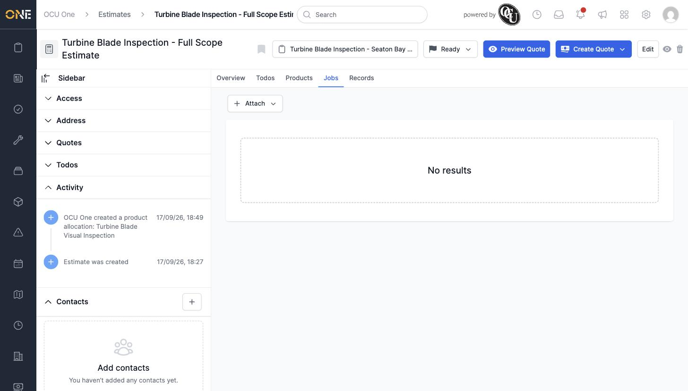
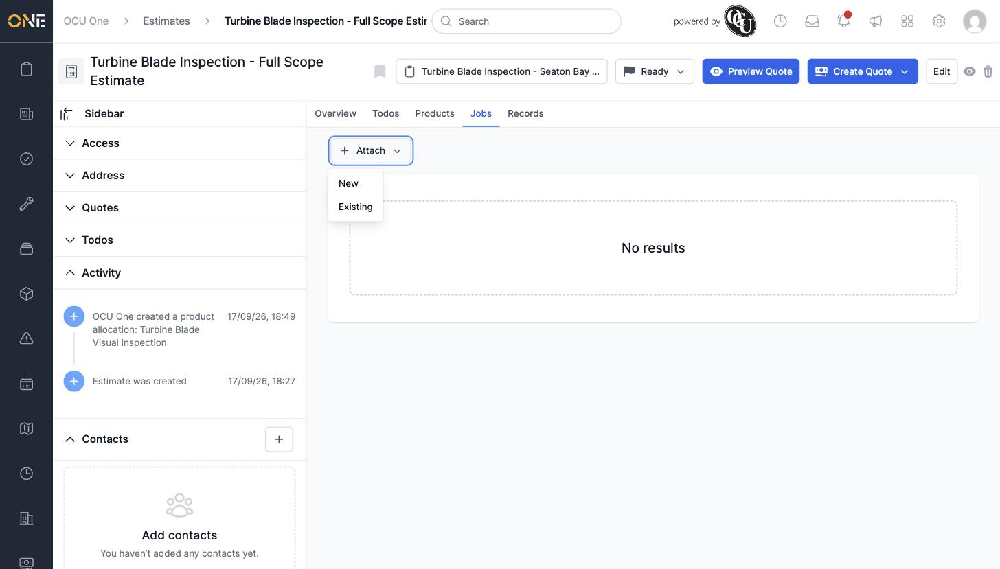
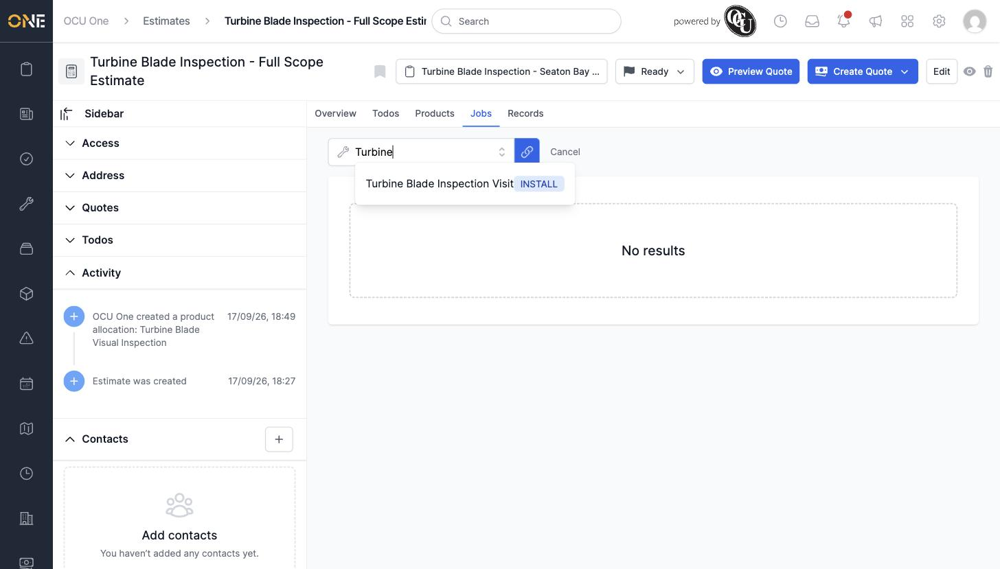
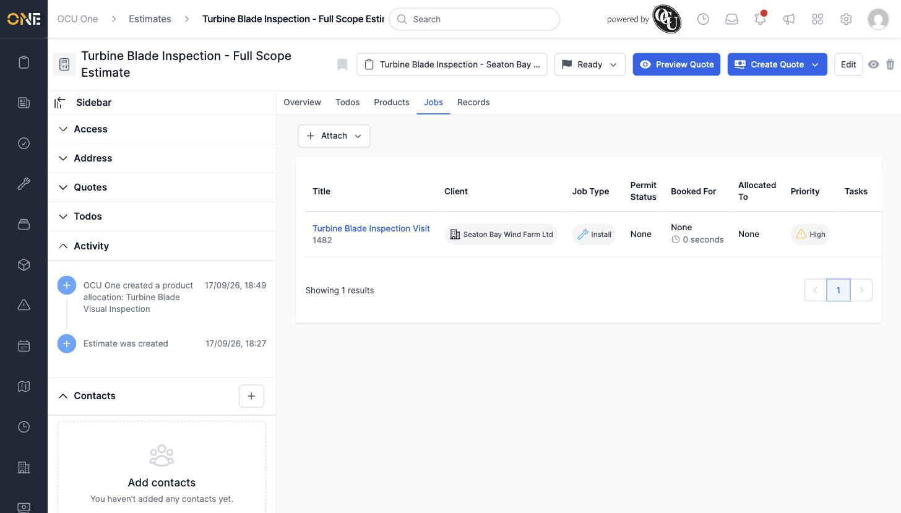
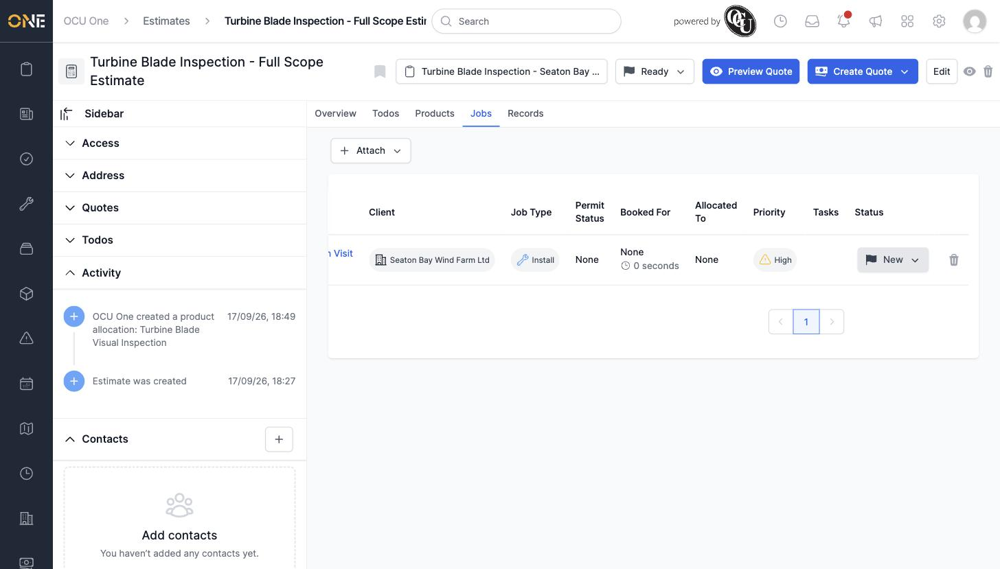
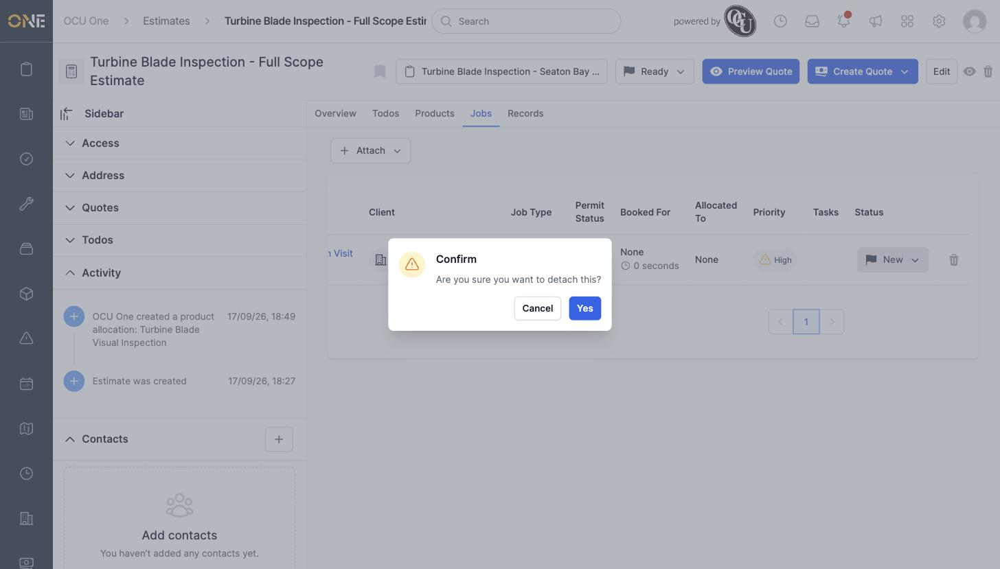

# Attaching or detaching jobs on an estimate

An estimate's **Jobs** tab links it to the actual jobs that carry out the work it scopes out.

## Viewing linked jobs

Open an estimate and click its **Jobs** tab. If nothing is linked yet, you'll see an empty state and an **+ Attach** button.

## Attaching a job

Click **+ Attach** and choose:

- **New** — create a brand new job, pre-linked to this estimate.
- **Existing** — link a job that already exists.

Choosing **Existing** opens a search field — type the job's title and pick it from the results.

Click the link icon next to the field to confirm. A "Job was successfully attached" notice appears, and the job now shows in the table with its client, job type, permit status, booked date, allocated user, priority, and current status.

## Detaching a job

Scroll the table right to reveal the trash icon in the **Status** column, and click it.

A confirmation dialog appears — click **Yes** to detach it, or **Cancel** to leave it linked.

Detaching a job doesn't delete it — it just removes the link between the job and this estimate.
