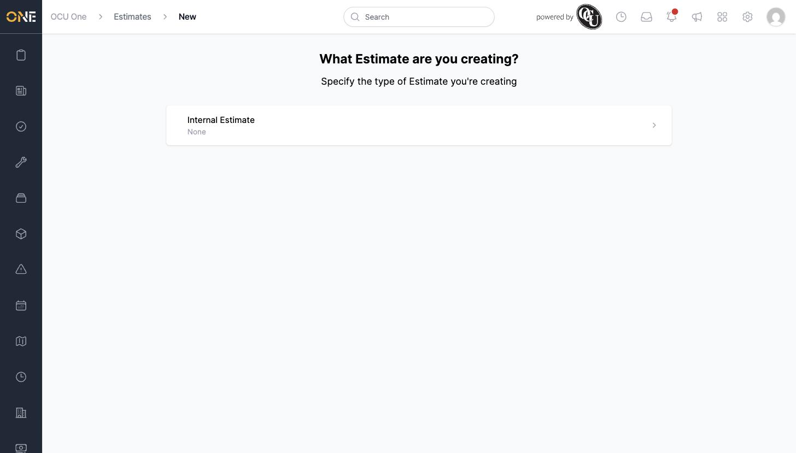
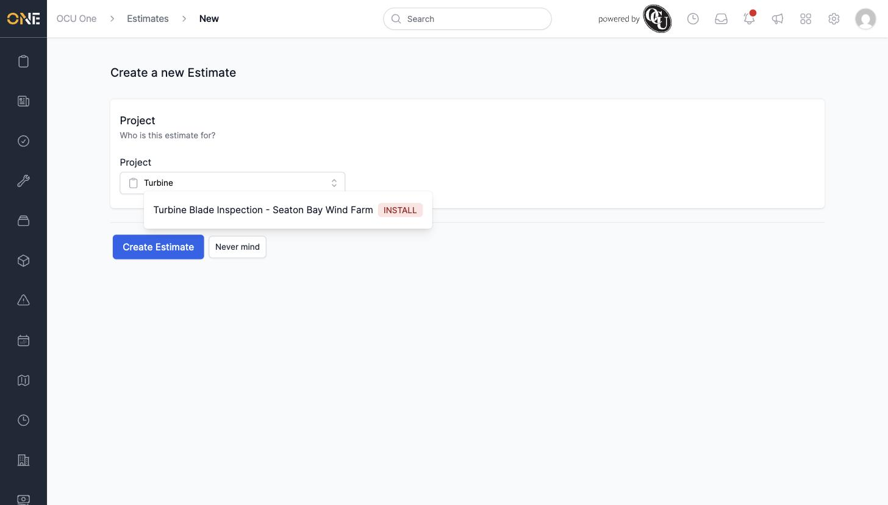
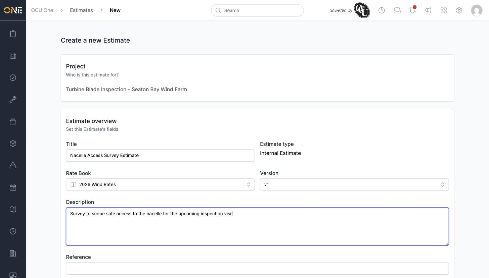
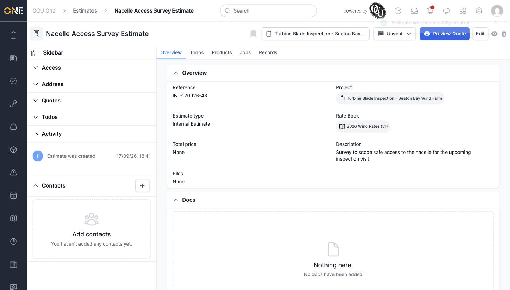

# Creating a new estimate

An estimate is where you scope out proposed work and its likely cost, before turning it into a job or sending a quote to a client.

## Starting a new estimate

From the **Estimates** list, click **+ Estimate** in the top right.

*If your tenant has more than one estimate type configured, they'll all be listed here — pick the one that matches what you're scoping out.*

Click the estimate type you want. You're then asked which project the estimate is for.

Start typing the project's name and select it from the list.

## Filling in the details

Once a project is chosen, the rest of the form appears:

- **Title** — a short name for the estimate.
- **Estimate type** — shown for reference; set by which type you picked at the start.
- **Rate Book** and **Version** — which set of prices the estimate's products will be costed against. These default to the project's own rate book, but can be changed.
- **Description** — free text explaining the scope of work.
- **Reference** — leave blank to have one generated automatically.
- **Files** — optionally attach supporting documents (site photos, specifications) at creation time, or add them later.

Click **Create Estimate** to save it, or **Never mind** to cancel.

## After creating it

The new estimate opens on its overview page, starting in **Unsent** status with no total price yet — that fills in once products are allocated (see [Managing products/materials on an estimate](Managing%20products%20materials%20on%20an%20estimate.md)).

From here you can add products, attach jobs, add contacts, and move it through its status workflow — covered in the other guides in this section.
